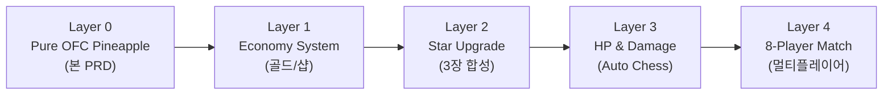
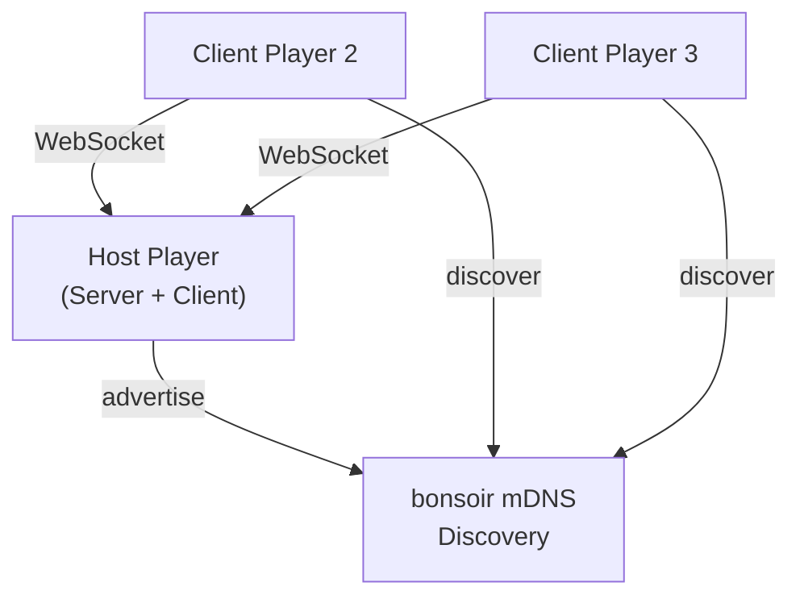

# Layer 0: Pure OFC Pineapple PRD

**버전**: 1.0
**작성일**: 2026-02-27
**상태**: 초안
**목적**: Pure OFC Pineapple 정식 규칙 완벽 구현

---

## 목차

1. [개요](#1-개요)
2. [게임 규칙 요구사항](#2-게임-규칙-요구사항)
3. [기술 요구사항](#3-기술-요구사항)
4. [구현 상태](#4-구현-상태)
5. [Changelog](#5-changelog)

---

## 1. 개요

### 1.1 목적

Pure OFC Pineapple의 정식 카드 게임 규칙을 완벽하게 구현한다. 커스텀 규칙(경제 시스템, 별 강화, HP/데미지)을 일절 포함하지 않으며, 국제 표준 OFC Pineapple 규칙을 기준으로 Flutter 기반 멀티플레이어 클라이언트를 제공하는 것이 목표다.

### 1.2 배경

기존 Trump Card Auto Chess PRD(v4.0)는 OFC 정식 규칙과 커스텀 오토체스 규칙을 혼합하여 22개의 내부 모순이 발생했다. 이를 해결하기 위해 레이어 분리 접근을 채택한다.

- **Layer 0**: Pure OFC Pineapple (정식 규칙, 본 PRD)
- Layer 0가 완전히 검증된 이후에만 상위 레이어를 추가한다
- 기존 Python POC(`src/`)의 커스텀 로직은 Layer 1 이상에서 사용

### 1.3 범위

**포함 (Layer 0)**:
- OFC Pineapple 표준 딜링 및 배치 규칙
- Foul, Scoop, Royalty, Fantasyland 공식 규칙
- 1:1 및 최대 3인 Pairwise 점수 계산
- Flutter LAN 멀티플레이어 (최대 3인)

**제외 (Layer 1 이상)**:
- 경제 시스템 (골드, 이자, 샵)
- 별 강화 (3장 합성)
- HP/데미지 시스템
- 오토체스 라운드 구조
- 커스텀 수트 순환 우위

### 1.4 Layer Roadmap



| Layer | 명칭 | 핵심 추가 기능 | 의존성 |
|-------|------|---------------|--------|
| 0 | Pure OFC Pineapple | 정식 OFC 룰 완전 구현 | — |
| 1 | Economy System | 골드, 이자, 샵 드로우 | Layer 0 |
| 2 | Star Upgrade | 3장 합성, 별 강화 | Layer 1 |
| 3 | HP & Damage | 라운드 데미지, HP 시스템 | Layer 2 |
| 4 | 8-Player Match | 8인 PvP, 토너먼트 | Layer 3 |
| 5 | Full Auto Chess | TFT 오토체스 완전체 | Layer 4 |
| 6 | Custom Rules | 커스텀 수트 우위 등 | Layer 5 |

---

## 2. 게임 규칙 요구사항

### 2.1 보드 구조

각 플레이어는 세 개의 라인(Row)으로 구성된 보드를 가진다.

| 라인 | 영문명 | 슬롯 수 | 강도 제약 |
|------|--------|---------|-----------|
| Top (앞줄) | Front | 3장 | 가장 약해야 함 |
| Mid (중간) | Middle | 5장 | 중간 |
| Bottom (뒷줄) | Back | 5장 | 가장 강해야 함 |

**필수 제약**: `Bottom 핸드 ≥ Mid 핸드 ≥ Top 핸드`

이 제약을 위반하면 Foul이 선언된다 (§2.4 참조).

### 2.2 Pineapple OFC 딜링

딜링은 총 5라운드로 진행된다.

| 라운드 | 드로우 | 배치 | 버림 |
|--------|--------|------|------|
| Round 0 (첫 딜) | 5장 | 5장 모두 배치 | 0장 |
| Round 1 | 3장 | 2장 배치 | 1장 (face-down) |
| Round 2 | 3장 | 2장 배치 | 1장 (face-down) |
| Round 3 | 3장 | 2장 배치 | 1장 (face-down) |
| Round 4 | 3장 | 2장 배치 | 1장 (face-down) |

**합계**: 총 17장 확인, 13장 배치, 4장 버림 (face-down, 비공개)

**제약사항**:
- 최대 3인 플레이어
- 버린 카드는 공개하지 않음
- Round 0에서 5장을 원하는 라인에 자유롭게 배치

### 2.3 Committed Rule

**Confirm 이후** 배치된 카드는 이동하거나 제거할 수 없다.

- 라인 정원(Top=3, Mid=5, Bottom=5)에 도달하면 추가 배치 불가
- **Confirm 전 취소 가능** (§2.11 참조): 현재 턴에 배치한 카드는 Confirm 버튼을 누르기 전까지 취소하여 핸드로 되돌릴 수 있다
- Confirm 이후에는 취소 불가 (영구 확정)
- Fantasyland에서도 동일하게 적용

### 2.4 Foul 규칙

**Foul 조건**: 모든 카드 배치 완료 후 `Bottom < Mid` 또는 `Mid < Top` 상태

**Foul 패널티**:
- Foul 선언 플레이어의 전 라인 핸드 무효 처리
- 상대 각각에게 **6점** 지급 (라인 비교 없이 고정)
- 본인 Royalty 소멸
- 상대 Royalty는 정상 지급

**양측 Foul (동시 Foul)**:
- 두 플레이어 모두 Foul 시 해당 매치업 0점으로 상쇄
- 각자 Royalty 소멸

### 2.5 Scoop 보너스

3라인 전승(3:0 스윕)을 달성한 플레이어에게 보너스를 추가로 지급한다.

- **Scoop 보너스**: +3점 (3라인 승리 +3점과 합산하여 총 **+6점**)
- Foul이 있는 경우 Scoop 보너스 미적용 (6점 고정 패널티만 적용)
- 3인 게임에서는 각 쌍별로 독립 적용

### 2.6 점수 계산 (1-6 Method, Pairwise)

**기본 원칙**: 모든 플레이어 쌍 간 1:1 비교 (Pairwise)

**라인별 점수**:
- 각 라인 승자: **+1점**, 패자: **-1점**, 동률: 0점
- 3라인 합산 후 Scoop 보너스 및 Royalty 차이 추가

**점수 계산 순서**:
1. Foul 여부 확인 → Foul 적용 (§2.4)
2. 라인별 핸드 비교 (Bottom, Mid, Top)
3. Scoop 보너스 확인 (§2.5)
4. Royalty 계산 (§2.7)
5. 최종 점수 = 라인 점수 합 + Scoop 보너스 + Royalty 차이

**3인 예시** (A vs B vs C):
- A vs B, A vs C, B vs C 총 3쌍 독립 계산
- 각 플레이어 최종 점수 = 3쌍 합산

### 2.7 Royalty 테이블

Royalty는 각 라인에서 조건을 충족하는 핸드에 부여되는 추가 점수다. Foul 시 소멸한다.

**Bottom (5장)**:

| 핸드 | Royalty 점수 |
|------|-------------|
| Straight | +2 |
| Flush | +4 |
| Full House | +6 |
| Four of a Kind | +10 |
| Straight Flush | +15 |
| Royal Flush | +25 |

**Mid (5장)**:

| 핸드 | Royalty 점수 |
|------|-------------|
| Three of a Kind | +2 |
| Straight | +4 |
| Flush | +8 |
| Full House | +12 |
| Four of a Kind | +20 |
| Straight Flush | +30 |
| Royal Flush | +50 |

**Top (3장)**:

| 핸드 | Royalty 점수 |
|------|-------------|
| 66 (Pair of Sixes) | +1 |
| 77 | +2 |
| 88 | +3 |
| 99 | +4 |
| TT | +5 |
| JJ | +6 |
| QQ | +7 |
| KK | +8 |
| AA | +9 |
| Trip 2s (222) | +10 |
| Trip 3s (333) | +11 |
| Trip 4s (444) | +12 |
| Trip 5s (555) | +13 |
| Trip 6s (666) | +14 |
| Trip 7s (777) | +15 |
| Trip 8s (888) | +16 |
| Trip 9s (999) | +17 |
| Trip Tens (TTT) | +18 |
| Trip Jacks (JJJ) | +19 |
| Trip Queens (QQQ) | +20 |
| Trip Kings (KKK) | +21 |
| Trip Aces (AAA) | +22 |

### 2.8 Fantasyland

**진입 조건**:
- Top 라인에 **QQ(페어 퀸) 이상** 핸드 배치
- Foul 없이 핸드 완성

**Fantasyland 딜링 (Progressive)**:

| Top 핸드 | 진입 시 받는 카드 수 |
|----------|---------------------|
| QQ (Pair of Queens) | 14장 |
| KK (Pair of Kings) | 15장 |
| AA (Pair of Aces) | 16장 |
| Trips (Three of a Kind) | 17장 |

**Fantasyland 진행**:
- 지정된 장 수를 한 번에 받아 보드 완성 (배치 후 4장/5장/6장 버림)
- 비-Fantasyland 플레이어는 일반 딜링 진행
- Fantasyland 플레이어의 핸드는 다른 플레이어 배치 완료 후 공개

**Fantasyland 유지 (Re-Fantasyland)**:
- Top Trips (Three of a Kind) 달성
- Mid Four of a Kind 이상 달성
- Bottom Four of a Kind 이상 달성
- Re-FL 카드 수: 항상 **14장** (진입 조건과 무관)

### 2.9 타이브레이커

동일 핸드 타입 간 비교는 아래 규칙을 따른다.

- **랭크만 사용**: 킥커 랭크 순서로 결정
- **수트 제외**: 수트는 타이브레이커로 사용하지 않음 (Layer 0 표준 규칙)
- **완전 동률**: 두 핸드가 완전히 동일하면 0점 (draw)

> Layer 0 이후 레이어에서 커스텀 수트 순환 우위를 추가할 수 있다.

### 2.10 Turn UX: Inline Discard + Undo

#### 2.10.1 Inline Discard (Pineapple Phase)

Pineapple 라운드(Round 1~4)에서 3장 중 1장을 버릴 때, 별도의 고정 discard 존을 사용하지 않는다.

- 핸드의 각 카드 아래에 **Discard 버튼**이 직접 표시된다
- 플레이어가 해당 카드의 Discard 버튼을 탭하면 즉시 버림 처리
- 이미 1장을 버린 경우 나머지 카드의 Discard 버튼은 비활성화
- Round 0(5장 전부 배치)에서는 Discard 버튼 미표시

#### 2.10.2 Undo (Confirm 전 취소)

현재 턴에서 배치 또는 버림한 카드를 Confirm 전에 취소할 수 있다.

**배치 취소**:
- 보드에 이번 턴에 배치한 카드를 탭하면 취소 → 핸드로 복귀
- 이전 턴에 배치한 카드(이미 Confirm된 카드)는 취소 불가
- 이번 턴에 배치한 카드는 시각적으로 구분 표시 (펄스 테두리)

**버림 취소**:
- Undo 버튼으로 버림 취소 가능 → 카드가 핸드로 복귀
- 배치 + 버림 전체를 한 번에 되돌리는 "Reset Turn" 버튼 제공

**제약사항**:
- Confirm 이후에는 모든 취소 불가 (Committed Rule §2.3)
- AI 플레이어에게는 undo 미적용

### 2.11 Top 3장 핸드 규칙

Top 라인은 3장으로 구성되므로 포커 핸드 종류가 제한된다.

**Top에서 가능한 핸드** (강도 순):
1. Three of a Kind (트립)
2. One Pair (원페어)
3. High Card (하이카드)

**Top에서 불가능한 핸드**:
- Straight (5장 필요)
- Flush (5장 필요)
- Full House (5장 필요)
- Four of a Kind (5장 필요)
- Straight Flush (5장 필요)
- Royal Flush (5장 필요)

---

## 3. 기술 요구사항

### 3.1 플랫폼 및 프레임워크

| 항목 | 기술 스택 |
|------|----------|
| UI 프레임워크 | Flutter (Dart) |
| 애니메이션 | Rive |
| 상태 관리 | Riverpod |
| 데이터 모델 | freezed + json_serializable |
| 타겟 플랫폼 | Android, iOS, (선택: macOS, Windows) |

### 3.2 네트워크 아키텍처 (LAN 멀티플레이어)



- **호스트 기반 Client-Server**: 한 플레이어가 서버 역할 수행
- **mDNS 자동 검색**: bonsoir 패키지로 LAN 내 게임 자동 탐색
- **WebSocket 통신**: 실시간 상태 동기화
- **최대 3인**: Layer 0 기준

### 3.3 핵심 Flutter 패키지

| 패키지 | 용도 |
|--------|------|
| `riverpod` / `flutter_riverpod` | 상태 관리 |
| `freezed` | 불변 데이터 모델 |
| `json_serializable` | JSON 직렬화 |
| `web_socket_channel` | WebSocket 클라이언트 |
| `bonsoir` | mDNS LAN 검색 |
| `rive` | 카드 애니메이션 |

### 3.4 게임 상태 모델 (freezed)

```dart
@freezed
class OFCBoard with _$OFCBoard {
  const factory OFCBoard({
    required List<Card?> top,    // 3슬롯
    required List<Card?> mid,    // 5슬롯
    required List<Card?> bottom, // 5슬롯
  }) = _OFCBoard;
}

@freezed
class GameState with _$GameState {
  const factory GameState({
    required List<PlayerState> players,
    required int currentRound,       // 0~4
    required GamePhase phase,
    required List<Card> deck,
    required List<Card?> discarded,  // face-down
  }) = _GameState;
}
```

### 3.5 성능 요구사항

| 항목 | 기준 |
|------|------|
| 네트워크 지연 | LAN 환경 < 50ms |
| 핸드 평가 속도 | < 1ms (단일 핸드) |
| UI 프레임률 | 60fps 이상 |
| 동시 접속 | 최대 3인 |

---

## 4. 구현 상태

### 4.1 기능별 구현 현황

| 기능 | 항목 | 상태 | 비고 |
|------|------|------|------|
| **게임 규칙** | 보드 구조 (Top/Mid/Bottom) | 예정 | Flutter 신규 구현 |
| | Pineapple 딜링 (5+3×4) | 예정 | |
| | Committed Rule | 예정 | |
| | Foul 감지 | 예정 | Python POC 로직 참조 가능 |
| | Scoop 보너스 | 예정 | |
| **점수** | Pairwise 1:1 계산 | 예정 | |
| | Royalty 테이블 (Bottom/Mid/Top) | 예정 | |
| | Foul 패널티 (6점 고정) | 예정 | |
| **핸드 평가** | Top 3장 핸드 평가 | 예정 | Trips/Pair/HighCard |
| | Mid/Bottom 5장 핸드 평가 | 예정 | 표준 포커 핸드 |
| | 타이브레이커 (랭크 기반) | 예정 | 수트 제외 |
| **Fantasyland** | 진입 조건 (QQ+ Top) | 예정 | |
| | Progressive 딜링 (14~17장) | 예정 | |
| | 유지 조건 (Re-FL) | 예정 | |
| **네트워크** | mDNS 게임 검색 (bonsoir) | 예정 | |
| | WebSocket 상태 동기화 | 예정 | |
| | 호스트 서버 구현 | 예정 | |
| **UI** | 보드 화면 (3라인) | 완료 | BoardWidget |
| | 카드 드래그 앤 드롭 배치 | 완료 | LineSlotWidget |
| | 점수 결과 화면 | 완료 | ScoreScreen |
| | Fantasyland 특수 화면 | 완료 | GameScreen FL badge |
| | Inline Discard 버튼 | 완료 | HandWidget §2.10.1 |
| | Undo 배치/버림 취소 | 완료 | §2.10.2 |

### 4.2 Python POC 재사용 가능 로직

기존 `C:\claude\card_ofc\src\` 의 Python 코드는 Layer 0 Flutter 구현 시 참조 가능하다.

| Python 모듈 | Flutter 대응 | 재사용 가능성 |
|-------------|-------------|--------------|
| `hand.py` → `evaluate_hand()` | `HandEvaluator` | 높음 (로직 이식) |
| `board.py` → `OFCBoard` | `OFCBoard` freezed 모델 | 중간 (구조 참조) |
| `combat.py` → `CombatResolver` | `ScoreCalculator` | 중간 (Foul/Scoop 로직) |
| `card.py` → `Card`, `Rank`, `Suit` | `Card` freezed 모델 | 높음 |

> **주의**: Python POC의 수트 순환 우위 로직은 Layer 0에서 사용하지 않음 (Layer 6+ 전용)

---

## 5. Changelog

| 날짜 | 버전 | 변경 내용 | 결정 근거 |
|------|------|-----------|----------|
| 2026-02-28 | v1.1 | §2.3 Committed Rule 수정 (Confirm 전 취소 허용), §2.10 Inline Discard + Undo 추가 | 디지털 게임 UX 편의성 강화 |
| 2026-02-27 | v1.0 | 최초 작성 | Layer 분리 접근으로 PRD v4.0 모순 22개 해결 |
