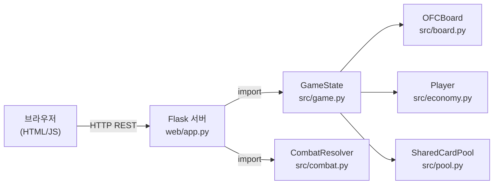
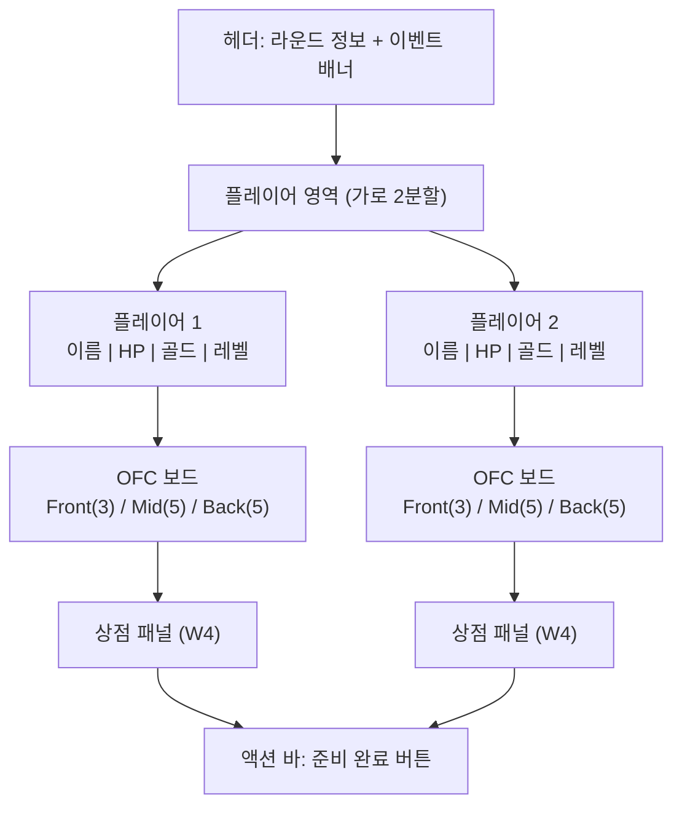
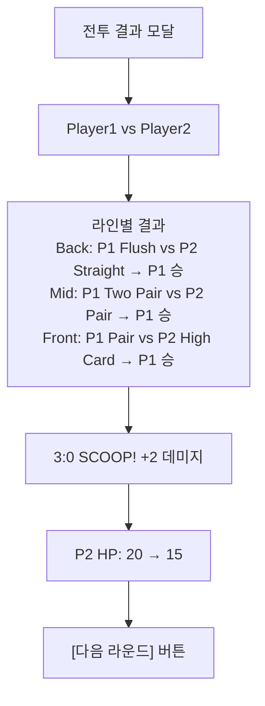
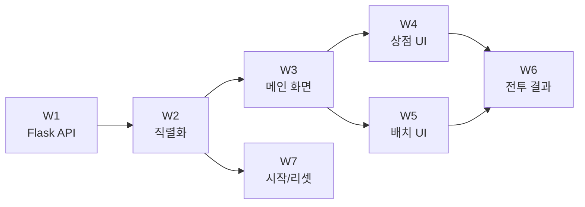

# Trump Card Auto Chess — Web GUI PRD

**버전**: 1.0.0
**작성일**: 2026-02-23
**기반**: STANDARD 완료 보고서 + `standard.prd.md` (293 테스트 PASS)
**목적**: Flask + HTML/JS 기반 브라우저 플레이어블 GUI 버전 구현

---

## 목차

1. [배경 및 목적](#1-배경-및-목적)
2. [요구사항 목록](#2-요구사항-목록)
3. [기능 범위](#3-기능-범위)
4. [비기능 요구사항](#4-비기능-요구사항)
5. [제약사항](#5-제약사항)
6. [우선순위](#6-우선순위)
7. [구현 단계](#7-구현-단계)

---

## 1. 배경 및 목적

### 1.1 STANDARD 완료 상태

Trump Card Auto Chess STANDARD 단계는 POC/Alpha 위에 판타지랜드 13장 드로우, CLI 인코딩 수정, 증강체 선택 UI, 8인 멀티플레이어 매칭, 버그 수정 9개 항목(S1~S9)을 구현하고 293개 테스트 전부 통과했다.

| 항목 | 상태 |
|------|------|
| 총 테스트 | 293개 전체 PASS |
| 린트 | ruff PASS |
| 구현 모듈 | `src/` 11개 모듈 |
| CLI | `cli/main.py` — 2~8인 자동/수동 모드 동작 |

### 1.2 Web GUI 전환 이유

STANDARD까지 구현된 게임 로직은 CLI 전용으로 설계됐다. CLI 기반 인터페이스는 다음 한계를 가진다.

| 한계 | 설명 |
|------|------|
| **진입 장벽** | 터미널 환경에 익숙하지 않은 사용자는 게임을 체험할 수 없음 |
| **카드 배치 직관성** | 텍스트 입력으로 카드 배치 → 클릭/드래그 대비 UX 열등 |
| **시각적 피드백 부재** | 전투 결과, 핸드 강도, 보드 상태를 텍스트로만 표현 |
| **멀티플레이어 동시 접속** | 단일 터미널로 2인 동시 플레이 불가 |

Flask + HTML/JS 기반 웹 GUI로 전환하면 브라우저만 있으면 누구나 게임을 체험할 수 있고, 동일 서버에서 2인 로컬 동시 플레이가 가능해진다.

### 1.3 Web GUI 목표

기존 `src/` 백엔드 코드를 재사용하면서 최소한의 웹 레이어를 추가하는 것이 목표다. 새로운 게임 로직을 작성하지 않고 Flask REST API로 `GameState`를 노출하고, 프론트엔드가 JSON을 소비해 화면을 렌더링한다.



---

## 2. 요구사항 목록

### W1. Flask 서버 및 API 엔드포인트

**파일**: `web/app.py`

Flask 애플리케이션을 `web/app.py`에 구현한다. 게임 상태는 서버 메모리에 세션별로 저장한다.

**엔드포인트 목록**:

| 메서드 | 경로 | 설명 |
|--------|------|------|
| `POST` | `/api/start` | 새 게임 초기화 (플레이어 수, 이름 설정) |
| `GET` | `/api/state` | 현재 게임 상태 JSON 반환 |
| `POST` | `/api/action` | 플레이어 액션 처리 (구매, 배치, 판매, 준비 완료) |
| `POST` | `/api/reset` | 게임 리셋 |
| `GET` | `/` | 메인 HTML 페이지 서빙 |

**`/api/start` 요청 스키마**:
```json
{
  "num_players": 2,
  "player_names": ["Player1", "Player2"]
}
```

**`/api/action` 요청 스키마**:
```json
{
  "player_id": 0,
  "action_type": "buy_card | place_card | sell_card | ready | roll_shop",
  "payload": {}
}
```

**응답 형식**: 모든 엔드포인트는 `{"success": true, "state": <GameStateJSON>}` 또는 `{"success": false, "error": "<message>"}` 반환.

**디렉토리 구조**:
```
web/
├── app.py           ← Flask 앱 + 라우터
├── serializer.py    ← GameState → JSON 변환
└── static/
    ├── index.html   ← 메인 HTML
    ├── style.css    ← 스타일시트
    └── game.js      ← 프론트엔드 로직
```

---

### W2. 게임 상태 직렬화

**파일**: `web/serializer.py`

`GameState` 객체를 JSON으로 직렬화해 프론트엔드가 소비할 수 있게 한다. `Card`, `OFCBoard`, `Player` 등 내부 객체 전부 직렬화 대상이다.

**직렬화 대상 클래스**:

| 클래스 | 직렬화 필드 |
|--------|------------|
| `Card` | `rank`, `suit`, `stars`, `suit_symbol` |
| `OFCBoard` | `front` (3칸), `mid` (5칸), `back` (5칸), `foul`, `hand_strengths` |
| `Player` | `name`, `gold`, `hp`, `streak`, `level`, `augments`, `board`, `shop_cards` |
| `GameState` | `round_num`, `phase`, `players`, `current_event`, `active_player_id` |

**GameState JSON 스키마**:
```json
{
  "round_num": 1,
  "phase": "prep",
  "active_player_id": 0,
  "current_event": null,
  "players": [
    {
      "id": 0,
      "name": "Player1",
      "gold": 5,
      "hp": 20,
      "level": 1,
      "streak": 0,
      "augments": [],
      "board": {
        "front": [null, null, null],
        "mid": [null, null, null, null, null],
        "back": [null, null, null, null, null],
        "foul": false,
        "hand_strengths": {"front": null, "mid": null, "back": null}
      },
      "shop_cards": [
        {"rank": "A", "suit": 1, "suit_symbol": "♠", "stars": 0, "cost": 5}
      ]
    }
  ]
}
```

**역직렬화**: `/api/action` payload 처리 시 카드 식별에 `rank + suit` 조합 키 사용.

**구현 함수**:
- `serialize_game(game_state) -> dict`
- `serialize_player(player) -> dict`
- `serialize_board(board) -> dict`
- `serialize_card(card) -> dict | None`

---

### W3. HTML 메인 화면 (보드 3라인)

**파일**: `web/static/index.html`, `web/static/style.css`

브라우저에서 게임 보드를 시각적으로 표시하는 메인 화면이다. 2인 플레이 기준으로 양쪽 플레이어 보드를 동시에 표시한다.

**화면 레이아웃**:



**보드 카드 슬롯 표시 규칙**:
- 빈 슬롯: 회색 점선 테두리 + `[ ]` 텍스트
- 카드 있는 슬롯: 수트 색상(♠♣=검정, ♥♦=빨강) + 랭크 + 별 아이콘
- Foul 상태: 해당 라인 배경 빨강 하이라이트
- 핸드 강도 표시: 각 라인 우측에 `(Two Pair)` 형태로 표기

**카드 컴포넌트 HTML 예시**:
```html
<div class="card-slot filled suit-spade">
  <span class="rank">A</span>
  <span class="suit">♠</span>
  <span class="stars">★★</span>
</div>
```

**반응형**: 최소 지원 폭 1024px (데스크탑 우선).

---

### W4. 상점 UI

**파일**: `web/static/game.js`, `web/static/style.css`

prep 페이즈에서 각 플레이어가 상점 카드를 확인하고 구매하는 UI이다.

**상점 패널 구성**:
- 카드 5장 가로 배열 표시
- 각 카드 하단에 비용 표시 (골드 아이콘 + 숫자)
- 구매 버튼: 보유 골드 충분 시 활성(파란색), 부족 시 비활성(회색)
- 새로고침 버튼: 골드 2개 소모 → `/api/action` `roll_shop`

**카드 비용 표시 규칙**:

| rank | 비용 |
|------|------|
| 2~5 | 1골드 |
| 6~8 | 2골드 |
| 9~J | 3골드 |
| Q~K | 4골드 |
| A | 5골드 |

**구매 플로우**:
```
카드 클릭 → 구매 확인 없이 즉시 /api/action {action_type: "buy_card", payload: {card_key: "A_1"}}
→ 서버 응답 → 상태 갱신 → 핸드 영역에 구매한 카드 추가
```

**핸드 영역**: 구매한 카드는 보드 배치 전까지 화면 하단 "핸드" 패널에 임시 보관. 최대 13장.

---

### W5. 카드 배치 UI

**파일**: `web/static/game.js`

핸드의 카드를 OFC 보드의 front/mid/back 슬롯에 배치하는 인터랙션이다. 클릭 기반 배치를 Must로, 드래그 앤 드롭을 Should로 구현한다.

**클릭 배치 플로우**:
```
핸드 카드 클릭 → 선택 상태(파란 테두리) → 보드 슬롯 클릭
→ /api/action {action_type: "place_card", payload: {card_key: "A_1", line: "back", slot: 2}}
→ 서버 응답 → 보드 업데이트 + Foul 경고 표시
```

**드래그 앤 드롭 플로우** (Should):
```
핸드 카드 드래그 시작 → 보드 슬롯 드롭 존 하이라이트
→ 드롭 → 동일 /api/action 호출
```

**Foul 실시간 피드백**:
- 배치 후 서버가 `foul: true` 반환 시 해당 라인 빨강 테두리 표시
- 툴팁: "Foul! Back ≥ Mid ≥ Front 조건 위반"

**카드 회수**:
- 배치된 카드 클릭 → 핸드로 반환 (`/api/action` `remove_card`)
- combat 페이즈 전환 후에는 회수 불가 (슬롯 잠금)

**판타지랜드 배치 모드**:
- `in_fantasyland=True` 플레이어는 13장 카드를 한꺼번에 받아 배치 후 나머지 반환
- 별도 "판타지랜드 배치" 모달 또는 전용 패널로 표시

---

### W6. 전투 결과 화면

**파일**: `web/static/game.js`, `web/static/style.css`

combat 페이즈 종료 후 전투 결과를 시각적으로 표시하는 화면이다.

**결과 표시 항목**:

| 항목 | 표시 방법 |
|------|----------|
| 라인별 승패 | 각 라인(Front/Mid/Back) 옆에 ✓(승)/✗(패)/=(무) 아이콘 |
| 스쿠프 여부 | 3:0 승리 시 "SCOOP! +2" 배너 |
| 훌라 발동 | "훌라! ×4" 황금색 배너 |
| HP 변화 | 이전 HP → 현재 HP 애니메이션 (숫자 카운트다운) |
| Foul 패널티 | Foul 라인에 "Foul (-1 핸드)" 표시 |
| 전투 요약 | 승리 라인 수 + 총 데미지 |

**결과 화면 레이아웃**:


**전환**: 결과 확인 후 "다음 라운드" 버튼 클릭 → prep 페이즈로 전환 + 상점 새로고침.

---

### W7. 게임 시작/리셋 UI

**파일**: `web/static/index.html`, `web/static/game.js`

서버 시작 후 브라우저 접속 시 표시되는 게임 설정 화면 및 진행 중 리셋 기능이다.

**시작 화면 구성**:
```
+------------------------------------------+
|   Trump Card Auto Chess                  |
+------------------------------------------+
|  플레이어 수: [2] (라디오: 2/3/4/5/6/7/8) |
|                                          |
|  Player 1 이름: [____________]           |
|  Player 2 이름: [____________]           |
|                                          |
|  [게임 시작]                              |
+------------------------------------------+
```

**동작**:
- 플레이어 수 선택 → 해당 수만큼 이름 입력 필드 동적 생성
- 빈 이름은 `Player N` 기본값 적용
- "게임 시작" 클릭 → `POST /api/start` → 성공 시 메인 보드 화면으로 전환

**게임 중 리셋**:
- 우측 상단 "새 게임" 버튼 → 확인 다이얼로그 → `POST /api/reset` → 시작 화면으로 복귀
- HP 0 플레이어 발생 시 "게임 종료" 모달 → 최종 순위 표시 → "다시 시작" 버튼

**게임 종료 모달**:
```
+------------------------------------------+
|  게임 종료!                               |
|                                          |
|  1위: Player1 (HP: 15)                   |
|  2위: Player2 (HP: 0)                    |
|                                          |
|  [다시 시작]                              |
+------------------------------------------+
```

---

## 3. 기능 범위

### Must Have (필수 구현)

| 항목 | 설명 |
|------|------|
| W1 Flask 서버 | `/api/start`, `/api/state`, `/api/action`, `/api/reset` 엔드포인트 |
| W2 직렬화 | `GameState` → JSON 완전 직렬화 |
| W3 보드 화면 | OFC 3라인 카드 슬롯 표시, HP/골드/레벨 정보 |
| W7 시작/리셋 | 게임 시작 설정 화면, 리셋 기능 |

### Should Have (권장 구현)

| 항목 | 설명 |
|------|------|
| W4 상점 UI | 카드 5장 표시, 구매 버튼, 새로고침 |
| W5 카드 배치 (클릭) | 클릭 기반 카드 배치, Foul 실시간 피드백 |
| W6 전투 결과 | 라인별 승패, HP 변화, 스쿠프/훌라 표시 |

### Could Have (선택 구현)

| 항목 | 설명 |
|------|------|
| W5 드래그 앤 드롭 | HTML5 Drag and Drop API 기반 카드 배치 |
| 애니메이션 | 카드 이동, HP 변화, 배틀 연출 CSS 트랜지션 |
| 증강체 선택 UI | 라운드 2/4 증강체 선택 모달 |
| 판타지랜드 전용 UI | 13장 배치 전용 모달 패널 |

### Won't Have (이번 버전 제외)

| 항목 | 이유 |
|------|------|
| 네트워크 멀티플레이 | WebSocket/세션 관리 복잡도 → 별도 단계 |
| 모바일 반응형 | 터치 UX 설계 별도 필요 |
| 사운드/음악 | 코어 기능 완성 후 후순위 |
| 서버 영속성 | DB 연동 없이 메모리 내 상태로 단순화 |
| 스펙테이터 모드 | 2인 로컬 플레이에 집중 |

---

## 4. 비기능 요구사항

### 4.1 성능

| 항목 | 목표값 | 비고 |
|------|--------|------|
| API 응답 시간 | < 200ms | 로컬호스트 기준 95th 퍼센타일 |
| 페이지 초기 로드 | < 1초 | 외부 CDN 의존 없음 |
| 상태 갱신 레이턴시 | < 100ms | `/api/state` 폴링 또는 즉시 응답 |

### 4.2 동시성

| 항목 | 요구사항 |
|------|----------|
| 최소 동시 세션 | 2인 로컬 동시 플레이 (동일 서버, 다른 브라우저 탭) |
| 세션 격리 | 플레이어 ID 기반 액션 검증 (다른 플레이어 액션 차단) |
| 경쟁 조건 방지 | Flask 기본 동기 처리로 충분 (멀티스레드 불필요) |

### 4.3 호환성

| 항목 | 요구사항 |
|------|----------|
| 브라우저 | Chrome 100+, Firefox 100+, Edge 100+ |
| 최소 화면 해상도 | 1024 × 768 |
| JavaScript 의존 | ES6+ 기본 문법 (외부 프레임워크 불필요) |

### 4.4 유지보수성

| 항목 | 요구사항 |
|------|----------|
| 백엔드 코드 재사용 | `src/` 모듈 변경 없이 `web/` 레이어만 추가 |
| 테스트 커버리지 | `web/serializer.py` 유닛 테스트 필수 |
| API 문서 | 엔드포인트별 docstring 필수 |

---

## 5. 제약사항

### 5.1 기술 제약

| 제약 | 내용 | 이유 |
|------|------|------|
| **기존 백엔드 재사용 필수** | `src/` 하위 모듈 코드 변경 금지 (읽기 전용 사용) | 293개 통과 테스트 보호 |
| **새 패키지 최소화** | `flask` 1개만 추가 허용 (pip install flask) | 의존성 증가 방지 |
| **외부 CDN 금지** | jQuery, Bootstrap 등 외부 라이브러리 CDN 로드 금지 | 오프라인 환경 지원 |
| **데이터베이스 없음** | 서버 메모리 내 상태 저장만 허용 | 설치 복잡도 최소화 |
| **WebSocket 제외** | 순수 HTTP REST + 폴링 방식 사용 | flask-socketio 의존 제거 |

### 5.2 개발 제약

| 제약 | 내용 |
|------|------|
| Python 버전 | 3.9+ (기존 프로젝트 호환) |
| 진입점 | `python web/app.py` 또는 `flask --app web/app run` |
| 포트 | 기본 5000 (충돌 시 `--port` 옵션) |
| 경로 | 기존 `src/` 임포트 경로 보존 (`sys.path` 조정 허용) |

### 5.3 범위 제약

| 제약 | 내용 |
|------|------|
| 지원 플레이어 수 | 2인 필수 구현. 3~8인은 백엔드만 지원, UI는 2인 고정 |
| 게임 모드 | 대인 대전만 지원 (AI 대전 제외) |
| 영속성 | 서버 재시작 시 게임 상태 초기화 허용 |

---

## 6. 우선순위

### 요구사항별 우선순위

| 요구사항 | 분류 | 우선순위 | 근거 |
|----------|------|:--------:|------|
| W1. Flask 서버 + API | Must | P0 | 모든 UI의 기반 인프라 |
| W2. 게임 상태 직렬화 | Must | P0 | API 응답의 핵심 데이터 구조 |
| W3. HTML 메인 화면 | Must | P1 | 보드 시각화 없으면 게임 불가 |
| W7. 게임 시작/리셋 UI | Must | P1 | 게임 진입점 |
| W4. 상점 UI | Should | P2 | 카드 구매 인터랙션 |
| W5. 카드 배치 UI (클릭) | Should | P2 | 보드 배치 인터랙션 |
| W6. 전투 결과 화면 | Should | P3 | 라운드 완성도 |
| W5. 드래그 앤 드롭 | Could | P4 | UX 향상 (필수 아님) |
| 증강체 선택 UI | Could | P4 | 백엔드만 지원됨 |
| 판타지랜드 전용 UI | Could | P5 | 고급 기능 |

### 구현 블로킹 관계



W1 → W2 완료 후 W3/W7 병렬 진행 가능. W4/W5는 W3 이후 병렬 진행 가능.

---

## 7. 구현 단계

### Phase 0: 환경 설정

**목표**: Flask 설치 + 프로젝트 구조 생성

```
작업:
1. pip install flask (pyproject.toml dependencies 추가)
2. web/ 디렉토리 생성
3. web/app.py 스켈레톤 작성
4. web/serializer.py 스켈레톤 작성
5. web/static/ 디렉토리 생성
```

**완료 기준**: `python web/app.py` 실행 시 Flask 서버 기동 확인

---

### Phase 1: 백엔드 API (W1 + W2)

**목표**: REST API + 직렬화 완성

```
작업:
1. web/serializer.py — serialize_card/board/player/game 구현
2. web/app.py — /api/start, /api/state 구현
3. web/app.py — /api/action (buy_card, place_card, ready) 구현
4. web/app.py — /api/reset 구현
5. tests/test_serializer.py — 직렬화 유닛 테스트 작성
```

**완료 기준**: pytest tests/test_serializer.py PASS + curl /api/start 응답 확인

---

### Phase 2: 메인 화면 + 시작 UI (W3 + W7)

**목표**: 브라우저에서 게임 시작 + 보드 확인 가능

```
작업:
1. web/static/index.html — 시작 화면 + 메인 보드 레이아웃
2. web/static/style.css — 카드 슬롯, 보드, 플레이어 정보 스타일
3. web/static/game.js — 시작 화면 폼 처리 + /api/start 호출
4. web/static/game.js — /api/state 폴링 + 보드 렌더링 함수
```

**완료 기준**: 브라우저에서 게임 시작 → 빈 보드 표시 확인

---

### Phase 3: 상점 + 배치 UI (W4 + W5)

**목표**: 카드 구매 + 보드 배치 인터랙션 완성

```
작업:
1. web/static/game.js — 상점 카드 렌더링 + 구매 버튼 이벤트
2. web/static/game.js — 핸드 영역 카드 표시
3. web/static/game.js — 클릭 배치 인터랙션 (카드 선택 → 슬롯 클릭)
4. web/static/game.js — Foul 경고 UI 처리
5. web/static/game.js — 준비 완료 버튼 + /api/action ready 호출
```

**완료 기준**: 상점에서 카드 구매 → 보드 배치 → 준비 완료 플로우 동작

---

### Phase 4: 전투 결과 (W6)

**목표**: 전투 결과 시각화 완성

```
작업:
1. web/app.py — combat 페이즈 트리거 + 결과 직렬화
2. web/static/game.js — 전투 결과 모달 렌더링
3. web/static/style.css — 승패 아이콘, 스쿠프/훌라 배너 스타일
4. web/static/game.js — "다음 라운드" 버튼 처리
```

**완료 기준**: 양쪽 플레이어 준비 완료 → 전투 → 결과 모달 표시 → 다음 라운드 전환

---

### Phase 5: 통합 테스트 + QA

**목표**: 전체 게임 루프 E2E 검증

```
작업:
1. 전체 게임 루프 (시작 → 라운드 3회 → 종료) 브라우저 수동 테스트
2. Foul 패널티 적용 확인
3. HP 0 게임 종료 확인
4. 새로고침/리셋 후 상태 초기화 확인
5. 린트: ruff check web/ --fix
```

**완료 기준**: Architect APPROVE

---

### 예상 파일 목록 (신규 생성)

| 파일 | 분류 | 단계 |
|------|------|------|
| `web/app.py` | 백엔드 | Phase 1 |
| `web/serializer.py` | 백엔드 | Phase 1 |
| `web/static/index.html` | 프론트엔드 | Phase 2 |
| `web/static/style.css` | 프론트엔드 | Phase 2 |
| `web/static/game.js` | 프론트엔드 | Phase 2~4 |
| `tests/test_serializer.py` | 테스트 | Phase 1 |

**기존 파일 변경 없음**: `src/` 모든 모듈 변경 금지. `pyproject.toml`에 `flask` 의존성 추가만 허용.
