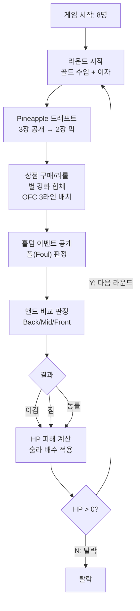
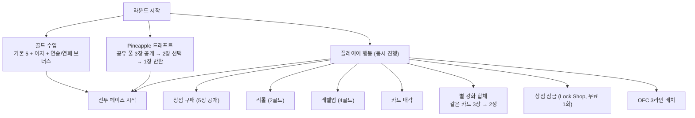
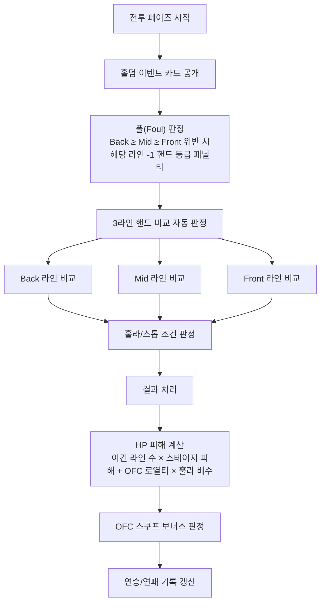
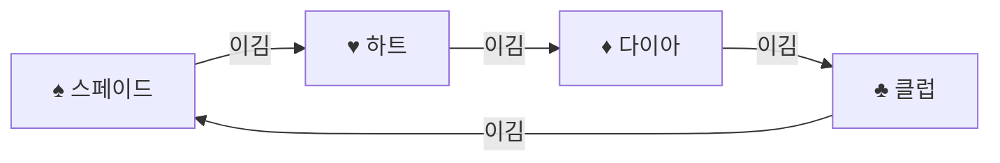
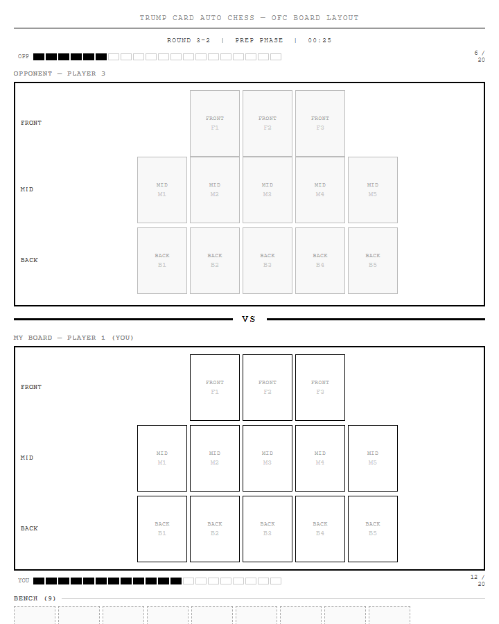
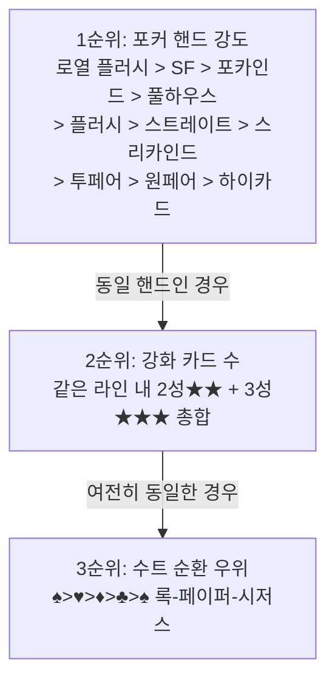

# Trump Card Auto Chess — PRD v4.0

**버전**: 4.0.0
**작성일**: 2026-02-19
**상태**: Draft v4 (TFT Backbone 전면 재설계, 공유 풀 + 수트 합성)
**작성자**: Product Team

---

## 1. 제품 개요

### 1.1 비전

> **"52장 공유 풀 경쟁 × TFT 경제 + 증강체 — 수트 전략(합성+시너지 통합)으로 OFC 3라인을 완성하고, 훌라 배수 선언으로 ×8 역전을 완성하는 8인 Card Auto Chess."**

v3.0은 TFT(Teamfight Tactics)의 경제·강화 시스템을 핵심 골격으로 삼고, OFC 3라인 배치 전략과 훌라 배수 선언을 레이어로 결합한다. 플레이어는 골드를 관리하며 카드를 구매·강화하고, 3개 라인에 최강의 포커 핸드를 구성하여 상대를 이긴다.

**v2.0 대비 핵심 변경**:

| 항목 | v2.0 | v3.0 |
|------|------|------|
| 카드 강도 | 빅투 역전: 2가 특수 최강 | **표준 포커: A가 최강, 2가 최약** |
| 전투 방식 | 유닛 자동 전투 (ATK/DEF/HP) | **핸드 비교 판정 (포커 핸드 비교)** |
| 승리 조건 | 유닛 HP 소진 | **핸드 강도 > 강화 카드 수 > 수트 순환** |
| 수트 우위 | 선형: ♠ > ♥ > ♦ > ♣ | **순환: ♠>♥>♦>♣>♠ (록-페이퍼-시저스)** |
| 별 강화 | 같은 랭크+수트 3장 → 2성 | **같은 랭크 3장 (수트 무관) → 2성** |
| 경제 핵심 | 다중 보너스 레이어 | **TFT 표준: 기본 5골드 + 이자 시스템** |
| 빅투 시스템 | 봄, 패스, 강도역전 존재 | **완전 제거** |

**v3.0 대비 핵심 변경**:

| 항목 | v3.0 | v4.0 |
|------|------|------|
| 합성 기준 | 같은 랭크 (수트 무관) | **같은 카드 (랭크+수트 동일)** |
| 카드 풀 | 미정의 | **52종×n장 공유 풀 (등급별 차등)** |
| 수트 역할 | 시너지 부가 효과 | **합성+시너지 통합 핵심 전략 축** |
| 증강체 | 없음 | **마일스톤 라운드 3회 Silver/Gold/Prismatic** |
| 아이템 | 황금 카드만 | **파츠 3종 → 조합 아이템 6종** |
| 상점 잠금 | 없음 | **무료 Lock Shop (라운드당 1회)** |
| OFC 폴 패널티 | 해당 라인 -2등급 | **-1등급 (접근성 개선)** |
| 훌라 조건 | 전 유닛 시너지 완성 | **배치 카드 중 3개 이상 시너지 활성화** |

### 1.2 핵심 가치 제안

| 기둥 | 설명 | 기존 TFT 대비 차이 |
|------|------|-----------------|
| **친숙함** | 누구나 아는 트럼프 카드 52장 | TFT는 LoL IP 필요, 러닝 커브 높음 |
| **OFC 3라인 배치** | Front/Mid/Back 3줄 핸드 제약 전략 | TFT는 단일 보드 자유 배치 |
| **별 강화 전략** | 같은 카드(랭크+수트 동일) 3장 → 강화. 수트 선택이 합성+시너지의 통합 전략 축 | TFT 3성 시스템의 카드 게임 버전 |
| **홀덤 이벤트** | 플롭/턴/리버 전장 이벤트 | 고정 메타 없이 매 게임 동적 변화 |
| **훌라 배수** | 훌라(×4) / 스톱(×8) 역전극 연출 | PvP 극적 역전 메커니즘 |
| **순환 수트** | ♠>♥>♦>♣>♠ 록-페이퍼-시저스 / 합성-시너지 일치로 수트 올인 전략 핵심화 | 특정 수트 절대 우위 없음 |
| **공유 풀 경쟁** | 52종×n장 공유 풀 — 동일 카드 경쟁으로 드래프트 긴장감 | TFT 3성 경쟁의 카드 게임 버전 |
| **증강체/아이템** | 마일스톤마다 Silver/Gold/Prismatic 증강체 선택 | TFT 증강체 시스템 계승 |

### 1.3 타겟 유저

| 세그먼트 | 설명 | 획득 채널 |
|----------|------|----------|
| **Primary** | 25~40세, 포커/OFC + TFT 경험자 | Steam, Reddit, 디스코드 |
| **Secondary** | 오토체스 입문자, 트럼프 카드 친숙 유저 | Mobile App Store |
| **Tertiary** | 스트리머/콘텐츠 크리에이터 | Twitch/YouTube |

### 1.4 경쟁 분석

| 게임 | 강점 | 약점 | Trump Card v4.0 차별점 |
|------|------|------|----------------------|
| **TFT (Set 16)** | IP, 밸런싱, 컨텐츠 규모 | 높은 복잡도, IP 종속 | OFC 3라인 + 훌라 배수 선언 + 수트 합성 전략 |
| **오토체스** | 순수 전략, 단순 학습 곡선 | 직관성 부족 | 트럼프 카드 포커 핸드 + 공유 풀 경쟁 |
| **Balatro** | 포커 핸드 멀티플라이어 | 솔로 로그라이크 | PvP 오토체스 + 증강체 + 멀티플레이 |
| **OFC 앱** | OFC 순수 팬 | 경제 시스템 없음 | TFT 경제 + 별 강화 + 증강체 시스템 |

---

## 2. 게임 컨셉

### 2.1 한 줄 요약

> **"52장 트럼프 덱으로 OFC 3라인 핸드를 구성하고, TFT 경제로 카드를 강화하며, 훌라 선언으로 ×8 역전을 완성하는 8인 Card Auto Chess."**

### 2.2 장르 정의

- **장르**: Card Auto Chess (카드 오토체스) + OFC Strategy + PvP
- **플레이 타임**: 25~40분 / 게임
- **플랫폼**: PC (Steam) → Mobile (Phase 2)
- **멀티플레이어**: 8인 동시 PvP (비동기 판정)

### 2.3 핵심 메커니즘 5가지

1. **카드 = 유닛 (52장 덱, A 최강)**: 순수 52장 덱. 수트(♠♥♦♣)가 시너지를 결정하고, 랭크(2~A)가 등급을 결정. A가 절대 최강, 2가 최약 (표준 포커 규칙).

2. **OFC 3라인 핸드 배치 전략**: Front(3칸) / Mid(5칸) / Back(5칸) 3줄에 카드 배치. Back ≥ Mid ≥ Front 핸드 강도 유지 의무. 위반 시 폴(Foul) 패널티.

3. **TFT 경제 + 별 강화**: 라운드마다 골드 획득, 보유 골드 10마다 이자 +1(최대 5). 같은 카드(랭크+수트 동일) 3장 → 2성 강화, 2성 3장 → 3성 강화(최대). ♠ 전략은 ♠ 카드 합성+시너지 동시 달성.

4. **포커 핸드 비교 판정**: 전투 = 라인별 포커 핸드 자동 비교. 강한 핸드가 이김. 동일 핸드 → 강화 카드(2성+3성) 수 비교. 동일 시 수트 순환 우위.

5. **훌라 배수 선언 + 홀덤 이벤트**: 배치 카드 중 3개 이상 시너지 활성화 시 훌라(×4) 선언 가능. 스톱 조건 달성 시 ×8. 매 라운드 플롭/턴/리버 공유 이벤트 적용.

6. **공유 풀 경쟁 + 증강체 시스템**: 8인이 52종×n장 공유 풀을 경쟁하며 카드를 구매. 마일스톤 라운드(2-4, 4-6, 6-4)마다 Silver/Gold/Prismatic 증강체 선택으로 플레이 스타일 특화.

### 2.4 핵심 게임 루프



---

## 3. 코어 게임 루프

### 3.1 라운드 구조 (스테이지별)

| 스테이지 | 라운드 | 타입 | 특이사항 |
|---------|--------|------|---------|
| 1 | 1-1, 1-2, 1-3 | PvE 크리프 | 튜토리얼, 기본 규칙 학습 |
| 1 | 1-4 | **캐러셀** | 강화 카드 선택 |
| 2 | 2-1 ~ 2-3 | PvP | 으뜸패 첫 로테이션 (2-3) |
| 2 | 2-4 | **PvE 크리프 + Silver 증강체** | Silver 증강체 3개 중 1개 선택 |
| 2 | 2-5 ~ 2-6 | PvP | - |
| 3 | 3-1 ~ 3-5 | PvP | 으뜸패 2차 로테이션 (3-3) |
| 3 | 3-6 | **크리프 보스** | 강화 아이템 드롭 |
| 4 | 4-1 ~ 4-5 | PvP | 수트 전쟁 이벤트 (4-3), 훌라 선언 개방 |
| 4 | 4-6 | **크리프 보스 + Gold 증강체** | Gold 증강체 3개 중 1개 선택 + 아이템 파츠 2개 드롭 |
| 5 | 5-1 ~ 5-5 | PvP | 로우볼 역전 라운드 (5-2), 판타지랜드 (5-4) |
| 5 | 5-6 | **보스 크리프** | 강화 아이템 드롭 |
| 6 | 6-1 ~ 6-3 | PvP | 최후 생존전, 스톱 선언 가능 |
| 6 | 6-4 | **크리프 보스 + Prismatic 증강체** | Prismatic 증강체 3개 중 1개 선택 |
| 7+ | 계속 | PvP | 최후 결전 |

### 3.2 준비 페이즈 (35초)



### 3.3 전투 페이즈 (자동 판정)



### 3.4 특수 라운드

| 라운드 | 타입 | 보상 | 특이사항 |
|--------|------|------|---------|
| 크리프 1-1~1-3 | PvE | 골드 2~3 | 체력(포커 핸드) 200~400, 튜토리얼 |
| 크리프 일반 | PvE | 골드 3~5 + 카드 1장 | 크리프 핸드와 비교 |
| 보스 크리프 | PvE | 골드 5~8 + 강화 카드 | 고강도 크리프 핸드 |
| 캐러셀 | 특수 | 강화 카드 1장 선택 | HP 낮은 순 선택 |
| 수트 전쟁 (4-3) | 이벤트 | 골드 5 + 강화 카드 | 2v2 팀 핸드 전투 |
| 로우볼 역전 | 이벤트 | 골드 3 + OFC 로열티 | 낮은 핸드가 강한 핸드를 이김 |
| 판타지랜드 | 이벤트 | 13장 드래프트 특권 | Front 라인 QQ+ 달성 시 진입 |

---

## 4. 카드 시스템 (52장)

### 4.1 카드 구성

| 구성 | 수량 | 설명 |
|------|------|------|
| ♠ 스페이드 | 13장 | 랭크 2~A |
| ♥ 하트 | 13장 | 랭크 2~A |
| ♦ 다이아몬드 | 13장 | 랭크 2~A |
| ♣ 클럽 | 13장 | 랭크 2~A |
| **합계** | **52장** | 조커 없음 |

**공유 풀 크기 (랭크별 복사본)**:

| 랭크 구간 | 유닛 등급 | 풀당 복사본 | 근거 |
|----------|-----------|-----------|------|
| 2, 3, 4, 5 | 일반 (Common) | 40장 | 초반 안정성 |
| 6, 7, 8 | 정예 (Rare) | 24장 | 중반 경쟁 |
| 9, 10, J | 엘리트 (Epic) | 16장 | 희소성 유지 |
| Q, K | 영웅 (Legendary) | 8장 | 2~3명만 보유 |
| A | 전설 (Mythic) | 4장 | 0~1명 3성 |

### 4.2 수트 시스템 — 순환 우위 + 시너지

**수트 순환 우위 (록-페이퍼-시저스)**:



| 수트 | 이기는 상대 | 지는 상대 | 시너지 테마 |
|------|----------|---------|-----------|
| ♠ 스페이드 | ♥ 하트 | ♣ 클럽 | 전사/방어 |
| ♥ 하트 | ♦ 다이아 | ♠ 스페이드 | 치유/생명 |
| ♦ 다이아 | ♣ 클럽 | ♥ 하트 | 마법/지식 |
| ♣ 클럽 | ♠ 스페이드 | ♦ 다이아 | 자연/속도 |

**수트 런 시너지**:

| 수트 | 런 시너지 (같은 수트 3장+ 배치) | 효과 |
|------|--------------------------|------|
| ♠ 런 | 연속 3장+ | 비교 판정 시 핸드 강도 +0.5 보정 |
| ♥ 런 | 연속 3장+ | 동률 판정 시 회복 요소 우선 적용 |
| ♦ 런 | 연속 3장+ | 홀덤 이벤트 효과 +10% 추가 |
| ♣ 런 | 연속 3장+ | 다음 라운드 드래프트 카드 +1장 추가 공개 |

### 4.3 랭크별 카드 등급 (표준 포커 강도 — A 최강)

| 랭크 | 등급 | 코스트 | 기본 핸드 기여 | 특이사항 |
|------|------|--------|------------|---------|
| A | 전설 (Mythic) | 5골드 | 최고 하이카드, 로열 플러시 구성 | 전설 궁극기 보유 |
| K | 영웅 (Legendary) | 4골드 | 높은 하이카드 | 영웅 스킬 보유 |
| Q | 영웅 (Legendary) | 4골드 | 높은 하이카드 | 영웅 스킬 보유, 판타지랜드 연동 |
| J | 엘리트 (Epic) | 3골드 | 중상위 하이카드 | 영웅 스킬 보유 |
| 10 | 엘리트 (Epic) | 3골드 | 중상위 | 로열 플러시 구성 핵심 |
| 9 | 엘리트 (Epic) | 3골드 | 중상위 | - |
| 8 | 정예 (Rare) | 2골드 | 중간 | - |
| 7 | 정예 (Rare) | 2골드 | 중간 | **7 특권**: 단독 시너지 카운트 +1 |
| 6 | 정예 (Rare) | 2골드 | 중간 | - |
| 5 | 일반 (Common) | 1골드 | 하위 | - |
| 4 | 일반 (Common) | 1골드 | 하위 | - |
| 3 | 일반 (Common) | 1골드 | 하위 | - |
| 2 | 일반 (Common) | 1골드 | **최약** | 표준 포커 최약 카드 |

**카드 강도 순서 (약 → 강)**:
```
2 < 3 < 4 < 5 < 6 < 7 < 8 < 9 < 10 < J < Q < K < A
```

### 4.4 페이스 카드 특수 능력 (J/Q/K/A)

페이스 카드는 핸드 비교 판정 시 추가 보정을 부여한다.

#### 잭(J) — 유연함
| 수트 | 유닛명 | 특수 보정 |
|------|--------|---------|
| ♠J | 흑기사 | 스트레이트 완성 시 Back 라인 핸드 강도 +0.5 |
| ♥J | 성기사 | 동률 판정 시 Front 라인 우선 이김 |
| ♦J | 마법사 도제 | 플러시 완성 시 Mid 라인 핸드 강도 +0.5 |
| ♣J | 야수 사냥꾼 | 동률 시 강화 카드 수 +1 보정 |

#### 퀸(Q) — 지원
| 수트 | 유닛명 | 특수 보정 |
|------|--------|---------|
| ♠Q | 어둠의 여왕 | 폴(Foul) 발생 시 패널티 경감 (-50%) |
| ♥Q | 치유의 여왕 | 판타지랜드 진입 후 2성 카드 1장 자동 생성 |
| ♦Q | 수정의 여왕 | 홀덤 이벤트 효과 추가 +10% |
| ♣Q | 폭풍 여왕 | 드래프트 시 카드 1장 추가 공개 |

#### 킹(K) — 지휘관
| 수트 | 유닛명 | 특수 보정 |
|------|--------|---------|
| ♠K | 암흑 군주 | 이긴 라인 수에 +0.5 추가 피해 기여 |
| ♥K | 성왕 | 연패 시 HP 피해 -10% |
| ♦K | 현자왕 | 이자 계산 시 골드 +2 보정 |
| ♣K | 야생왕 | ♣ 시너지 달성 1단계 추가 |

#### 에이스(A) — 전설
| 수트 | 유닛명 | 특수 보정 |
|------|--------|---------|
| ♠A | 죽음의 기사 | 3성일 때 모든 라인 판정에서 하이카드 최강 처리 |
| ♥A | 생명의 성녀 | 훌라 선언 시 배수 +0.5 (×4.5 효과) |
| ♦A | 마법 대현자 | 스트레이트 플러시 달성 시 OFC 로열티 2배 |
| ♣A | 자연의 화신 | 로우볼 역전 라운드에서 모든 수트 순환 우위 무시 |

### 4.5 공유 카드 풀 시스템 (신규 — TFT 핵심 메커니즘)

8명의 플레이어가 하나의 카드 풀을 공유합니다. 카드를 먼저 사는 플레이어가 유리하므로, 상점 타이밍과 리롤 결정이 핵심 전략입니다.

#### 4.5.1 풀 구조

| 등급 | 랭크 | 장당 복사본(n장) | 총 카드 수 |
|------|------|----------------|----------|
| Common | 2, 3, 4 | 29장 | 4수트×3랭크×29 |
| Rare | 5, 6, 7 | 22장 | 4수트×3랭크×22 |
| Epic | 8, 9, 10 | 18장 | 4수트×3랭크×18 |
| Legendary | J, Q, K | 12장 | 4수트×3랭크×12 |
| Mythic | A | 10장 | 4수트×1랭크×10 |

**8명 기준 3성 달성 경쟁률:**
- Common (29장): 29 ÷ 9(합성에 필요한 원본) ≈ 3.2명이 3성 가능 → 경쟁 있지만 여유
- Legendary (12장): 12 ÷ 9 ≈ 1.3명만 3성 가능 → 치열한 경쟁
- Mythic A (10장): 10 ÷ 9 ≈ 1.1명만 3성 가능 → 극한 경쟁 (게임당 사실상 1명만)

#### 4.5.2 상점 드로우 메커니즘

- 매 라운드 준비 페이즈 시작 시 풀에서 무작위 5장 드로우하여 상점에 공개
- 드로우 확률은 플레이어 레벨에 따라 등급별 가중치 조정 (§10.6 확률 표 참조)
- 이미 플레이어 보드/벤치에 있는 카드와 동일한 종류도 풀에서 정상 드로우됨
- 다른 플레이어가 구매한 카드는 해당 플레이어가 매각하기 전까지 풀에서 제거

#### 4.5.3 풀 반환 규칙

| 행동 | 풀 반환 |
|------|---------|
| 1성 카드 매각 | 1장 즉시 반환 |
| 2성 카드 매각 | 1장만 반환 (나머지 2장 소실) |
| 3성 카드 매각 | 1장만 반환 (나머지 8장 소실) |
| 합성 완료 | 반환 없음 (원본 3장은 2성 유닛으로 변환) |

#### 4.5.4 풀 고갈 처리

- 특정 카드가 풀에 0장 남을 경우 상점에 절대 등장 불가
- 다른 플레이어가 매각하거나 게임 리셋 없이는 획득 불가
- **전략적 함의**: 상대가 ♠K를 먼저 구매하면 나의 ♠K 3성이 불가능해질 수 있음 → 상대 상점 관찰 중요

#### 4.5.5 투명성 규칙

- 각 플레이어는 풀에 몇 장이 남았는지 확인 가능 (예: "♠K: 3장 남음")
- 다른 플레이어의 보드/벤치는 경기 중 공개 (TFT 동일)
- 이를 통해 플레이어는 경쟁 여부를 판단하고 전략을 수정 가능

### 4.6 Pineapple 드래프트

| 항목 | 내용 |
|------|------|
| 드래프트 시점 | 매 라운드 준비 페이즈 시작 시 |
| 제시 카드 수 | 공유 풀에서 3장 공개 |
| 선택 | 2장 선택, 1장 버리기 (공유 풀 반환) |
| 판타지랜드 예외 | Front 라인 QQ+ 달성 시 다음 라운드 13장 동시 공개 |

---

## 5. 시너지 시스템

### 5.1 레이어 1: 수트 시너지 — 순환 우위 반영

수트 시너지는 배치된 카드 수에 따라 단계별 효과 적용. **순환 우위**가 시너지 충돌 시 최종 판정에 반영.

**수트 시너지 효과 (3단계)**:

| 수트 | 1단계 (2~3장) | 2단계 (4~5장) | 3단계 (6장+) |
|------|------------|------------|-----------|
| ♠ 전사 | DEF 보정 +15% | DEF +30%, 핸드 비교 방어 | DEF +50%, 동률 시 자동 승리 |
| ♥ 치유 | 강화 카드 효과 +10% | 강화 카드 효과 +20%, 손실 HP 1 회복 | 강화 카드 효과 +35%, 손실 HP 3 회복 |
| ♦ 마법 | 홀덤 이벤트 효과 +10% | 홀덤 이벤트 효과 +20%, 추가 공개 | 홀덤 이벤트 효과 +30%, 카드 1장 추가 |
| ♣ 사냥 | 드래프트 우선권 +1 | 드래프트 우선권 +1, 리롤 비용 -1 | 드래프트 우선권 +2, 리롤 무료 |

**순환 우위와 시너지 충돌 처리**:
- 동일 핸드 + 동일 강화 카드 수 → 수트 순환 우위 (♠>♥>♦>♣>♠)
- 혼합 수트 배치 시: 가장 많이 보유한 수트 기준
- 동수 수트: 더 높은 랭크 카드가 속한 수트 기준

### 5.2 레이어 2: 포커 핸드 시너지 — 9종

배치된 카드들의 랭크와 수트 조합으로 자동 판정.

| 포커 핸드 | 조건 | 핸드 강도 점수 | 보너스 효과 |
|----------|------|------------|-----------|
| **하이카드** | 배치에 A 카드 존재 | 1 | A 카드 강화 효과 +10% |
| **원페어** | 같은 랭크 2장 | 2 | 해당 랭크 강화 효과 +15% |
| **투페어** | 다른 랭크 페어 2쌍 | 3 | 두 페어 강화 효과 +20% |
| **스리카인드** | 같은 랭크 3장 | 4 | 자동 2성 강화 + OFC 로열티 보너스 |
| **스트레이트** | 연속 랭크 5장 | 5 | 이긴 라인 추가 피해 +1 |
| **플러시** | 같은 수트 5장+ | 6 | 해당 수트 시너지 1단계 추가 |
| **풀하우스** | 스리카인드 + 원페어 | 7 | 강화 카드 효과 +30% |
| **포카인드** | 같은 랭크 4장 | 8 | 3성 자동 달성 조건 충족 + OFC 로열티 최대 |
| **스트레이트 플러시** | 같은 수트 연속 5장 | 9 | 훌라 선언 조건 자동 충족 + 이긴 라인 피해 +2 |
| **로열 플러시** | 같은 수트 10-J-Q-K-A | 10 | 해당 라운드 OFC 로열티 최대 + 상대 HP -10 직접 피해 |

### 5.3 레이어 3: OFC 3라인 시너지 — Front/Mid/Back 라인별

| 라인 | OFC 명칭 | 배치 슬롯 | 핸드 강도 제약 | 로열티 보너스 |
|------|---------|---------|------------|------------|
| **Back** | Bottom | 5칸 | 가장 강한 핸드 | 스트레이트~로열 플러시 |
| **Mid** | Middle | 5칸 | Back보다 약하거나 같음 | 스리카인드~플러시 |
| **Front** | Top | 3칸 | Mid보다 약하거나 같음 | 페어~스트레이트 |

### 5.4 으뜸패(Trump Suit) 로테이션

매 3라운드마다 랜덤으로 1개 수트가 "으뜸패"로 지정. 해당 수트 카드 핸드 강도 +25% 보정.

| 라운드 | 으뜸패 발표 | 지속 | 효과 |
|--------|-----------|------|------|
| 2-3 | 시작 15초 전 공개 | 해당 라운드 | 해당 수트 핸드 강도 × 1.25 |
| 3-3 이후 | 동일 | 해당 라운드 | 동일 |

**안티 스노우볼**: 직전 으뜸패 수트 재선택 불가.

### 5.5 7 특권 (Seven Privilege)

**7 랭크 카드는 단독으로도 시너지 카운트 1을 적용한다.**

| 조건 | 효과 |
|------|------|
| 수트별 7 카드 1장 배치 | 해당 수트 시너지 카운트 +1 |
| 수트별 7 카드 2장 배치 | 해당 수트 시너지 카운트 +2 |
| 7 스리카인드 달성 | 훌라 세트 카운트 +2 |

### 5.6 랭크 그룹 특성 (신규)

랭크 그룹은 수트 무관하게 카운트됩니다. 예: ♠7 + ♥8 + ♦9 = 미드넘버 3종 + 하이넘버 2종 각각 별도 계산.

#### 로얄 그룹 (J, Q, K, A) — 영웅/전설급 집중 전략

| 활성 조건 | 효과 |
|----------|------|
| 2종류 이상 | Legendary+ 상점 드롭률 +5% |
| 3종류 이상 | 별 강화 합성 1장 절감 (3장→2장, 2성 한정) |
| 4종류 모두 | 매 라운드 골드 +1 (영구) |

#### 하이넘버 그룹 (8, 9, 10) — 경제 중심 전략

| 활성 조건 | 효과 |
|----------|------|
| 2종류 이상 | 이자 수입 +1 |
| 3종류 모두 | 레벨업 비용 -1골드 |

#### 미드넘버 그룹 (5, 6, 7) — 드래프트 전략

| 활성 조건 | 효과 |
|----------|------|
| 2종류 이상 | 상점 공개 +1장 (Pineapple 효과) |
| 3종류 모두 | 인터럽트 추가 +1회/라운드 (최대 3회) |

#### 로우넘버 그룹 (2, 3, 4) — 리롤/매각 전략

| 활성 조건 | 효과 |
|----------|------|
| 2종류 이상 | 리롤 비용 -1골드 (최소 1골드) |
| 3종류 모두 | 카드 매각가 +1골드 |

---

### 5.7 증강체 시스템 (신규 — TFT 증강체 계승)

마일스톤 크리프 라운드마다 3개 옵션 중 1개를 선택합니다. 증강체는 게임 종료 시까지 영구 적용됩니다.

#### 증강체 획득 타이밍

| 라운드 | 등급 | 보상 |
|--------|------|------|
| 2-4 크리프 | Silver | 증강체 3개 중 1개 선택 |
| 4-6 크리프 보스 | Gold | 증강체 3개 중 1개 선택 + 아이템 파츠 2개 드롭 |
| 6-4 크리프 보스 | Prismatic | 증강체 3개 중 1개 선택 |

#### Silver 증강체 예시 (15종 중 3개 랜덤 제시)

| 이름 | 효과 |
|------|------|
| 수트의 신비 | 선택한 수트 1개 시너지 카운트 +1 (영구) |
| 경제학자 | 이자 수입 상한 5→6골드 |
| 훌라 연습생 | 훌라 선언 실패 시 패널티 제거 (1회) |
| 행운의 상점 | 매 라운드 상점 공개 +1장 (5→6장) |
| 빠른 손 | 라운드당 리롤 무료 1회 추가 |

#### Gold 증강체 예시 (10종 중 3개 랜덤 제시)

| 이름 | 효과 |
|------|------|
| 별의 가속 | 이번 게임 3성 달성 시 복제본 1장 생성 (풀 외) |
| 슈퍼 이자 | 이자 수입 ×2 |
| 폴 면제 | OFC 폴 판정 영구 무효 |
| 수트 마스터 | 선택한 수트 시너지 최고 단계 항상 활성화 |

#### Prismatic 증강체 예시 (5종 중 3개 랜덤 제시)

| 이름 | 효과 |
|------|------|
| 황금 상점 | 매 라운드 황금 카드 1장 보장 등장 |
| 시간 왜곡 | 준비 페이즈 +15초 (35→50초) |
| 무적의 수트 | 선택한 수트 카드 매각가 2배 + 풀 반환 시 2장 반환 |

---

### 5.8 시너지 발동 조건 통합표

| 시너지 | 1단계 | 2단계 | 3단계 |
|--------|-------|-------|-------|
| ♠ 전사 | 2장 (7 특권 포함) | 4장 | 6장 |
| ♥ 치유 | 2장 (7 특권 포함) | 4장 | 6장 |
| ♦ 마법 | 2장 (7 특권 포함) | 4장 | 6장 |
| ♣ 사냥 | 2장 (7 특권 포함) | 4장 | 6장 |
| 훌라 세트 | 스리카인드 1개 | 스리카인드 2개 | 스리카인드 3개+ |
| 훌라 런 | 스트레이트/플러시 1개 | 2개 | 3개+ |
| OFC 로열티 | 라인 핸드 달성 시 | - | 스쿠프 보너스 |
| 으뜸패 | 해당 수트 보유 | - | - |
| 7 특권 | 7 카드 1장 | 7 카드 2장 | 7 스리카인드 |

---

## 6. OFC 3라인 배치 시스템

### 6.1 3라인 구조



> 전체 인터랙티브 목업: [ofc-board.html](../mockups/ofc-board.html)

### 6.2 라인 강도 제약 — Back ≥ Mid ≥ Front

| 라인 조합 | 판정 | 설명 |
|---------|------|------|
| Back=플러시, Mid=스트레이트, Front=원페어 | **정상** | Back > Mid > Front |
| Back=스트레이트, Mid=플러시, Front=원페어 | **폴(Foul)** | Mid > Back 위반 |
| Back=스리카인드, Mid=스리카인드, Front=원페어 | **정상** | 동률 허용 |
| Back=원페어, Mid=원페어, Front=스리카인드 | **폴(Foul)** | Front > Mid 위반 |

**핸드 강도 순서 (약 → 강)**:
```
하이카드 < 원페어 < 투페어 < 스리카인드 < 스트레이트 < 플러시
< 풀하우스 < 포카인드 < 스트레이트 플러시 < 로열 플러시
```

### 6.3 폴(Foul) 패널티

| 조건 | 패널티 |
|------|--------|
| 라인 강도 역전 발생 | 해당 라인 핸드 강도 -1등급 패널티 (TFT 신규 유저 접근성 개선) (판정 시) |
| 폴 상태 + 패배 | OFC 로열티 해당 라인 무효 + 추가 HP 피해 +1 |

**폴 방지 전략**:
- Back에 가장 강한 핸드 우선 구성
- Pineapple 버리기 시 폴 위험 카드 우선 버리기
- 판타지랜드 진입 시 폴 자동 면제

### 6.4 스쿠프(Scoop) 보너스

**스쿠프**: 3라인(Front/Mid/Back) 모두에서 상대를 이기는 경우 추가 보너스.

| 스쿠프 결과 | 보너스 |
|-----------|--------|
| 3라인 전승 | OFC 로열티 +6점 추가 |
| 3라인 전승 + 훌라 선언 중 | OFC 로열티 +6점 + 훌라 배수 중첩 |
| 상대 폴 상태에서 스쿠프 | OFC 로열티 +9점 |

### 6.5 로열티(Royalty) 시스템

**Back 라인 로열티** (3단계 단순화):
| 구간 | 핸드 예시 | 로열티 포인트 |
|------|---------|------------|
| 강 (SF+) | 스트레이트 플러시, 로열 플러시 | +15pt |
| 중 (Flush/Full House) | 플러시, 풀하우스 | +6pt |
| 약 (Straight) | 스트레이트 | +2pt |

**Mid 라인 로열티** (3단계 단순화):
| 구간 | 핸드 예시 | 로열티 포인트 |
|------|---------|------------|
| 강 (Full House+) | 풀하우스, 포카인드 이상 | +10pt |
| 중 (Flush) | 플러시 | +5pt |
| 약 (Straight) | 스트레이트 | +2pt |

**Front 라인 로열티** (3칸 제약, 3단계 단순화):
| 구간 | 핸드 예시 | 로열티 포인트 | 비고 |
|------|---------|------------|------|
| 강 (Three of a Kind) | 스리카인드 | +20pt | 극히 희귀 |
| 중 (AA+) | AA 원페어 이상 | +8pt | - |
| 약 (KK) | KK 원페어 | +4pt | - |

**로열티 → HP 피해 환산**: 로열티 포인트 1점 = 추가 HP 피해 0.5

### 6.6 판타지랜드 진입 조건 및 효과

| 조건 | 내용 |
|------|------|
| **진입 조건** | Front 라인에서 QQ (퀸 원페어) 이상 달성 |
| **유지 조건** | 판타지랜드 중 스리카인드 이상 달성 시 다음 라운드 유지 |
| **진입 효과** | 다음 라운드 공유 풀에서 13장 동시 공개, 필요 카드 선택 후 나머지 반환 |
| **폴 면제** | 판타지랜드 진입 라운드 폴 판정 자동 면제 |

---

## 7. 카드 강도 & 수트 순환 시스템

### 7.1 표준 포커 강도 — A 절대 최강

v3.0은 빅투의 역전 개념을 완전 제거하고 표준 포커 강도를 채택한다.

**카드 강도 (약 → 강)**:
```
2 < 3 < 4 < 5 < 6 < 7 < 8 < 9 < 10 < J < Q < K < A
```

| 상황 | 판정 방식 |
|------|---------|
| 같은 핸드 동일 등급 비교 | 더 높은 랭크의 카드를 보유한 쪽 우위 |
| 포커 핸드 내 타이브레이커 | 표준 포커 규칙 (높은 랭크 우선) |
| 스트레이트 | A-2-3-4-5 (로우 스트레이트) 허용, A-K-Q-J-10 (하이) 최강 |

### 7.2 수트 순환 우위 (최종 타이브레이커)

**핸드 강도 동일 + 강화 카드 수 동일일 때만** 수트 순환 우위 적용.

```
♠ 스페이드 → ♥ 하트를 이김
♥ 하트     → ♦ 다이아를 이김
♦ 다이아   → ♣ 클럽을 이김
♣ 클럽     → ♠ 스페이드를 이김 (순환!)
```

**혼합 수트 배치 시 기준**:
1. 라인 내 가장 많이 보유한 수트
2. 동수 수트 시: 해당 라인에서 가장 높은 랭크 카드의 수트

**동일 수트 충돌**: 두 플레이어가 같은 기준 수트 → 더 높은 랭크의 카드를 보유한 쪽 승리

### 7.3 잔류 카드 패널티

전투 패배 시 상대방 배치 카드 수에 따라 추가 HP 피해 (OFC 잔류 패널티).

| 상대 배치 카드 수 | 추가 HP 피해 |
|--------------|-----------|
| 1~3장 | +1 |
| 4~6장 | +3 |
| 7~9장 | +6 |
| 10~13장 | +10 |

---

## 8. 홀덤 이벤트 시스템

### 8.1 공유 카드 이벤트 — 플롭/턴/리버 3단계

| 라운드 | 이벤트 단계 | 공개 카드 수 | 내용 |
|--------|-----------|-----------|------|
| 스테이지 X의 1번째 라운드 | 플롭 | 3장 동시 공개 | 전장 버프/디버프 3가지 동시 적용 |
| 스테이지 X의 2번째 라운드 | 턴 | 1장 추가 공개 | 추가 이벤트 1가지 발동 |
| 스테이지 X의 3번째 라운드 | 리버 | 1장 추가 공개 | 최종 이벤트 발동, 보상 결정 |

**이벤트 카드 풀**: 총 30종 (플롭 15종, 턴 10종, 리버 5종). §19.5 참조.

### 8.2 포지션 시스템 — 버튼 플레이어

| 포지션 | 조건 | 효과 |
|--------|------|------|
| **버튼 (Button)** | 직전 라운드 우승자 | 상대 Front 라인 배치 5초 먼저 공개 |
| **일반** | 그 외 | 표준 정보 |

**버튼 추가 혜택**: 홀덤 이벤트 카드 공개 시 원하는 카드 1장 "폴드" (효과 무효화) 가능.

### 8.3 블라인드 유지비

| 블라인드 단계 | 발동 조건 | 유지비 | 미납 패널티 |
|------------|---------|--------|-----------|
| 스몰 블라인드 | 스테이지 2 이후 | 매 라운드 1골드 | HP -2 |
| 빅 블라인드 | 스테이지 4 이후 | 매 라운드 2골드 | HP -4 |
| 슈퍼 블라인드 | 스테이지 6 이후 | 매 라운드 3골드 | HP -6 |

### 8.4 블러핑 시스템

| 정보 | 공개 대상 | 숨김 대상 |
|------|---------|---------|
| 벤치 카드 수 | 전체 공개 | - |
| 벤치 카드 수트 | 전체 공개 | - |
| 벤치 카드 랭크 | **비공개** | 모든 플레이어 |
| 보드 배치 (Front) | 전투 시작 후 공개 | 준비 페이즈 비공개 |

### 8.5 역전 라운드 — 로우볼

| 항목 | 내용 |
|------|------|
| 발동 조건 | 스테이지 5-2, 이후 3스테이지마다 1회 |
| 효과 | 핸드 강도 역전: 낮은 핸드가 강한 핸드를 이김 |
| 구체적 역전 | 하이카드 > 로열 플러시 (완전 역전) |
| OFC 연동 | 로우볼 라운드 중 낮은 핸드 달성 시 OFC 로열티 보너스 |
| 예고 | 해당 라운드 시작 20초 전 전체 공지 |

---

## 9. 훌라 보너스 시스템

### 9.1 훌라 선언 — ×4 배수

| 조건 | 내용 |
|------|------|
| **훌라 선언 조건** | 배치 카드 중 3개 이상 시너지 활성화 (수트 시너지 또는 랭크 그룹 특성 포함) |
| **효과** | 해당 라운드 HP 피해 × 4 배수 |
| **OFC 연동** | 훌라 선언 + 스쿠프(3라인 전승) = 로열티 +6 + ×4 배수 중첩 |
| **선언 시점** | 전투 시작 전 준비 페이즈 마지막 5초 내 선언 |
| **실패 패널티** | 조건 미충족 시 해당 라운드 OFC 로열티 -25% |

### 9.2 스톱 선언 — ×8 배수

| 스톱 타입 | 조건 | 효과 |
|---------|------|------|
| **로우 스톱** | 훌라 선언 중 + 상대 HP 10 이하 | HP 피해 × 8 |
| **하이 스톱** | 훌라 선언 중 + OFC 3라인 전승 (스쿠프) + 로열 플러시 달성 | HP 피해 × 8 + 로열티 최대 |

### 9.3 배수 시스템

| 배수 | 조건 | HP 피해 배율 |
|------|------|-----------|
| ×1 | 일반 전투 결과 | 기본 피해 공식 적용 |
| ×4 | 훌라 선언 성공 | 기본 피해 × 4 |
| ×8 | 스톱 선언 성공 | 기본 피해 × 8 |

**배수 중첩 규칙**:
- 스톱 선언 시 훌라 중첩 불가 (스톱이 최우선)
- OFC 로열티는 배수와 별도 덧셈으로 계산

---

## 10. 경제 시스템 (TFT 표준)

### 10.1 골드 수입 구조

| 수입 항목 | 기본값 | 조건 |
|---------|--------|------|
| **라운드 기본 수입** | **5골드** | 매 라운드 |
| **이자 수입** | 보유 골드 ÷ 10 (최대 5골드) | 라운드 시작 시 |
| 연승 보너스 | 연승 2 = +1, 3 = +1, 5+ = +3 | 누적 |
| 연패 보너스 | 연패 2 = +1, 3 = +1, 5+ = +3 | 캐치업 |
| PvE 크리프 | 3~8골드 | 크리프 라운드 |
| 카드 매각 | 구매 코스트와 동일 | 언제든지 |

### 10.2 이자 시스템 (TFT 동일)

`이자 = MIN(FLOOR(보유골드 / 10), 5)`

| 보유 골드 | 이자 |
|---------|------|
| 0~9 | 0 |
| 10~19 | +1 |
| 20~29 | +2 |
| 30~39 | +3 |
| 40~49 | +4 |
| 50+ | +5 (최대) |

**이자 전략 포인트**: 골드를 쓰지 않고 50골드 유지하면 매 라운드 +5골드 이자 획득.

### 10.3 블라인드 유지비

§8.3 참조. 스테이지 진행에 따라 강제 골드 소비.

### 10.4 카드 구매 비용

| 등급 | 코스트 | 해당 랭크 |
|------|--------|---------|
| 일반 (Common) | 1골드 | 2, 3, 4, 5 |
| 정예 (Rare) | 2골드 | 6, 7, 8 |
| 엘리트 (Epic) | 3골드 | 9, 10, J |
| 영웅 (Legendary) | 4골드 | Q, K |
| 전설 (Mythic) | 5골드 | A |

### 10.5 연승/연패 보너스

| 연속 결과 | 추가 골드 |
|---------|---------|
| 연승 2연속 | +1골드 |
| 연승 3연속 | +1골드 (누적 +2) |
| 연승 5연속+ | +3골드 (상한) |
| 연패 2연속 | +1골드 |
| 연패 3연속 | +1골드 (누적 +2) |
| 연패 5연속+ | +3골드 (상한) |

### 10.6 레벨업 및 상점 드롭 확률

**레벨업 비용**: 4골드 (XP 구매)

| 레벨 | XP 필요 | 배치 슬롯 | 1코스트 | 2코스트 | 3코스트 | 4코스트 | 5코스트 |
|------|--------|---------|--------|--------|--------|--------|--------|
| 1 | 0 | 1 | 75% | 20% | 5% | 0% | 0% |
| 2 | 2 | 2 | 75% | 20% | 5% | 0% | 0% |
| 3 | 6 | 3 | 55% | 30% | 15% | 0% | 0% |
| 4 | 10 | 4 | 55% | 30% | 15% | 0% | 0% |
| 5 | 20 | 5 | 35% | 35% | 25% | 5% | 0% |
| 6 | 36 | 6 | 20% | 35% | 30% | 14% | 1% |
| 7 | 56 | 7 | 15% | 25% | 35% | 20% | 5% |
| 8 | 80 | 8 | 10% | 15% | 35% | 30% | 10% |
| 9 | 100 | 9 | 5% | 10% | 25% | 35% | 25% |

### 10.7 상점 잠금 (Lock Shop) — 신규

현재 상점에 공개된 5장을 다음 라운드까지 보존하는 기능입니다.

| 항목 | 내용 |
|------|------|
| 비용 | 무료 |
| 제한 | 라운드당 1회 |
| 효과 | 현재 5장 카드를 다음 라운드 준비 페이즈까지 유지 |
| 풀 상태 | 잠긴 카드는 풀에서 제거된 상태 유지 (타 플레이어 드로우 불가) |
| UI | 상점 우측 하단 자물쇠 아이콘 클릭 |
| 해제 | 잠금 해제 시 카드 즉시 풀 반환 (타 플레이어 드로우 가능) |

**전략적 활용:**
- 원하는 카드를 구매 전 1라운드 "예약"하는 효과
- 상대방이 동일 카드를 구매하지 못하도록 차단 가능
- 다음 라운드 구매 확정 후 잠금 → 골드 절약 전략

---

## 11. 핸드 비교 판정 시스템 (전투 시스템)

### 11.1 판정 기본 규칙

전투는 유닛이 싸우는 자동 전투가 아니라 **포커 핸드 비교**로 즉시 판정된다.

```
전투 = 3라인 동시 핸드 비교 판정
       (Back vs Back, Mid vs Mid, Front vs Front)
```

**판정 3단계 우선순위**:



### 11.2 동일 핸드 비교 상세

**2순위 - 강화 카드 수 비교**:

| 상황 | 예시 | 판정 |
|------|------|------|
| 둘 다 플러시, A가 3성 1장 | A: ★★★×1 | A 승리 (강화 1장 > 0장) |
| 둘 다 스트레이트, 3성 동일 | A: ★★★×1, B: ★★★×1 | 2성 수 비교로 진행 |
| 2성+3성 합산 동일 | A: ★★★×1, B: ★★☆×2, ★ 외 | 3성 수 우선 (무거운 강화 우선) |

**강화 카드 우선순위**: 3성(★★★) > 2성(★★☆) > 1성(★☆☆)
동률 시: 3성 카드 수 → 2성 카드 수 → 수트 순환 우위 순서로 최종 판정

**3순위 - 수트 순환 우위 적용**:
- 해당 라인에서 가장 많이 보유한 수트 기준
- 동수 시: 라인에서 가장 높은 랭크 카드의 수트

### 11.3 라인별 판정 결과 처리

| 결과 | 이긴 플레이어 행동 |
|------|----------------|
| Back 이김 | Back 승리 카운트 +1 |
| Mid 이김 | Mid 승리 카운트 +1 |
| Front 이김 | Front 승리 카운트 +1 |
| 스쿠프 (3라인 전승) | OFC 로열티 +6 + HP 추가 피해 |

### 11.4 HP 피해 계산 공식

```
라운드 기본 피해 = 스테이지 번호 × 2 (최대 10)
잔류 패널티 = 상대 배치 카드 수에 따른 추가 피해 (§7.3 참조)
OFC 로열티 = 로열티 포인트 × 0.5
훌라 배수 = ×1 / ×4 / ×8 (§9.4 참조)

총 HP 피해 = (라운드 기본 피해 + 잔류 패널티 + OFC 로열티) × 훌라 배수
```

**예시 (스테이지 3, 훌라 ×4, 상대 8장 배치, 로열티 4점)**:
```
기본 피해 = 3 × 2 = 6
잔류 패널티 = +6 (7~9장)
OFC 로열티 = 4 × 0.5 = 2
소계 = 6 + 6 + 2 = 14
훌라 배수 = 14 × 4 = 56 HP 피해
```

### 11.5 폴(Foul) 패널티 판정

| 조건 | 패널티 효과 |
|------|----------|
| 라인 강도 역전 | 해당 라인 핸드 강도 -1단계 하향 (TFT 신규 유저 접근성 개선, 판정 시 적용) |
| 폴 라인 패배 | OFC 로열티 해당 라인 무효 |
| 폴 + 스쿠프 당함 | 추가 HP 피해 +2 |

---

## 12. 별 강화(Star) 시스템 (TFT 방식)

### 12.1 별 업그레이드 — 핵심 메커니즘

| 등급 | 표기 | 조건 | 스탯 변화 |
|------|------|------|---------|
| **1성** | ★☆☆ | 기본 카드 1장 | 기본 |
| **2성** | ★★☆ | **같은 카드 (랭크+수트 동일) 3장 합체** | × 2 |
| **3성** | ★★★ | **2성 카드 3장 합체** (원본 9장) | × 4 |

**핵심 규칙**:
- **같은 카드 (랭크+수트 동일)**: 예) ♠7 × 3 → ♠7 2성 (합체 수트는 원본 수트 그대로 유지)
- **합성 불가 예시**: ♠7 + ♥7 + ♦7 → 합성 불가 (수트가 다름)
- **올바른 합성 예시**: ♠7 × 3 → ♠7 2성 ✅ / ♥K × 3 → ♥K 2성 ✅
- 3성 달성 예시: ♠7 2성 × 3 (원본 ♠7 필요 수: 9장) → ♠7 3성
- 합성 후 수트 유지: 합성된 카드의 수트는 원본 수트 그대로 유지

**별 강화 스탯 배율**:
```
1성 기준 스탯을 S라 할 때:
2성: S × 2 (핸드 비교 판정 시 강화 카드 1장으로 카운트)
3성: S × 4 (핸드 비교 판정 시 강화 카드 1장으로 카운트, 우선순위 최상)
```

### 12.2 별 강화 전략

| 전략 유형 | 목표 | 활용 |
|---------|------|------|
| **스피드 강화** | 저코스트 카드(1골드) 9장 수집 → 3성 | 초반 강력한 핸드 구성 |
| **프리미엄 강화** | 고코스트 카드(4~5골드) 3장 수집 → 2성 | 영웅/전설급 2성 1장으로 핸드 승리 |
| **핸드 우선** | 강화 없이 포커 핸드 최적 구성 | 동률 회피, 핸드 강도로 압도 |
| **혼합** | 2성 2~3장 + 최적 핸드 | 표준 전략 |

### 12.3 황금 카드 (Special Variant)

| 항목 | 내용 |
|------|------|
| 황금 카드 획득 | 크리프 보상, 캐러셀, 특수 이벤트, 판타지랜드 보너스 |
| 황금 카드 효과 | 핸드 비교 시 강화 카드 효과 +0.5 (2성과 3성 사이의 가중치) |
| 황금 3성 | 강화 카드 중 최우선 판정 |
| 외형 | 황금 반짝임 이펙트 |

### 12.4 아이템 파츠 시스템 (신규)

#### 파츠 종류 및 획득

| 파츠 | 아이콘 | 획득처 |
|------|--------|--------|
| ATK (공격) | [ATK] | PvE 크리프 라운드, 캐러셀 |
| DEF (방어) | [DEF] | PvE 크리프 라운드, 캐러셀 |
| UTIL (유틸) | [UTIL] | Gold 증강체 보상, 특수 이벤트 |

#### 조합 아이템 표

| 파츠 조합 | 아이템명 | 효과 |
|---------|--------|------|
| ATK + ATK | 검의 날 | 해당 라인 핸드 강도 판정 +1 |
| DEF + DEF | 강철 방패 | OFC 폴 패널티 1회 면제 |
| UTIL + UTIL | 마법 렌즈 | 상점 리롤 시 +1장 추가 공개 |
| ATK + DEF | 균형의 검 | 수트 순환 판정 시 자동 승리 |
| ATK + UTIL | 마법 반지 | 별 강화 합성 시 1성 카드 1장 환급 |
| DEF + UTIL | 행운의 부적 | 이자 수입 +1 (영구) |

#### 장착 규칙

- 카드 1장에 아이템 최대 2개 장착
- 아이템은 1성/2성/3성 모두 장착 가능
- 카드 매각 시 파츠 회수 불가 (아이템 소멸)
- 합성 시 2성 카드에 아이템 이전 가능 (원본 카드 1개의 아이템만 유지, 나머지 소멸)

---

## 13. 매칭 및 생존

### 13.1 8인 대전 구조

- **참가**: 최대 8인 동시 진행
- **매칭**: 매 라운드 랜덤 상대 (같은 상대 3연속 금지)
- **Ghost 매칭**: 탈락 플레이어 마지막 배치로 생존자와 전투
- **관전**: 탈락 후 다른 플레이어 관전 가능

### 13.2 HP 시스템

- **시작 HP**: 100
- **탈락**: HP 0 이하
- **HP 회복 없음** (기본, 특수 이벤트 제외)

| 스테이지 | 예상 생존자 |
|---------|-----------|
| 스테이지 1 종료 | 8명 |
| 스테이지 2 종료 | 6~7명 |
| 스테이지 3 종료 | 4~5명 |
| 스테이지 4 종료 | 2~3명 |
| 스테이지 5+ | 1명 (우승) |

### 13.3 캐러셀

| 항목 | 내용 |
|------|------|
| 발동 시점 | 스테이지 1-4, 2-6, 4-6 이후 |
| 선택 순서 | HP 낮은 순부터 강화 카드 선택 |
| 제공 카드 | 황금 카드 또는 강화 효과 부여 카드 |

---

## 14. 특수 이벤트 시스템

### 14.1 플롭/턴/리버 이벤트 — 홀덤 기반

§8.1 및 §19.5 참조. 30종 이벤트 카드 (플롭 15종/턴 10종/리버 5종).

**이벤트 카드 예시**:
- 플롭: "혈맹의 밤" — ♥ 카드 핸드 비교 시 +0.5 강도 보정 (1라운드)
- 턴: "폭풍의 전조" — ♠ 카드 보유 시 잔류 패널티 +1
- 리버: "최후의 심판" — 가장 많은 카드를 보유한 플레이어 Back 라인 -1 핸드 등급

### 14.2 수트 전쟁

- **발동**: 스테이지 4-3
- **방식**: 생존 플레이어를 2팀(4명씩)으로 분류, 팀 최강 핸드로 4v4 비교
- **보상**: 승리 팀 전원 골드 5 + 강화 카드 1장
- **패배**: 패배 팀 전원 HP -10

### 14.3 데드맨즈 핸드 (♠A + ♣8)

- **조건**: 보드에 ♠A + ♣8 동시 배치
- **효과**: 해당 라인 핸드 비교 판정 시 +1 핸드 등급 보정, 단 매 라운드 후 HP -5
- **리스크/리워드**: 강력한 핸드 보정 vs 지속적 HP 손실

### 14.4 로우볼 역전 라운드

§8.5 참조. 낮은 핸드가 강한 핸드를 이기는 역전 라운드.

### 14.5 판타지랜드 라운드

§6.6 참조. Front 라인 QQ+ 달성 시 다음 라운드 13장 드래프트 특권.

### 14.6 로열 플러시 이벤트

- **조건**: 같은 수트 10-J-Q-K-A 5장 동시 배치
- **즉시 효과**: 해당 라운드 해당 라인 자동 승리 + 상대에게 10 HP 직접 피해
- **전체 공지**: "로열 플러시 달성!" 팝업

---

## 15. 밸런싱 전략

### 15.1 52장 풀 수량 설계

| 랭크 | 코스트 | 풀 복사본 | 설계 의도 |
|------|--------|---------|---------|
| 2, 3, 4, 5 (일반) | 1골드 | 40장 | 초반 구성 안정성, 3성 달성 현실적 |
| 6, 7, 8 (정예) | 2골드 | 24장 | 중반 경쟁, 7 특권 전략 경로 |
| 9, 10, J (엘리트) | 3골드 | 16장 | 희소성 유지 |
| Q, K (영웅) | 4골드 | 8장 | 8인 중 2~3명만 보유 가능 |
| A (전설) | 5골드 | 4장 | 게임당 0~1명 3성 달성 |

### 15.2 OFC 로열티 파워 커브

| 게임 단계 | 평균 로열티/라운드 | HP 기여 |
|---------|----------------|---------|
| 초반 (스테이지 1~2) | 0~4점 | HP 피해의 10% |
| 중반 (스테이지 3~4) | 4~12점 | HP 피해의 20% |
| 후반 (스테이지 5+) | 12~25점 | HP 피해의 30% |

### 15.3 훌라 배수 발동 빈도

**설계 목표**: 게임당 훌라 1~3회, 스톱 0~1회.

| 배수 이벤트 | 예상 발동 빈도 | 조절 방법 |
|-----------|-----------|---------|
| ×4 훌라 | 게임당 1~3회 | 훌라 선언 조건 난이도 |
| ×8 스톱 | 게임당 0~1회 | 스톱 조건 = 훌라 + 스쿠프 + 로열 플러시 |

### 15.4 수트 순환 밸런스

**설계 의도**: 특정 수트가 절대 강자가 되지 않도록 순환 구조 채택.

| 수트 | 시너지 특성 | 순환 관계 | 균형 설계 |
|------|----------|---------|---------|
| ♠ 전사 | 방어 특화 | ♥에 약함 | ♥ 치유로 극복 가능 |
| ♥ 치유 | 생존 특화 | ♦에 약함 | ♦ 마법으로 극복 가능 |
| ♦ 마법 | 이벤트 특화 | ♣에 약함 | ♣ 속도로 극복 가능 |
| ♣ 사냥 | 속도 특화 | ♠에 약함 | ♠ 방어로 극복 가능 |

### 15.5 별 강화 경제 균형

| 강화 등급 | 원본 카드 수 | 골드 투자 (1코스트 기준) | 핸드 기여 |
|---------|-----------|-------------------|---------|
| 2성 | 3장 | 3골드 | 강화 카드 +1 (×2 스탯) |
| 3성 | 9장 | 9골드 | 강화 카드 +1 (×4 스탯, 최우선) |
| 황금 3성 | 9장 + 황금 | 캐러셀/이벤트 보상 | 강화 카드 최상위 |

---

## 16. 기술 요구사항

### 16.1 플랫폼

| Phase | 플랫폼 | 목표 |
|-------|--------|------|
| MVP | PC (Steam, Windows/Mac) | 핵심 게임플레이 검증 |
| Phase 2 | Mobile (iOS/Android) | 유저 베이스 확장 |
| Phase 3 | 크로스 플랫폼 | 동일 서버 공유 |

### 16.2 기술 스택

| 영역 | 기술 | 이유 |
|------|------|------|
| **클라이언트** | Unity 2022 LTS (C#) | 멀티플랫폼, 2D/3D 혼용 |
| **서버** | Node.js + TypeScript | 실시간 WebSocket, 빠른 개발 |
| **DB** | PostgreSQL + Redis | 영구 데이터 + 게임 세션 인메모리 |
| **실시간** | WebSocket (Socket.io) | 저지연 상태 동기화 |
| **인프라** | AWS (ECS Fargate) | 가변 부하 대응 |

### 16.3 핵심 데이터 구조 (TypeScript)

```typescript
// 카드 기본 타입 (v3.0)
interface Card {
  id: string;           // "spade_7", "heart_ace"
  suit: 'spade' | 'heart' | 'diamond' | 'club';
  rank: 2 | 3 | 4 | 5 | 6 | 7 | 8 | 9 | 10 | 'J' | 'Q' | 'K' | 'A';
  tier: 'common' | 'rare' | 'epic' | 'legendary' | 'mythic';
  cost: 1 | 2 | 3 | 4 | 5;
  starLevel: 1 | 2 | 3;
  isGolden: boolean;
}

// OFC 3라인 보드
interface OFCBoard {
  back: (Card | null)[];   // 5칸
  mid: (Card | null)[];    // 5칸
  front: (Card | null)[];  // 3칸
}

// 훌라 상태
interface HulaState {
  isDeclared: boolean;
  isStop: boolean;
  multiplier: 1 | 4 | 8;
}

// 플레이어 상태
interface PlayerState {
  playerId: string;
  hp: number;
  gold: number;
  level: number;
  xp: number;
  board: OFCBoard;
  bench: (Card | null)[];  // 9칸
  shop: Card[];            // 5장
  winStreak: number;
  loseStreak: number;
  isFantasyland: boolean;
  hula: HulaState;
  royalty: OFCRoyalty;
}

// 수트 순환 우위 판정
type Suit = 'spade' | 'heart' | 'diamond' | 'club';
const SUIT_BEATS: Record<Suit, Suit> = {
  spade: 'heart',     // ♠ beats ♥
  heart: 'diamond',   // ♥ beats ♦
  diamond: 'club',    // ♦ beats ♣
  club: 'spade'       // ♣ beats ♠ (circular!)
};
```

### 16.4 핸드 비교 판정 알고리즘

```typescript
// 핸드 강도 평가 (0~9: 하이카드~로열플러시)
function evaluateHandStrength(cards: (Card | null)[]): number {
  const validCards = cards.filter(c => c !== null) as Card[];
  if (validCards.length === 0) return 0;
  return detectPokerHand(validCards); // 0~9 반환
}

// 강화 카드 수 계산
function countEnhancedCards(cards: (Card | null)[]): {
  star3: number; star2: number; total: number
} {
  const valid = cards.filter(c => c !== null) as Card[];
  const star3 = valid.filter(c => c.starLevel === 3).length;
  const star2 = valid.filter(c => c.starLevel === 2).length;
  return { star3, star2, total: star3 + star2 };
}

// 수트 순환 우위 판정
function getSuitAdvantage(cards: (Card | null)[]): Suit {
  const valid = cards.filter(c => c !== null) as Card[];
  const suitCount = { spade: 0, heart: 0, diamond: 0, club: 0 };
  valid.forEach(c => suitCount[c.suit]++);
  const maxCount = Math.max(...Object.values(suitCount));
  const dominant = (Object.entries(suitCount) as [Suit, number][])
    .filter(([, count]) => count === maxCount)
    .map(([suit]) => suit);
  if (dominant.length === 1) return dominant[0];
  // 동수: 가장 높은 랭크 카드의 수트
  return getHighestRankSuit(valid, dominant);
}

// 라인 비교 판정 (3단계 우선순위)
function compareLine(
  lineA: (Card | null)[],
  lineB: (Card | null)[]
): 'A' | 'B' | 'DRAW' {
  // 1순위: 핸드 강도
  const handA = evaluateHandStrength(lineA);
  const handB = evaluateHandStrength(lineB);
  if (handA !== handB) return handA > handB ? 'A' : 'B';

  // 2순위: 강화 카드 수
  const enhA = countEnhancedCards(lineA);
  const enhB = countEnhancedCards(lineB);
  if (enhA.star3 !== enhB.star3) return enhA.star3 > enhB.star3 ? 'A' : 'B';
  if (enhA.star2 !== enhB.star2) return enhA.star2 > enhB.star2 ? 'A' : 'B';

  // 3순위: 수트 순환 우위
  const suitA = getSuitAdvantage(lineA);
  const suitB = getSuitAdvantage(lineB);
  if (SUIT_BEATS[suitA] === suitB) return 'A';
  if (SUIT_BEATS[suitB] === suitA) return 'B';
  return 'DRAW';
}

// OFC 폴 판정
function checkFoul(board: OFCBoard): boolean {
  const backStrength = evaluateHandStrength(board.back);
  const midStrength = evaluateHandStrength(board.mid);
  const frontStrength = evaluateHandStrength(board.front);
  if (backStrength < midStrength) return true;
  if (midStrength < frontStrength) return true;
  return false;
}
```

---

## 17. MVP 스코프 v3.0

### 17.1 P0 — MVP 필수

| 기능 | 우선순위 | 설명 |
|------|---------|------|
| 코어 게임 루프 | P0 | 준비→판정→결과 사이클 |
| 카드 시스템 52장 | P0 | A 최강, 표준 포커 강도 |
| 수트 시너지 4종 | P0 | ♠♥♦♣ 각 3단계 |
| OFC 3라인 배치 | P0 | Front/Mid/Back + 폴 패널티 |
| 핸드 비교 판정 | P0 | 3단계 우선순위 (핸드>강화>수트순환) |
| 별 강화 시스템 | P0 | 1성→2성→3성 (같은 랭크 3장) |
| TFT 경제 | P0 | 기본 5골드 + 이자 + 연승/연패 |
| 상점 시스템 | P0 | 카드 구매, 리롤(2골드), 레벨업(4골드) |
| 훌라 선언 기본 | P0 | ×4 배수 |
| 수트 순환 우위 | P0 | ♠>♥>♦>♣>♠ |
| Pineapple 드래프트 | P0 | 3장 중 2장 선택 |
| 8인 매칭 | P0 | 단순 랜덤 매칭 |

### 17.2 P1 — 1차 확장

| 기능 | 우선순위 | 설명 |
|------|---------|------|
| 홀덤 이벤트 카드 | P1 | 플롭/턴/리버 30종 |
| 버튼 포지션 시스템 | P1 | 정보 우위 5초 선공개 |
| 판타지랜드 | P1 | 13장 드래프트 특권 |
| OFC 로열티 | P1 | 라인별 핸드 보너스 점수 |
| 스쿠프 보너스 | P1 | 3라인 전승 +6점 |
| 7 특권 | P1 | 7 카드 단독 시너지 카운트 |
| 페이스 카드 보정 | P1 | J/Q/K/A 특수 보정 효과 |
| 크리프 라운드 | P1 | PvE 크리프 핸드 비교 |
| 캐러셀 | P1 | HP 순서 카드 선택 |
| 으뜸패 로테이션 | P1 | 매 3라운드 수트 버프 |

### 17.3 P2 — 2차 확장

| 기능 | 우선순위 | 설명 |
|------|---------|------|
| 스톱 선언 (×8) | P2 | 하이/로우 스톱 |
| 로우볼 역전 라운드 | P2 | 낮은 핸드가 이기는 역전 |
| 수트 전쟁 이벤트 | P2 | 2v2 팀 핸드 비교 |
| 데드맨즈 핸드 | P2 | ♠A + ♣8 콤보 |
| 황금 카드 시스템 | P2 | 크리프/캐러셀 보상 |
| 카드 거래 | P2 | 플레이어 간 1:1 교환 |
| 로열 플러시 이벤트 | P2 | 최고 난도 달성 보상 |

### 17.4 개발 로드맵

| Phase | 기간 | 주요 마일스톤 |
|-------|------|------------|
| **Pre-Alpha** | M1~M3 | P0 완성, 핸드 비교 판정 + TFT 경제, 2인 테스트 |
| **Alpha** | M4~M6 | 8인 멀티 + P1 기능, 홀덤 이벤트, 내부 플레이테스트 |
| **Beta** | M7~M9 | P2 기능, 밸런싱 이터레이션, 외부 CBT |
| **Early Access** | M10~M12 | Steam EA 출시, 커뮤니티 피드백 |
| **1.0** | M13~M15 | 전체 기능 완성, 안정화 |

---

## 18. 리스크 및 대응

| 리스크 | 심각도 | 가능성 | 대응 전략 |
|--------|--------|--------|---------|
| **핸드 비교 직관성 부족**: 왜 졌는지 모름 | 높음 | 중간 | 판정 결과 시각화 UI (3단계 이유 표시) |
| **3성 집중 전략 OP**: 저코스트 3성 남용 | 높음 | 높음 | 공유 풀 수량 제한 (40장), 상점 드롭률 조절 |
| **OFC 폴 UX 혼란**: 폴 실수 빈발 | 높음 | 높음 | 실시간 폴 경고 UI, 자동 방지 제안 |
| **수트 순환 불균형**: 특정 수트 편중 | 중간 | 중간 | 으뜸패 로테이션으로 동적 보정 |
| **훌라 배수 인플레**: ×8 빈발 시 게임 파괴 | 높음 | 낮음 | 스톱 조건 엄격화 |
| **이자 전략 OP**: 골드 적립만으로 승리 | 중간 | 중간 | 블라인드 유지비로 강제 소비 |
| **TFT 경쟁**: 기존 유저 이탈 방지 | 높음 | 높음 | OFC 3라인 + 훌라 = 차별화 포인트 강조 |

---

## 19. 부록

### 19.1 52장 전체 카드 목록

#### ♠ 스페이드 (13장) — 전사 / 수트 순환: ♥ 이김, ♣에 짐

| 랭크 | 유닛명 | 등급 | 핸드 기여 | 특수 보정 |
|------|--------|------|---------|---------|
| ♠2 | 어둠의 야습병 | 일반 | 최약 하이카드 | - |
| ♠3 | 방패병 | 일반 | 낮은 하이카드 | - |
| ♠4 | 검사 | 일반 | 낮은 하이카드 | - |
| ♠5 | 창기병 | 일반 | 낮은 하이카드 | - |
| ♠6 | 기사 | 정예 | 중간 하이카드 | - |
| ♠7 | 철갑 기사 | 정예 | 중간 하이카드 | **7 특권**: 단독 시너지 +1 |
| ♠8 | 폭풍 검사 | 정예 | 중간 하이카드 | - |
| ♠9 | 암흑 기사 | 엘리트 | 높은 하이카드 | - |
| ♠10 | 파괴자 | 엘리트 | 높은 하이카드 | 로열 플러시 구성 가능 |
| ♠J | 흑기사 | 엘리트 | 높은 하이카드 | 스트레이트 완성 시 Back +0.5 |
| ♠Q | 어둠의 여왕 | 영웅 | 최상위 하이카드 | 폴 패널티 경감 |
| ♠K | 암흑 군주 | 영웅 | 최상위 하이카드 | 이긴 라인 추가 피해 +0.5 |
| ♠A | 죽음의 기사 | 전설 | **최강 하이카드** | 3성 시 모든 라인 하이카드 최강 |

#### ♥ 하트 (13장) — 치유 / 수트 순환: ♦ 이김, ♠에 짐

| 랭크 | 유닛명 | 등급 | 핸드 기여 | 특수 보정 |
|------|--------|------|---------|---------|
| ♥2 | 생명의 수호자 | 일반 | 최약 하이카드 | - |
| ♥3 | 수련생 성직자 | 일반 | 낮은 하이카드 | - |
| ♥4 | 성직자 | 일반 | 낮은 하이카드 | - |
| ♥5 | 수녀 | 일반 | 낮은 하이카드 | - |
| ♥6 | 사제 | 정예 | 중간 하이카드 | - |
| ♥7 | 성스러운 수호자 | 정예 | 중간 하이카드 | **7 특권**: 단독 시너지 +1 |
| ♥8 | 치유사 | 정예 | 중간 하이카드 | - |
| ♥9 | 대사제 | 엘리트 | 높은 하이카드 | - |
| ♥10 | 성스러운 기사 | 엘리트 | 높은 하이카드 | - |
| ♥J | 기적의 주술사 | 엘리트 | 높은 하이카드 | 동률 시 Front 우선 이김 |
| ♥Q | 치유의 여왕 | 영웅 | 최상위 하이카드 | 판타지랜드 시 2성 자동 생성 |
| ♥K | 성왕 | 영웅 | 최상위 하이카드 | 연패 시 HP 피해 -10% |
| ♥A | 생명의 성녀 | 전설 | **최강 하이카드** | 훌라 선언 시 배수 +0.5 |

#### ♦ 다이아몬드 (13장) — 마법 / 수트 순환: ♣ 이김, ♥에 짐

| 랭크 | 유닛명 | 등급 | 핸드 기여 | 특수 보정 |
|------|--------|------|---------|---------|
| ♦2 | 마법의 인도자 | 일반 | 최약 하이카드 | - |
| ♦3 | 마법 수련생 | 일반 | 낮은 하이카드 | - |
| ♦4 | 마법사 | 일반 | 낮은 하이카드 | - |
| ♦5 | 마법 궁수 | 일반 | 낮은 하이카드 | - |
| ♦6 | 마법 학자 | 정예 | 중간 하이카드 | - |
| ♦7 | 폭풍 마법사 | 정예 | 중간 하이카드 | **7 특권**: 단독 시너지 +1 |
| ♦8 | 마법 기사 | 정예 | 중간 하이카드 | - |
| ♦9 | 마법 대가 | 엘리트 | 높은 하이카드 | - |
| ♦10 | 수정 마법사 | 엘리트 | 높은 하이카드 | 로열 플러시 구성 가능 |
| ♦J | 마법 폭파왕 | 엘리트 | 높은 하이카드 | 플러시 완성 시 Mid +0.5 |
| ♦Q | 수정의 여왕 | 영웅 | 최상위 하이카드 | 홀덤 이벤트 효과 +10% |
| ♦K | 현자왕 | 영웅 | 최상위 하이카드 | 이자 계산 시 +2 보정 |
| ♦A | 마법 대현자 | 전설 | **최강 하이카드** | 스트레이트 플러시 시 로열티 2배 |

#### ♣ 클럽 (13장) — 자연/속도 / 수트 순환: ♠ 이김, ♦에 짐

| 랭크 | 유닛명 | 등급 | 핸드 기여 | 특수 보정 |
|------|--------|------|---------|---------|
| ♣2 | 야성의 선구자 | 일반 | 최약 하이카드 | - |
| ♣3 | 사냥꾼 | 일반 | 낮은 하이카드 | - |
| ♣4 | 삼림 궁수 | 일반 | 낮은 하이카드 | - |
| ♣5 | 야수 조련사 | 일반 | 낮은 하이카드 | - |
| ♣6 | 독 사냥꾼 | 정예 | 중간 하이카드 | - |
| ♣7 | 야수 기수 | 정예 | 중간 하이카드 | **7 특권**: 단독 시너지 +1 |
| ♣8 | 폭풍 궁수 | 정예 | 중간 하이카드 | 데드맨즈 핸드 연동 |
| ♣9 | 정글 사냥꾼 | 엘리트 | 높은 하이카드 | - |
| ♣10 | 독수리 사냥꾼 | 엘리트 | 높은 하이카드 | - |
| ♣J | 야성 지배자 | 엘리트 | 높은 하이카드 | 동률 시 강화 카드 수 +1 보정 |
| ♣Q | 폭풍 여왕 | 영웅 | 최상위 하이카드 | 드래프트 시 +1장 추가 공개 |
| ♣K | 야생왕 | 영웅 | 최상위 하이카드 | ♣ 시너지 1단계 추가 |
| ♣A | 자연의 화신 | 전설 | **최강 하이카드** | 로우볼 라운드 수트 순환 무시 |

---

### 19.2 OFC 로열티 보너스 전체표

#### Back 라인 (5장 핸드)

| 핸드 | 로열티 포인트 | HP 피해 환산 |
|------|------------|-----------|
| 로열 플러시 | +25 | +12.5 HP |
| 스트레이트 플러시 | +15 | +7.5 HP |
| 포카인드 | +10 | +5 HP |
| 풀하우스 | +6 | +3 HP |
| 플러시 | +4 | +2 HP |
| 스트레이트 | +2 | +1 HP |
| 스리카인드 이하 | 0 | 0 |

#### Mid 라인 (5장 핸드)

| 핸드 | 로열티 포인트 | HP 피해 환산 |
|------|------------|-----------|
| 포카인드 | +20 | +10 HP |
| 풀하우스 | +12 | +6 HP |
| 플러시 | +8 | +4 HP |
| 스트레이트 | +4 | +2 HP |
| 스리카인드 | +2 | +1 HP |
| 투페어 이하 | 0 | 0 |

#### Front 라인 (3장 핸드, 달성 희귀)

| 핸드 | 로열티 포인트 | HP 피해 환산 | 비고 |
|------|------------|-----------|------|
| 스리카인드 | +22 | +11 HP | 극히 희귀 |
| AA 원페어 | +9 | +4.5 HP | - |
| KK 원페어 | +6 | +3 HP | - |
| QQ 원페어 | +4 | +2 HP | **판타지랜드 진입 조건** |
| 66 이하 원페어 | +1 | +0.5 HP | - |

#### 스쿠프 보너스

| 조건 | 로열티 포인트 | HP 피해 환산 |
|------|------------|-----------|
| 3라인 전승 | +6 | +3 HP |
| 스쿠프 + 상대 폴 | +9 | +4.5 HP |
| 스쿠프 + 훌라 선언 | +6 (×4 배수 별도) | 최강 중첩 |

---

### 19.3 시너지 발동 조건 전체표

| 시너지 | 1단계 | 효과 | 2단계 | 효과 | 3단계 | 효과 |
|--------|-------|------|-------|------|-------|------|
| ♠ 전사 | 2장 | 방어 보정 +15% | 4장 | 방어 +30%, 동률 시 자동 승리 | 6장 | 방어 +50%, 동률 자동 승리 강화 |
| ♥ 치유 | 2장 | 강화 효과 +10% | 4장 | 강화 +20%, HP 회복 | 6장 | 강화 +35%, HP 대회복 |
| ♦ 마법 | 2장 | 이벤트 +10% | 4장 | 이벤트 +20% | 6장 | 이벤트 +30%, 추가 카드 |
| ♣ 사냥 | 2장 | 드래프트 우선 +1 | 4장 | 드래프트 +1, 리롤 -1 | 6장 | 드래프트 +2, 리롤 무료 |
| 훌라 세트 | 스리카인드 1개 | 강화 효과 +5% | 2개 | 강화 효과 +10% | 3개+ | +15%, 훌라 조건 -1 |
| 훌라 런 | 스트레이트/플러시 1개 | 이긴 라인 +0.5 | 2개 | +1.0 | 3개+ | +1.5, 훌라 조건 완화 |
| 7 특권 | 7 카드 1장 | 시너지 카운트 +1 | 7 카드 2장 | 카운트 +2 | 7 스리카인드 | 훌라 카운트 +2 |
| 으뜸패 | 해당 수트 보유 | 핸드 강도 ×1.25 | - | - | - | - |

---

### 19.4 포커 핸드 비교 전체표

| 포커 핸드 | 판정 점수 | 조건 | 보너스 효과 | P0 여부 |
|----------|---------|------|-----------|--------|
| 하이카드 | 1 | A 카드 존재 | A 강화 효과 +10% | MVP |
| 원페어 | 2 | 같은 랭크 2장 | 해당 강화 효과 +15% | MVP |
| 투페어 | 3 | 랭크 페어 2쌍 | 두 페어 강화 효과 +20% | MVP |
| 스리카인드 | 4 | 같은 랭크 3장 | 자동 2성 + OFC 로열티 | MVP |
| 스트레이트 | 5 | 연속 랭크 5장 | 이긴 라인 +1 추가 피해 | MVP |
| 플러시 | 6 | 같은 수트 5장+ | 수트 시너지 1단계 추가 | MVP |
| 풀하우스 | 7 | 스리카인드+원페어 | 강화 효과 +30% | P1 |
| 포카인드 | 8 | 같은 랭크 4장 | 3성 조건 자동 충족, 로열티 최대 | P1 |
| 스트레이트 플러시 | 9 | 같은 수트 연속 5장 | 훌라 조건 자동 + 이긴 라인 +2 | P1 |
| 로열 플러시 | 10 | 같은 수트 10-J-Q-K-A | 라인 자동 승리 + HP -10 | P2 |

---

### 19.5 홀덤 이벤트 카드 풀 (30종)

#### 플롭 이벤트 (15종)

| 번호 | 이벤트명 | 효과 | 지속 |
|------|---------|------|------|
| F-01 | 혈맹의 밤 | ♥ 카드 핸드 비교 시 +0.5 강도 보정 | 2라운드 |
| F-02 | 강철 폭풍 | ♠ 카드 보유 시 잔류 패널티 +1 | 1라운드 |
| F-03 | 마법의 파동 | ♦ 시너지 1단계 추가 효과 | 2라운드 |
| F-04 | 야성의 부름 | ♣ 드래프트 추가 카드 +1장 공개 | 1라운드 |
| F-05 | 황금의 시대 | 모든 플레이어 이자 +1 | 1라운드 |
| F-06 | 강화의 파도 | 2성 카드 핸드 비교 시 가중치 +0.5 | 1라운드 |
| F-07 | 전장의 침묵 | 모든 페이스 카드 특수 보정 무효 | 1라운드 |
| F-08 | 역전의 바람 | 수트 순환 우위 방향 역전 (♠>♣>♦>♥>♠) | 1라운드 |
| F-09 | 훌라의 축복 | 훌라 선언 시 배수 +0.5 (×4.5 효과) | 1라운드 |
| F-10 | 드래프트 혼란 | Pineapple 드래프트 카드 무작위 교체 | 즉발 |
| F-11 | 치유의 비 | 모든 플레이어 HP +5 회복 | 즉발 |
| F-12 | 수트 반란 | ♣ 카드가 이번 라운드 ♠에 동등 처리 | 1라운드 |
| F-13 | 영웅의 귀환 | 이번 라운드 잔류 패널티 -50% | 1라운드 |
| F-14 | 블라인드 감면 | 이번 라운드 블라인드 유지비 0 | 즉발 |
| F-15 | OFC 보너스 | 이번 라운드 OFC 로열티 ×1.5 | 1라운드 |

#### 턴 이벤트 (10종)

| 번호 | 이벤트명 | 효과 | 지속 |
|------|---------|------|------|
| T-01 | 폭풍의 전조 | ♠ 카드 플러시 완성 시 스쿠프 보너스 +3 | 2라운드 |
| T-02 | 마법 증폭 | ♦ 카드 홀덤 이벤트 효과 +30% | 2라운드 |
| T-03 | 야생의 분노 | ♣ 카드 드래프트 우선권 +1 추가 | 2라운드 |
| T-04 | 성스러운 보호 | ♥ 카드 패배 시 HP 피해 -20% | 2라운드 |
| T-05 | 강화 연쇄 | 이번 라운드 3성 합체 비용 카드 1장 할인 | 1라운드 |
| T-06 | 판타지랜드 기회 | 이번 라운드 Front 페어만으로도 판타지랜드 조건 충족 | 즉발 |
| T-07 | 로우볼 전조 | 랭크 5 이하 카드 핸드 비교 시 +0.5 보정 | 2라운드 |
| T-09 | 수트 역전 | ♣ 카드가 ♠ 상대 수트 순환 우위 | 1라운드 |
| T-10 | 황금 드래프트 | 다음 Pineapple 카드 1장 황금 카드로 제공 | 즉발 |

#### 리버 이벤트 (5종)

| 번호 | 이벤트명 | 효과 | 지속 |
|------|---------|------|------|
| R-01 | 최후의 심판 | 가장 많은 카드 보유 플레이어 Back 라인 -1 핸드 등급 | 즉발 |
| R-02 | 역전의 기회 | HP 가장 낮은 2명 이번 라운드 HP 피해 ×0.5 | 1라운드 |
| R-03 | 훌라의 파도 | 훌라 선언 조건 완화: 80% 이상 시너지 충족 시 선언 가능 | 1라운드 |
| R-04 | 로열 퍼레이드 | 이번 라운드 Front 라인 로열티 ×3 | 1라운드 |
| R-05 | 강화의 기적 | 이번 라운드 2성 카드를 3성 판정으로 처리 | 1라운드 |

---

### 19.6 참고 자료

| 자료 | 출처 | 용도 |
|------|------|------|
| OFC (Open Face Chinese Poker) | 국제 포커 커뮤니티 | 3라인 구조, 폴, 판타지랜드, 로열티 레퍼런스 |
| Texas Hold'em | 국제 포커 표준 | 플롭/턴/리버, 포지션, 블라인드 레퍼런스 |
| 훌라 (Hula) | 한국 고스톱 변형 | 세트/런, 훌라/스톱 선언, 땡큐, 배수 레퍼런스 |
| 로우볼 | 포커 변형 룰 | 역전 라운드 레퍼런스 |
| Teamfight Tactics Set 16 | Riot Games | 코어 루프, 경제, 별 업그레이드, 레벨 시스템 레퍼런스 |
| Auto Chess | Drodo Studio | 시너지 구조, 크리프 시스템 레퍼런스 |
| Balatro | LocalThunk | 포커 핸드 멀티플라이어, 이자 시스템 레퍼런스 |
| 표준 트럼프 카드 | 국제 표준 | 52장 구성 기반 |

---

---

## 20. Godot 4.x MVP 구현 계획

**작성일**: 2026-02-26
**상태**: 구현 중 (M1 — 핵심 게임 루프)

### 20.1 MVP 범위

| 항목 | MVP 포함 | MVP 제외 |
|------|----------|---------|
| 플레이어 수 | 1v1 (플레이어 vs AI) | 8인 멀티플레이어 |
| 라운드 | 무제한 (HP 소진 시 종료) | PvE 크리프, 캐러셀, 특수 라운드 |
| 상점 | 5장 구매/리롤(2G)/레벨업(4G XP) | 상점 잠금 |
| 경제 | 기본 5G + 이자 + 연승/연패 보너스 | 증강체, 아이템 |
| OFC 보드 | Back(5칸)/Mid(5칸)/Front(3칸) 배치 | 드래그앤드롭 (클릭 선택 방식) |
| 핸드 판정 | HIGH_CARD~ROYAL_FLUSH, Foul 패널티 | 홀덤 이벤트, 로얄티 보너스 |
| 별 강화 | 같은 카드 3장 → stars+1 (최대 3성) | 포함 |
| 전투 | 자동 핸드 비교, 데미지 계산, 훌라 감지 | 스톱 선언, 수트 런 시너지 |
| HP | 100HP / 플레이어+AI | 포함 |
| AI | 그리디 AI (최고비용 카드 우선 구매, 순서대로 배치) | 전략 AI |

### 20.2 기술 스택

| 레이어 | 기술 |
|--------|------|
| 엔진 | Godot 4.3 (Forward Plus) |
| 언어 | GDScript (typed) |
| 해상도 | 1280×720 |
| 패키지 | 없음 (순수 Godot) |
| 카드 비주얼 | ColorRect + Label (코드 생성, 에셋 없음) |

### 20.3 프로젝트 구조

```
godot/
├── project.godot
├── scripts/
│   ├── Card.gd              # 카드 데이터 (Rank/Suit enum, cost, stars)
│   ├── HandEvaluator.gd     # 포커 핸드 평가 (HIGH_CARD~ROYAL_FLUSH)
│   ├── Pool.gd              # 공유 카드 풀 (52종×등급별 복사본)
│   ├── Economy.gd           # 경제 (골드, 이자, 레벨, 연승/연패)
│   ├── Combat.gd            # 전투 판정 (3라인, Foul, 훌라)
│   ├── SimpleAI.gd          # 그리디 AI
│   ├── GameController.gd    # 메인 게임 로직 (Phase: PREP→COMBAT→RESULT)
│   ├── CardNode.gd          # 카드 시각 노드
│   └── GameUI.gd            # UI 컨트롤러
└── scenes/
    ├── Main.tscn            # 진입점
    ├── GameScene.tscn       # 메인 게임 씬 (보드+상점+HUD)
    └── CardNode.tscn        # 카드 컴포넌트 씬
```

### 20.4 구현 상태

| 모듈 | 상태 | 비고 |
|------|------|------|
| Card.gd | 완료 | - |
| HandEvaluator.gd | 완료 | Python hand.py 포팅 |
| Pool.gd | 완료 | 레벨별 드롭률 포함 |
| Economy.gd | 완료 | - |
| Combat.gd | 완료 | 훌라 간소화 (수트 3장+) |
| SimpleAI.gd | 완료 | - |
| GameController.gd | 완료 | - |
| CardNode.gd + .tscn | 완료 | - |
| GameScene.tscn | 완료 | - |
| GameUI.gd | 완료 | - |

## Changelog

| 날짜 | 버전 | 변경 내용 | 결정 근거 |
|------|------|-----------|----------|
| 2026-02-26 | v5.0-godot | Godot 4.x MVP 구현 계획 추가 | 게임 엔진 기반 플레이어블 프로토타입 요구 |
| 2026-02-19 | v4.0 | TFT Backbone 전면 재설계, 공유 풀 + 수트 합성 | - |

*문서 끝 — Trump Card Auto Chess PRD v4.0.0*

*v3.0 대비 주요 변경:*
*- 합성 기준 변경: 같은 랭크(수트 무관) → 같은 카드(랭크+수트 동일) 3장*
*- 52종×n장 공유 풀 시스템 신규 추가 (등급별 차등: Common 29장 ~ Mythic 10장)*
*- 수트 역할 강화: 시너지 부가 → 합성+시너지 통합 전략 축*
*- 증강체 시스템 신규: 마일스톤 라운드 3회 Silver/Gold/Prismatic 선택*
*- 아이템 파츠 시스템 신규: 파츠 3종 → 조합 아이템 6종*
*- 상점 잠금(Lock Shop) 신규: 무료 라운드당 1회*
*- OFC 폴 패널티 완화: -2등급 → -1등급*
*- 훌라 선언 조건 변경: 전 유닛 시너지 → 배치 카드 중 3개 이상 시너지 활성화*
*- 훌라 실패 패널티 완화: -50% → -25%*
*- 랭크 그룹 특성 신규: 로얄/하이넘버/미드넘버/로우넘버 4그룹*

*v2.0 대비 주요 변경:*
*- 빅투 시스템 완전 제거 (Wild 2, Bomb, Pass, 강도역전)*
*- A 절대 최강 (표준 포커 강도 채택)*
*- 전투 방식 변경: 유닛 자동 전투 → 포커 핸드 비교 판정*
*- 승리 조건 3단계: 핸드 강도 > 강화 카드 수 > 수트 순환 우위*
*- 수트 순환 우위: ♠>♥>♦>♣>♠ (록-페이퍼-시저스)*
*- TFT 경제 표준화: 기본 5골드 + 이자 (10골드당 +1, 최대 5)*
*- 땡큐 인터럽트 시스템 제거: 게임 흐름상 타이밍 구현 불가*
