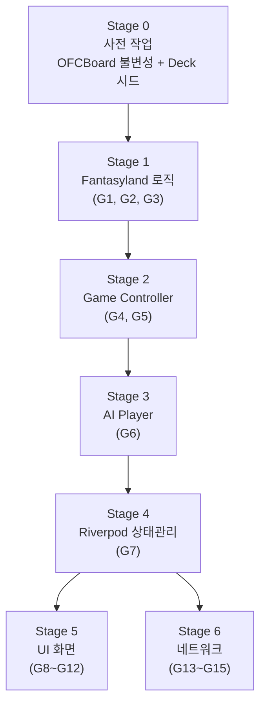
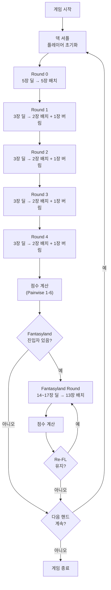
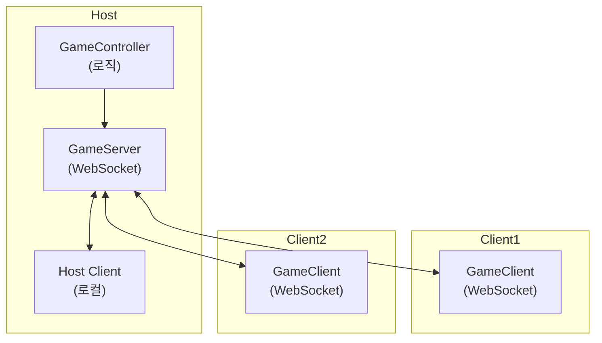
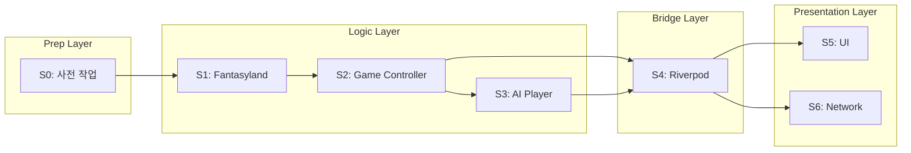
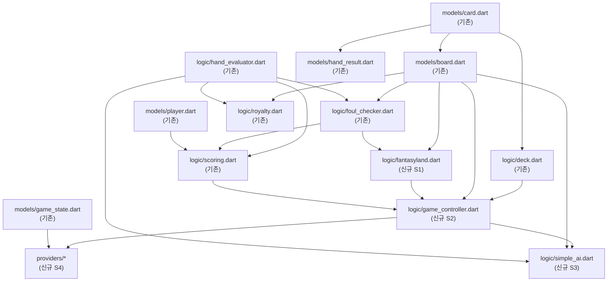

# Layer 0: Pure OFC Pineapple — 구현 계획

**버전**: 1.1
**작성일**: 2026-02-27
**수정일**: 2026-02-27 (Iter 2 — Architect + Critic 피드백 반영)
**PRD**: `docs/00-prd/layer0-ofc.prd.md` v1.0
**프로젝트**: `C:\claude\card_ofc\card_ofc_flutter\`

---

## 목차

1. [현재 상태 분석](#1-현재-상태-분석)
2. [갭 분석](#2-갭-분석)
3. [구현 단계](#3-구현-단계)
4. [Stage 0: 사전 작업 (불변성 전환)](#4-stage-0-사전-작업-불변성-전환)
5. [Stage 1: Fantasyland 로직](#5-stage-1-fantasyland-로직)
6. [Stage 2: Game Controller](#6-stage-2-game-controller)
7. [Stage 3: AI Player](#7-stage-3-ai-player)
8. [Stage 4: 상태 관리 (Riverpod)](#8-stage-4-상태-관리-riverpod)
9. [Stage 5: UI 화면](#9-stage-5-ui-화면)
10. [Stage 6: 네트워크 (LAN Multiplayer)](#10-stage-6-네트워크-lan-multiplayer)
11. [의존성 그래프](#11-의존성-그래프)
12. [테스트 전략](#12-테스트-전략)
13. [리스크](#13-리스크)

---

## 1. 현재 상태 분석

### 1.1 구현 완료 항목

| 파일 | 내용 | 테스트 |
|------|------|--------|
| `lib/models/card.dart` | Card, Rank, Suit enum (freezed) | - |
| `lib/models/board.dart` | OFCBoard (top/mid/bottom, placeCard, removeCard, isFull, copyWith, JSON) | - |
| `lib/models/player.dart` | Player (id, name, board, score, isInFantasyland, fantasylandCardCount) (freezed) | - |
| `lib/models/game_state.dart` | GameState (players, currentRound, currentPlayerIndex, phase, roundPhase, discardPile) (freezed) | - |
| `lib/models/hand_result.dart` | HandResult, HandType enum (freezed) | - |
| `lib/logic/hand_evaluator.dart` | evaluateHand(3/5장), compareHands(킥커 비교) | `test/logic/hand_evaluator_test.dart` |
| `lib/logic/foul_checker.dart` | checkFoul(Bottom >= Mid >= Top) | `test/logic/foul_checker_test.dart` |
| `lib/logic/royalty.dart` | RoyaltyResult, calcBoardRoyalty, calcLineRoyalty (PRD 2.7 테이블) | `test/logic/royalty_test.dart` |
| `lib/logic/scoring.dart` | calculateScores(Pairwise 1-6 Method), scoop 보너스 | `test/logic/scoring_test.dart` |
| `lib/logic/deck.dart` | Deck (52장 셔플, deal, reset) | `test/logic/deck_test.dart` |

### 1.2 기술 스택 (pubspec.yaml)

- Flutter SDK ^3.11.0
- 상태 관리: flutter_riverpod ^2.6.1, riverpod_annotation ^2.6.1
- 네트워크: web_socket_channel ^3.0.3, bonsoir ^6.0.1
- 애니메이션: rive ^0.14.3, flutter_animate ^4.5.2
- 직렬화: freezed_annotation, json_annotation
- 유틸: uuid ^4.5.3, collection ^1.19.1

## 2. 갭 분석

PRD 2.0의 게임 규칙 요구사항 대비 미구현 항목:

| # | 미구현 항목 | PRD 섹션 | 우선순위 | 의존성 |
|---|-----------|---------|---------|--------|
| G1 | **Fantasyland 진입 조건** (QQ+ Top, Foul 없음) | 2.8 | P0 | foul_checker, hand_evaluator |
| G2 | **Fantasyland Progressive 딜링** (14~17장) | 2.8 | P0 | G1, deck |
| G3 | **Fantasyland 유지 조건** (Re-FL) | 2.8 | P0 | G1 |
| G4 | **Game Controller** (Pineapple 딜링 루프 R0~R4) | 2.2 | P0 | deck, board |
| G5 | **Committed Rule** (배치 후 이동/취소 불가) | 2.3 | P0 | G4, board |
| G6 | **AI Player** (규칙 기반 단순 AI) | - | P1 | G4, G1 |
| G7 | **Riverpod Providers** (상태 관리) | 3.1 | P1 | G4, G6 |
| G8 | **UI: 보드 화면** (3라인 + 카드 배치) | 3.1 | P1 | G7 |
| G9 | **UI: 카드 드래그 앤 드롭** | 3.1 | P1 | G8 |
| G10 | **UI: 점수 결과 화면** | 3.1 | P2 | G7, scoring |
| G11 | **UI: Fantasyland 특수 화면** | 3.1 | P2 | G8, G1 |
| G12 | **UI: 로비/매칭 화면** | 3.1 | P2 | G7 |
| G13 | **네트워크: mDNS 검색** (bonsoir) | 3.2 | P2 | G7 |
| G14 | **네트워크: WebSocket 상태 동기화** | 3.2 | P2 | G13, G4 |
| G15 | **네트워크: Host 서버** | 3.2 | P2 | G14 |

**핵심 발견**: 코어 로직(hand evaluator, foul, royalty, scoring, deck)은 완성됨. Fantasyland과 Game Controller가 로직 레이어의 핵심 갭이며, 나머지는 UI/상태/네트워크 레이어에 해당.

## 3. 구현 단계

7개 Stage(S0~S6)를 의존성 순서로 실행한다. 각 Stage는 TDD 원칙(Red → Green → Refactor)을 따른다. **Stage 0은 S1 시작 전 반드시 코드 수정을 완료해야 한다.**



| Stage | 갭 ID | 파일 수 (예상) | 테스트 수 (예상) |
|-------|-------|:-------------:|:--------------:|
| 0. 사전 작업 (불변성 전환) | - | 2 | 4~6 |
| 1. Fantasyland 로직 | G1, G2, G3 | 1 | 8~12 |
| 2. Game Controller | G4, G5 | 1~2 | 12~17 |
| 3. AI Player | G6 | 1 | 5~8 |
| 4. Riverpod 상태관리 | G7 | 2~3 | 5~8 |
| 5. UI 화면 | G8~G12 | 8~12 | Widget 테스트 5~10 |
| 6. 네트워크 | G13~G15 | 3~5 | 통합 테스트 3~5 |

## 4. Stage 0: 사전 작업 (불변성 전환)

### 목표
Riverpod `state = state.copyWith(...)` 패턴에서 OFCBoard의 상태 추적이 가능하도록, **S1 시작 전에** 를 OFCBoard를 immutable API로 전환하고, Deck에 시드 주입 생성자를 추가한다. 또한 `Player` freezed 모델에 `hand` 필드를 추가한다.

### 수정 대상 파일

| 파일 | 수정 내용 | 구분 |
|------|-----------|------|
| `lib/models/board.dart` | `OFCBoard.placeCard()` 반환 타입 `OFCBoard`(새 인스턴스 반환), `removeCard()` 동일 처리 | 기존 수정 |
| `lib/models/player.dart` | `List<Card> hand` 필드 추가 (freezed copyWith 포함) | 기존 수정 |
| `lib/logic/deck.dart` | `Deck({int? seed})` 생성자 추가 | 기존 수정 |
| `lib/logic/foul_checker.dart` | OFCBoard 소비 코드 immutable API 추적 | 기존 수정 |
| `lib/logic/royalty.dart` | OFCBoard 소비 코드 immutable API 추적 | 기존 수정 |
| `lib/logic/scoring.dart` | `_compareLine(List<Card>)` 타입 수정, Foul/Scoop 검증 테스트 추가 | 기존 수정 |
| `test/models/board_immutable_test.dart` | OFCBoard immutable 동작 위전 테스트 | 신규 |

### OFCBoard Immutable API 설계

```dart
// 전: mutable (mutation 작동)
void placeCard(String line, Card card) {
  _lines[line]!.add(card); // 직접 mutation
}

// 후: immutable (OFCBoard 반환)
OFCBoard placeCard(String line, Card card) {
  // 새 OFCBoard 인스턴스 반환 (copyWith 준비)
  final newLines = Map<String, List<Card>>.from(
    _lines.map((k, v) => MapEntry(k, List<Card>.from(v)))
  );
  newLines[line]!.add(card);
  return OFCBoard(lines: newLines);
}
```

### Player 필드 추가

```dart
@freezed
class Player with _$Player {
  const factory Player({
    required String id,
    required String name,
    required OFCBoard board,
    required int score,
    @Default(false) bool isInFantasyland,
    @Default(14) int fantasylandCardCount,
    @Default([]) List<Card> hand, // 추가: 미배치 카드 (deal 후 미배치)
  }) = _Player;
}
```

### Deck 시드 추가

```dart
class Deck {
  final int? seed;
  Deck({this.seed}) {
    _rng = seed != null ? Random(seed) : Random();
  }
}
```

### 테스트 케이스

| # | 테스트 | 기대 |
|---|--------|------|
| T1 | `placeCard()` 호출 후 새 OFCBoard 참조 반환 | 원본 변경 없는 불변 객체 |
| T2 | Riverpod `state.copyWith(board: newBoard)` 추적 확인 | 상태 추적 가능 |
| T3 | `Player.hand` copyWith 키 확인 | `[Card] → []` 변환 |
| T4 | `Deck(seed: 42).deal(5)` 를 2회 호출 시 동일 결과 | 결정적 테스트 |
| T5 | scoring.dart `_compareLine(List<Card>)` Foul 상쇄 (0차) 검증 | 0차 |
| T6 | scoring.dart Scoop 보너스(+3) 검증 | +3 |


## 5. Stage 1: Fantasyland 로직

### 목표
PRD 2.8 Fantasyland 규칙을 순수 Dart 로직으로 구현한다.

### 신규 파일

| 파일 | 내용 |
|------|------|
| `lib/logic/fantasyland.dart` | Fantasyland 진입/유지/딜링 판정 로직 |
| `test/logic/fantasyland_test.dart` | 단위 테스트 |

### API 설계

```dart
/// Fantasyland 진입 가능 여부 판단
/// board가 가득 차 있고, Foul이 아니며, Top에 QQ+ 핸드가 있으면 진입
class FantasylandChecker {
  /// 진입 조건 확인: QQ+ Top 핸드 + Foul 아님
  static bool canEnter(OFCBoard board);

  /// Progressive 딜링 카드 수 결정 (14~17장)
  /// QQ=14, KK=15, AA=16, Trips=17
  static int getEntryCardCount(OFCBoard board);

  /// Re-Fantasyland 유지 조건 확인
  /// Top Trips, Mid FourOfAKind+, Bottom FourOfAKind+
  static bool canMaintain(OFCBoard board);

  /// Re-FL 카드 수: 항상 14장
  static const int reEntryCardCount = 14;
}
```

### 테스트 케이스

| # | 테스트 | 기대 |
|---|--------|------|
| T1 | Top QQ (Pair of Queens) + no Foul | canEnter = true, cardCount = 14 |
| T2 | Top KK + no Foul | canEnter = true, cardCount = 15 |
| T3 | Top AA + no Foul | canEnter = true, cardCount = 16 |
| T4 | Top Trips (any) + no Foul | canEnter = true, cardCount = 17 |
| T5 | Top JJ + no Foul | canEnter = false (QQ 미만) |
| T6 | Top QQ + Foul | canEnter = false (Foul) |
| T7 | Top Trips → canMaintain = true | Re-FL |
| T8 | Mid FourOfAKind → canMaintain = true | Re-FL |
| T9 | Bottom FourOfAKind → canMaintain = true | Re-FL |
| T10 | Top AA, Mid FullHouse, Bottom Straight → canMaintain = false | 유지 안됨 |
| T11 | 빈 보드 → canEnter = false | 보드 미완성 |
| T12 | Progressive: Top Trips → 17장 확인 | 카드수 |

## 6. Stage 2: Game Controller

### 목표
PRD 2.2 Pineapple OFC 딜링 루프 + 2.3 Committed Rule을 구현한다. 게임 전체 라이프사이클(딜링 → 배치 → 점수계산 → Fantasyland)을 관리한다.

### 신규 파일

| 파일 | 내용 |
|------|------|
| `lib/logic/game_controller.dart` | GameController 클래스 (딜링 루프, 페이즈 전환, 점수 계산 트리거) |
| `test/logic/game_controller_test.dart` | 단위 테스트 |

### 핵심 설계

```dart
class GameController {
  GameState get state => _state; // immutable getter
  final Deck deck;

  /// 게임 시작: 덱 셔플, 플레이어 초기화 → 새 GameState 반환
  GameState startGame(List<String> playerNames);

  /// Round 0: 각 플레이어에게 5장 딜 → Player.hand 업데이트된 GameState 반환
  GameState dealInitial(String playerId);

  /// Round 1~4: 각 플레이어에게 3장 딜 → GameState 반환
  GameState dealPineapple(String playerId);

  /// 카드 배치 (Committed Rule) → 업데이트된 GameState 반환 (null = 채웠진 슬롯 등 거부)
  GameState? placeCard(String playerId, Card card, String line);

  /// 카드 버림 (Round 1~4: 3장 중 1장 버림) → GameState 반환
  GameState? discardCard(String playerId, Card card);

  /// 현재 플레이어의 배치 완료 확인 및 다음 플레이어/라운드 전환 → GameState 반환
  GameState confirmPlacement(String playerId);

  /// 모든 라운드 완료 후 점수 계산 → GameState(점수 업데이트) 반환
  GameState scoreRound();

  /// Fantasyland 진입자 확인 및 다음 핸드 설정 → GameState 반환
  GameState checkFantasyland();

  /// Fantasyland 플레이어에게 Progressive 딜링 → GameState 반환
  GameState dealFantasyland(String playerId);

  /// FL 플레이어 레인 배치 완료 후 나머지 카드 버림 (PRD 2.8)
  GameState discardFantasylandRemainder(String playerId);

  /// FL 플레이어 보드 공개 타이밍: 비-FL 플레이어 배치 완료 후 공개 (PRD 2.8)
  GameState revealFantasylandBoard(String playerId);
}
```

### 게임 플로우 (라운드 구조)



### Committed Rule 구현

- `placeCard()` 호출 시 보드에 카드 추가 → 되돌릴 수 있는 방법 없음
- `OFCBoard.removeCard()`는 Game Controller 레벨에서 호출 금지 (내부 테스트용으로만 존재)
- 배치 전 미리보기 기능은 UI 레벨에서 별도 관리 (임시 상태)

### 딜링 검증

- 최대 3인 플레이어: 17장 x 3 = 51장 (52장 덱 1장 남음)
- 2인 플레이어: 17장 x 2 = 34장 (18장 남음)
- Fantasyland: 14~17장 한 번에 딜 → 보드 13장 + 나머지 버림

### 테스트 케이스

| # | 테스트 | 기대 |
|---|--------|------|
| T1 | startGame(2명) → state 초기화 | 2 플레이어, round=0, phase=dealing |
| T2 | dealInitial → 5장 반환 | 5장, 덱에서 차감 |
| T3 | Round 0: 5장 모두 배치 후 confirmPlacement | 다음 플레이어로 전환 |
| T4 | dealPineapple → 3장 반환 | 3장, 라운드 1~4 |
| T5 | Round 1: 2장 배치 + 1장 discard → confirmPlacement | 다음 플레이어 전환 |
| T6 | Committed Rule: placeCard 후 removeCard 시도 → 거부 | controller 레벨에서 불가 |
| T7 | Round 4 완료 → 보드 full(13장) | isFull() = true |
| T8 | scoreRound → Pairwise 점수 반환 | calculateScores 결과 |
| T9 | checkFantasyland → QQ+ Top → fantasyland 진입 | isInFantasyland = true |
| T10 | dealFantasyland(QQ) → 14장 딜 | 14장 반환 |
| T11 | dealFantasyland(Trips) → 17장 딜 | 17장 반환 |
| T12 | 3인 게임: 전체 라운드 → 51장 사용 | 덱 remaining = 1 |
| T13 | 만석 라인에 배치 시도 → false | placeCard 거부 |
| T14 | FL 플레이어 + 일반 플레이어 혼합 라운드: 일반 플레이어 배치 완료 후 FL 보드 공개 | `revealFantasylandBoard()` 호출 |
| T15 | `discardFantasylandRemainder()`: FL 17장 딜 후 13장 배치, 4장 자동 버림 | Player.hand에서 4장 차감 |
| T16 | `placeCard()` 반환된 GameState에서 Riverpod 상태 추적 확인 | 원본 state != 반환 state |
| T17 | scoring: 양싸 Foul 상쇄 시 0차, Scoop 보너스 +3, Foul 시 Royalty 소멸 | 점수 검증 |

## 7. Stage 3: AI Player

### 목표
1인 플레이 테스트용 규칙 기반 단순 AI를 구현한다. 최적 전략이 아닌, 합법적 배치를 수행하는 것이 핵심.

### 신규 파일

| 파일 | 내용 |
|------|------|
| `lib/logic/simple_ai.dart` | SimpleAI 클래스 (규칙 기반 카드 배치) |
| `test/logic/simple_ai_test.dart` | 단위 테스트 |

### AI 전략 (규칙 기반)

```dart
class SimpleAI {
  /// 주어진 카드들과 현재 보드 상태에서 배치 결정을 반환
  /// PlacementDecision: 카드별 라인 매핑 + 버릴 카드(R1~R4)
  PlacementDecision decide(
    List<Card> hand,
    OFCBoard board,
    int round, // 0=initial, 1~4=pineapple
  );
}

class PlacementDecision {
  final Map<Card, String> placements; // card → 'top'|'mid'|'bottom'
  final Card? discard;                // round 1~4에서 버릴 카드
}
```

### AI 배치 규칙 (우선순위)

1. **High cards → Bottom 우선**: Ace, King 등 높은 랭크는 Bottom에 배치
2. **Pairs → Mid/Top**: 페어가 있으면 Mid에 배치, 6 이상 페어는 Top에도 고려
3. **Foul 방지**: 배치 전 시뮬레이션으로 Foul 가능성 체크
4. **Fantasyland 시도**: Round 0에서 QQ 이상을 Top에 배치 시도 (가능한 경우)
5. **Fallback**: 빈 슬롯이 가장 많은 라인에 배치

### 테스트 케이스

| # | 테스트 | 기대 |
|---|--------|------|
| T1 | Round 0: 5장 → 5개 PlacementDecision, discard=null | 유효한 5장 배치 |
| T2 | Round 1~4: 3장 → 2개 배치 + 1개 discard | 합법적 결정 |
| T3 | 모든 AI 결정 적용 후 Foul 안 됨 | checkFoul = false |
| T4 | 만석 라인에 배치하지 않음 | top 3장 차면 mid/bottom에만 배치 |
| T5 | 전체 게임(R0~R4) AI 자동 진행 → 보드 13장 | isFull = true |

## 8. Stage 4: 상태 관리 (Riverpod)

### 목표
GameController와 UI를 연결하는 Riverpod Provider 레이어를 구현한다.

### 신규 파일

| 파일 | 내용 |
|------|------|
| `lib/providers/game_provider.dart` | GameNotifier (게임 상태 Notifier, GameController 래핑) |
| `lib/providers/player_provider.dart` | 현재 플레이어 상태, 핸드 카드, 배치 가능 라인 |
| `lib/providers/score_provider.dart` | 라운드별 점수 결과, 누적 점수 |
| `test/providers/game_provider_test.dart` | Provider 단위 테스트 |

### Provider 설계

```dart
/// 메인 게임 상태 Provider
@riverpod
class GameNotifier extends _$GameNotifier {
  late GameController _controller;

  @override
  GameState build() => const GameState(players: []);

  /// 게임 시작
  void startGame(List<String> playerNames, {bool withAI = false});

  /// 현재 플레이어의 핸드 카드 (딜된 카드 중 미배치)
  List<Card> get currentHand;

  /// 카드 배치
  void placeCard(Card card, String line);

  /// 카드 버림 (Round 1~4)
  void discardCard(Card card);

  /// 배치 확정
  void confirmPlacement();

  /// 게임 종료 여부
  bool get isGameOver;
}

/// 파생 Provider
@riverpod
Player? currentPlayer(ref) => ...;  // state에서 현재 플레이어

@riverpod
Map<String, int>? roundScores(ref) => ...; // 라운드 점수

@riverpod
bool isMyTurn(ref) => ...; // 내 턴인지 확인

@riverpod
List<String> availableLines(ref) => ...; // 배치 가능한 라인 목록
```

### 핵심 원칙

- **GameController는 순수 로직**: UI/Flutter 의존 없음
- **Provider는 Controller 래핑**: UI ↔ Logic 브릿지 역할
- **불변 상태**: GameState는 freezed, 상태 변경은 copyWith로
- **Immutable 일관성**: GameController 모든 메서드는 GameState를 반환 (void 금지). Provider는 `state = _controller.method()` 패턴으로 업데이트

## 9. Stage 5: UI 화면

### 목표
게임 플레이에 필요한 핵심 UI 화면을 Flutter로 구현한다.

### 화면 목록 및 파일

| 화면 | 파일 | 설명 |
|------|------|------|
| 홈/로비 | `lib/screens/home_screen.dart` | 게임 시작, AI 대전, 멀티플레이 선택 |
| 게임 보드 | `lib/screens/game_screen.dart` | 메인 게임 화면 (보드 + 핸드 + HUD) |
| 점수 결과 | `lib/screens/score_screen.dart` | 라운드/핸드 종료 후 점수 상세 |

### 위젯 목록

| 위젯 | 파일 | 설명 |
|------|------|------|
| 카드 위젯 | `lib/widgets/card_widget.dart` | 개별 카드 표시 (랭크+수트, 앞면/뒷면) |
| 보드 위젯 | `lib/widgets/board_widget.dart` | 3라인 보드 레이아웃 (Top 3슬롯, Mid 5슬롯, Bottom 5슬롯) |
| 핸드 위젯 | `lib/widgets/hand_widget.dart` | 딜된 카드 표시 (배치 대상) |
| 라인 슬롯 | `lib/widgets/line_slot_widget.dart` | 빈/채워진 카드 슬롯 + 드롭 타겟 |
| 상대 보드 | `lib/widgets/opponent_board_widget.dart` | 상대 보드 축소 표시 |
| 점수 패널 | `lib/widgets/score_panel_widget.dart` | 라인별 점수, 로얄티, 스쿱 표시 |
| 턴 인디케이터 | `lib/widgets/turn_indicator_widget.dart` | 현재 턴, 라운드 번호 표시 |

### 카드 배치 인터랙션

1. **핸드 영역**: 딜된 카드가 가로 배열로 표시
2. **드래그 시작**: 카드를 길게 누르면 드래그 시작 (Draggable)
3. **드롭 타겟**: 각 라인의 빈 슬롯이 DragTarget으로 동작
4. **배치 가능 여부**: 만석 라인은 비활성 표시, 드롭 거부
5. **버림**: 라운드 1~4에서 버림 영역(discard zone)에 드롭
6. **확정**: 배치/버림 수 충족 시 "확정" 버튼 활성화

### 레이아웃 구조 (game_screen)

```
+------------------------------------------+
| [Turn: Round 2]        [Score: P1: 5]    |
+------------------------------------------+
|                                          |
|    [Opponent Board - compact view]       |
|                                          |
+------------------------------------------+
|          My Board                        |
|  Top:    [_] [_] [_]                     |
|  Mid:    [_] [_] [_] [_] [_]            |
|  Bottom: [_] [_] [_] [_] [_]            |
+------------------------------------------+
|                                          |
|     My Hand:  [5♠] [K♥] [3♦]           |
|                                          |
|     [Discard Zone]    [Confirm]          |
+------------------------------------------+
```

### Fantasyland 특수 화면

- 14~17장을 한 번에 표시 (스크롤 가능 그리드)
- 일반 보드와 동일한 드래그 앤 드롭 배치
- 나머지 카드 자동 버림 (13장 초과분)

## 10. Stage 6: 네트워크 (LAN Multiplayer)

### 목표
PRD 3.2 LAN 멀티플레이어를 bonsoir(mDNS) + WebSocket으로 구현한다.

### 신규 파일

| 파일 | 내용 |
|------|------|
| `lib/network/game_server.dart` | WebSocket 호스트 서버 (게임 상태 관리, 브로드캐스트) |
| `lib/network/game_client.dart` | WebSocket 클라이언트 (서버 접속, 메시지 수신/송신) |
| `lib/network/discovery.dart` | bonsoir mDNS 게임 검색/광고 |
| `lib/network/messages.dart` | 네트워크 메시지 프로토콜 (JSON 직렬화) |
| `lib/screens/lobby_screen.dart` | 로비 화면 (호스트/참가, 검색된 게임 목록) |

### 아키텍처



### 메시지 프로토콜

| 메시지 타입 | 방향 | 내용 |
|------------|------|------|
| `join_request` | Client → Host | 참가 요청 (player name) |
| `join_accepted` | Host → Client | 참가 수락 (player id, 현재 상태) |
| `game_start` | Host → All | 게임 시작 |
| `deal_cards` | Host → Client | 딜된 카드 전달 |
| `place_card` | Client → Host | 카드 배치 액션 |
| `discard_card` | Client → Host | 카드 버림 액션 |
| `confirm_placement` | Client → Host | 배치 확정 |
| `state_update` | Host → All | 게임 상태 변경 브로드캐스트 |
| `round_result` | Host → All | 라운드 점수 결과 |
| `game_over` | Host → All | 게임 종료 |

### mDNS 서비스

- **서비스 타입**: `_ofc._tcp`
- **서비스 이름**: 호스트 플레이어 이름
- **포트**: 동적 할당 (0번 → OS가 빈 포트 배정)
- **TXT 레코드**: `players=1/3` (현재/최대 인원)

## 11. 의존성 그래프

### Stage 간 의존성



### 모듈 의존성



### 병렬 실행 가능 구간

| 구간 | 병렬 가능 | 이유 |
|------|:--------:|------|
| S0 → S1 | 아니오 | S1이 S0(OFCBoard immutable) 의존 |
| S1 → S2 | 아니오 | S2가 S1(fantasyland) 의존 |
| S2 → S3 | 아니오 | S3가 S2(controller) 의존 |
| S5, S6 | **가능** | 둘 다 S4만 의존, 상호 독립 |

## 12. 테스트 전략

### TDD 원칙

모든 Stage에서 Red → Green → Refactor 사이클을 따른다.

```
1. 테스트 파일 먼저 작성 (Red: 컴파일 실패/테스트 실패)
2. 최소 구현 코드 작성 (Green: 테스트 통과)
3. 리팩토링 (Refactor: 테스트 유지)
```

### 테스트 레벨

| 레벨 | 대상 Stage | 도구 | 설명 |
|------|-----------|------|------|
| **Unit** | S1, S2, S3 | `flutter_test` | 순수 Dart 로직 테스트 |
| **Provider** | S4 | `riverpod_test` | Provider 상태 변환 테스트 |
| **Widget** | S5 | `flutter_test` (widget) | UI 위젯 렌더링/인터랙션 테스트 |
| **Integration** | S6 | `integration_test` | 네트워크 연결/메시지 교환 테스트 |
| **E2E** | 전체 | 수동 + 자동 | 전체 게임 플로우 |

### 테스트 파일 매핑

| Stage | 테스트 파일 | 예상 테스트 수 |
|-------|-----------|:------------:|
| S0 | `test/models/board_immutable_test.dart` | 6 |
| S1 | `test/logic/fantasyland_test.dart` | 12 |
| S2 | `test/logic/game_controller_test.dart` | 17 |
| S3 | `test/logic/simple_ai_test.dart` | 5 |
| S4 | `test/providers/game_provider_test.dart` | 8 |
| S5 | `test/widgets/card_widget_test.dart`, `test/widgets/board_widget_test.dart` | 10 |
| S6 | `test/network/game_server_test.dart`, `test/network/game_client_test.dart` | 5 |
| 기존 | `test/logic/{deck,hand_evaluator,royalty,foul_checker,scoring}_test.dart` | 유지 |

### 테스트 실행 명령

```bash
# 전체 테스트
cd C:\claude\card_ofc\card_ofc_flutter
flutter test

# 개별 테스트
flutter test test/logic/fantasyland_test.dart
flutter test test/logic/game_controller_test.dart

# 커버리지
flutter test --coverage
```

## 13. 리스크

| # | 리스크 | 영향 | 완화 |
|---|--------|------|------|
| R1 | Fantasyland 딜링 시 덱 카드 부족 (3인) | 게임 불가 | 3인 FL 동시 진입 시 별도 덱 or 제한 규칙 적용 |
| R2 | freezed code generation 지연 | 빌드 오류 | `build_runner watch` 상시 실행 |
| R3 | bonsoir mDNS가 특정 OS에서 동작 안 함 | 네트워크 검색 실패 | 수동 IP 입력 fallback |
| R4 | 카드 드래그 앤 드롭 터치 인식 문제 (모바일) | UX 저하 | 탭 후 라인 선택 방식 대안 제공 |
| R5 | WebSocket 연결 불안정 (WiFi 환경) | 게임 중단 | 자동 재연결 + 상태 복구 메커니즘 |
| R6 | AI가 항상 Foul 발생 | 테스트 무의미 | Foul 방지 시뮬레이션 로직 강화 |
| R7 | OFCBoard 불변성 전환 시 S1~S3 영향 | `foul_checker`, `royalty`, `scoring` 소비 코드 수정 필요 | Stage 0 완료 후 S1 시작, 테스트 첫 실행으로 의존성 검증 |
| R8 | Deck 시드 비결정적 테스트 | 테스트 실행 마다 다른 결과 | `Deck(seed: N)` 생성자 사용으로 결정적 테스트 구현 |
| R9 | 핸드 카드 상태 위치 미결정 | S6 네트워크 동기화 시 추가 작업 | `Player.hand` 필드(Stage 0 추가)로 해소, 모든 상태 변경은 GameState에 유지 |

### 3인 Fantasyland 동시 진입 시 카드 수 문제

- 3인 모두 FL 진입 시: 최대 17 x 3 = 51장 필요 (52장 덱에서 가능)
- 실제 가능한 최대: 17(Trips) + 17(Trips) + 17(Trips) = 51장
- **결론**: 52장 덱으로 3인 FL 동시 가능 (1장 여유)
