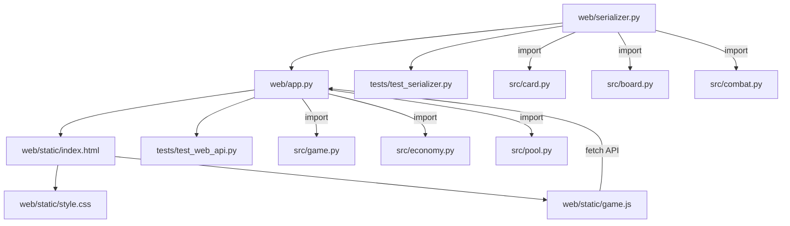
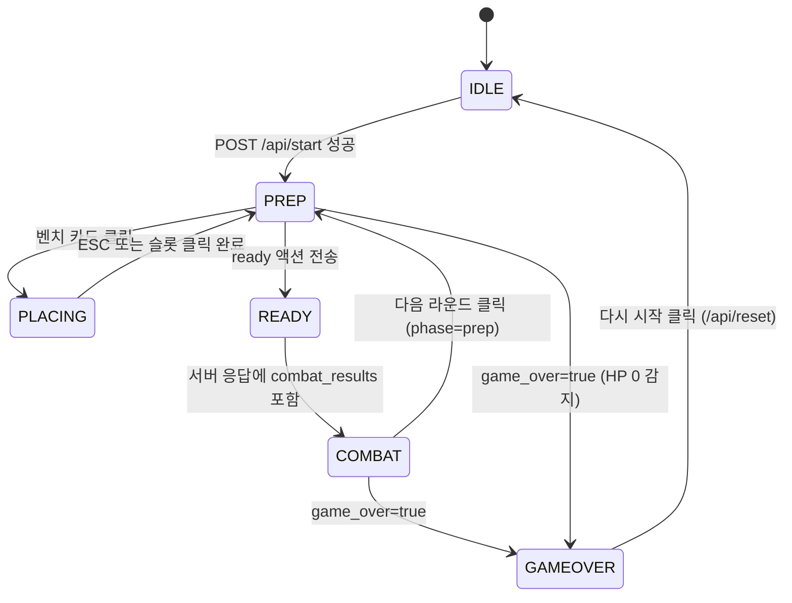
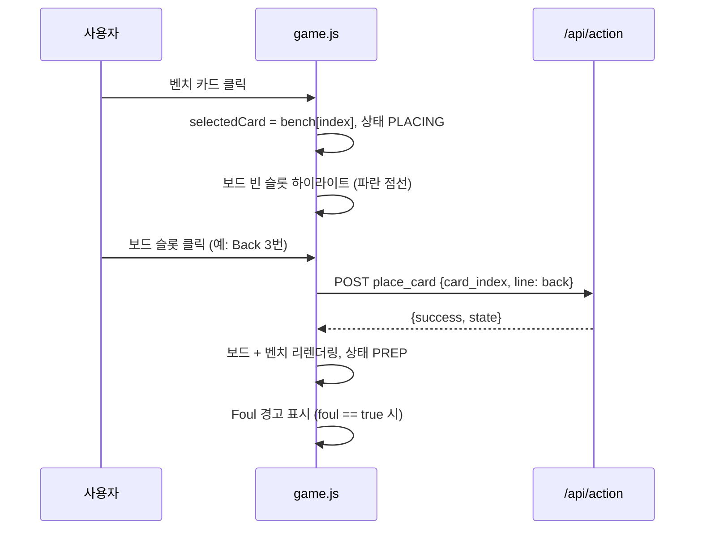
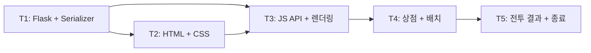

# Trump Card Auto Chess — Web GUI 구현 계획서

**버전**: 1.0.0
**작성일**: 2026-02-23
**기반 PRD**: `docs/00-prd/webgui.prd.md` v1.0.0
**현재 단계**: STANDARD 완료 (293 테스트 PASS) → Web GUI 구현

---

## 목차

1. [구현 목표 요약](#1-구현-목표-요약)
2. [신규 파일 목록](#2-신규-파일-목록)
3. [API 설계 상세](#3-api-설계-상세)
4. [GameState 직렬화 설계](#4-gamestate-직렬화-설계)
5. [Frontend 상태 기계](#5-frontend-상태-기계)
6. [카드 배치 UX 설계](#6-카드-배치-ux-설계)
7. [구현 순서 (Task 분해)](#7-구현-순서-task-분해)
8. [테스트 계획](#8-테스트-계획)
9. [영향 파일](#9-영향-파일)
10. [위험 요소 및 대응](#10-위험-요소-및-대응)

---

## 1. 구현 목표 요약

기존 `src/` 백엔드 11개 모듈(293 테스트 PASS)을 변경 없이 재사용하면서, Flask REST API 레이어(`web/`)와 Vanilla JS 프론트엔드를 추가해 브라우저에서 2인 로컬 대전이 가능한 Web GUI를 구현한다.
신규 패키지는 `flask` 1개만 추가하며, 외부 CDN/프레임워크 의존 없이 순수 HTML/CSS/JS로 프론트엔드를 작성한다.
서버 메모리 기반 상태 관리로 단순화하고, HTTP REST + 즉시 응답 방식(WebSocket 제외)으로 통신한다.

---

## 2. 신규 파일 목록

| 파일 경로 | 역할 | 의존 대상 | 구현 단계 |
|-----------|------|----------|----------|
| `web/__init__.py` | 패키지 초기화 (빈 파일) | - | T1 |
| `web/app.py` | Flask 라우터 + 게임 인스턴스 관리. `/api/start`, `/api/state`, `/api/action`, `/api/reset` 엔드포인트 정의. 서버 메모리에 단일 `GameState` 인스턴스 보유. | `src/game.py`, `src/economy.py`, `src/pool.py`, `web/serializer.py` | T1 |
| `web/serializer.py` | `GameState` → dict 변환. `Card`, `OFCBoard`, `Player`, `CombatResult` 등 내부 객체를 JSON-safe dict로 직렬화. 역직렬화 유틸 포함. | `src/card.py`, `src/board.py`, `src/economy.py`, `src/hand.py`, `src/combat.py`, `src/augment.py` | T1 |
| `web/static/index.html` | SPA 메인 페이지. 시작 화면, 메인 보드, 전투 결과 모달, 게임 종료 화면 포함. | `style.css`, `game.js` | T2 |
| `web/static/game.js` | UI 상태 기계 + 이벤트 핸들링 + API 호출 + DOM 렌더링. 상점/배치/전투 인터랙션 전체 관리. | `web/app.py` (API) | T3~T5 |
| `web/static/style.css` | 카드/보드/상점/모달 스타일. 수트별 색상, Foul 하이라이트, 슬롯 레이아웃 정의. | - | T2 |
| `tests/test_serializer.py` | `web/serializer.py` 직렬화 함수 단위 테스트. Card/Board/Player/GameState 직렬화 검증. | `web/serializer.py` | T1 |
| `tests/test_web_api.py` | Flask `test_client` 기반 엔드포인트 테스트. 게임 시작/상태 조회/액션/리셋 플로우 검증. | `web/app.py` | T1 |

**파일 의존 관계**:



---

## 3. API 설계 상세

### 3.1 공통 응답 형식

모든 API 엔드포인트는 아래 두 형식 중 하나를 반환한다.

**성공 응답**:
```json
{
  "success": true,
  "state": { "..." : "..." }
}
```

**실패 응답**:
```json
{
  "success": false,
  "error": "에러 메시지"
}
```

- Content-Type: `application/json; charset=utf-8`
- HTTP Status: 성공 200, 클라이언트 오류 400, 서버 오류 500

### 3.2 POST /api/start

새 게임을 초기화한다. 기존 게임 인스턴스가 있으면 덮어쓴다.

**Request**:
```json
{
  "num_players": 2,
  "player_names": ["Alice", "Bob"]
}
```

| 필드 | 타입 | 필수 | 기본값 | 설명 |
|------|------|:----:|--------|------|
| `num_players` | int | O | - | 2~8 범위 |
| `player_names` | string[] | X | `["Player1", ...]` | 부족한 이름은 기본값 적용 |

**서버 처리 로직**:
```python
pool = SharedCardPool()
pool.initialize()
players = [Player(name=names[i], gold=0) for i in range(num_players)]
game_state = GameState(players=players, pool=pool)
manager = RoundManager(game_state)
manager.start_prep_phase()
```

**Response** (200):
```json
{
  "success": true,
  "state": { "round_num": 1, "phase": "prep", "players": ["..."] }
}
```

**에러**: `num_players` 범위 초과 -> 400 `"플레이어 수는 2~8 사이여야 합니다"`

### 3.3 GET /api/state

현재 게임 상태를 JSON으로 반환한다. 프론트엔드가 액션 응답에서 직접 상태를 받으므로 폴링은 보조 용도.

**Request**: 파라미터 없음.

**Response** (200):
```json
{
  "success": true,
  "state": {
    "round_num": 1,
    "phase": "prep",
    "players": [],
    "ready_flags": { "0": false, "1": false },
    "last_combat_results": null,
    "game_over": false,
    "winner": null
  }
}
```

**에러**: 게임 미시작 -> 400 `"게임이 시작되지 않았습니다"`

### 3.4 POST /api/action

플레이어 액션을 처리한다.

**Request 공통**:
```json
{
  "player_id": 0,
  "action_type": "buy_card",
  "payload": {}
}
```

#### 3.4.1 buy_card

상점 카드 구매. `player.buy_card(card, pool)` 호출. 3장 동일 시 별 강화 자동.

```json
{ "payload": { "card_index": 2 } }
```

| payload 필드 | 타입 | 설명 |
|-------------|------|------|
| `card_index` | int | `shop_cards` 배열 인덱스 (0-based) |

#### 3.4.2 place_card

벤치 카드를 OFC 보드 라인에 배치.

```json
{ "payload": { "card_index": 0, "line": "back" } }
```

| payload 필드 | 타입 | 설명 |
|-------------|------|------|
| `card_index` | int | `bench` 배열 인덱스 |
| `line` | string | `"front"`, `"mid"`, `"back"` |

**처리**: `board.place_card(line, bench[card_index])` 호출. 성공 시 벤치에서 제거. 배치 후 `check_foul()` 결과를 `state.players[].board.foul` 에 반영.

#### 3.4.3 sell_card

벤치 카드 매각.

```json
{ "payload": { "card_index": 1 } }
```

**처리**: `player.sell_card(bench[card_index], pool)` 호출. 골드 반환.

#### 3.4.4 remove_card

보드에 배치된 카드를 벤치로 회수.

```json
{ "payload": { "line": "back", "slot": 2 } }
```

| payload 필드 | 타입 | 설명 |
|-------------|------|------|
| `line` | string | 회수할 라인 |
| `slot` | int | 라인 내 슬롯 인덱스 |

**처리**: 해당 라인의 `slot` 인덱스 카드를 `board.remove_card()` + 벤치 복원. combat 페이즈에서는 거부.

#### 3.4.5 roll_shop

상점 새로고침. 골드 2 소모.

```json
{ "payload": {} }
```

**처리**: 기존 `shop_cards` 풀 반환 -> `pool.random_draw_n(shop_size, level)` 재드로우 -> 골드 -2.

#### 3.4.6 ready

준비 완료 선언. 모든 플레이어 ready 시 전투 자동 진행.

```json
{ "payload": {} }
```

**처리 로직**:
```python
ready_flags[player_id] = True
alive = [p for p in game_state.players if p.hp > 0]
if all(ready_flags.get(i, False) for i in range(len(alive))):
    results = manager.start_combat_phase()
    last_combat_results = serialize_combat_results(results, game_state)
    manager.end_round()
    ready_flags.clear()
```

**공통 에러 케이스**:

| 조건 | HTTP | 메시지 |
|------|:----:|--------|
| 게임 미시작 | 400 | `"게임이 시작되지 않았습니다"` |
| `player_id` 범위 초과 | 400 | `"유효하지 않은 플레이어 ID"` |
| 잘못된 `action_type` | 400 | `"알 수 없는 액션 타입"` |
| 페이즈 불일치 | 400 | `"현재 페이즈에서 수행할 수 없는 액션입니다"` |
| 골드 부족 | 400 | `"골드가 부족합니다"` |
| 슬롯 초과 | 400 | `"해당 라인에 빈 슬롯이 없습니다"` |
| 벤치 인덱스 초과 | 400 | `"유효하지 않은 카드 인덱스"` |

### 3.5 POST /api/reset

게임 초기화. 시작 화면 복귀.

**Request**: 빈 body `{}`.

**Response** (200):
```json
{ "success": true, "state": null }
```

### 3.6 GET /

메인 HTML 서빙.

```python
@app.route('/')
def index():
    return send_from_directory(app.static_folder, 'index.html')
```

### 3.7 세션 관리 방식

서버 메모리에 단일 게임 인스턴스를 저장한다. 동시 멀티 세션은 미지원.

```python
# web/app.py 모듈 레벨 변수
_game_state: GameState | None = None
_round_manager: RoundManager | None = None
_ready_flags: dict[int, bool] = {}
```

- 서버 재시작 시 상태 초기화 (영속성 없음)
- 동일 서버에서 2개 브라우저 탭으로 2인 플레이 (같은 게임 인스턴스 공유)
- `player_id` 기반 액션 검증으로 타 플레이어 액션 차단

### 3.8 에러 처리 패턴

```python
@app.errorhandler(400)
def bad_request(e):
    return jsonify({"success": False, "error": str(e.description)}), 400

@app.errorhandler(500)
def internal_error(e):
    return jsonify({"success": False, "error": "서버 내부 오류"}), 500
```

모든 액션 핸들러에서 `try-except` -> 400 변환. `src/` 모듈 `ValueError` 등도 포착.

---

## 4. GameState 직렬화 설계

### 4.1 Card 직렬화

```python
SUIT_SYMBOLS = {1: 'C', 2: 'D', 3: 'H', 4: 'S'}
RANK_NAMES = {2:'2', 3:'3', 4:'4', 5:'5', 6:'6', 7:'7', 8:'8',
              9:'9', 10:'10', 11:'J', 12:'Q', 13:'K', 14:'A'}

def serialize_card(card: Card | None) -> dict | None:
    if card is None:
        return None
    return {
        "rank": RANK_NAMES[card.rank.value],
        "rank_value": card.rank.value,
        "suit": card.suit.value,
        "suit_symbol": SUIT_SYMBOLS[card.suit.value],
        "stars": card.stars,
        "cost": card.cost,
        "key": f"{card.rank.value}_{card.suit.value}_{card.stars}",
    }
```

| 필드 | 타입 | 예시 | 용도 |
|------|------|------|------|
| `rank` | string | `"A"` | 화면 표시 |
| `rank_value` | int | `14` | 정렬/비교 |
| `suit` | int | `4` | 내부 식별 |
| `suit_symbol` | string | `"S"` | 화면 표시 (JS에서 유니코드 매핑) |
| `stars` | int | `1` | 별 아이콘 |
| `cost` | int | `5` | 비용 표시 |
| `key` | string | `"14_4_1"` | 고유 식별자 |

### 4.2 OFCBoard 직렬화

```python
def serialize_board(board: OFCBoard) -> dict:
    hand_results = board.get_hand_results()
    foul = board.check_foul()
    return {
        "front": [serialize_card(c) for c in board.front]
                 + [None] * (3 - len(board.front)),
        "mid":   [serialize_card(c) for c in board.mid]
                 + [None] * (5 - len(board.mid)),
        "back":  [serialize_card(c) for c in board.back]
                 + [None] * (5 - len(board.back)),
        "foul": foul.has_foul,
        "foul_lines": foul.foul_lines,
        "hand_strengths": {
            "front": hand_results['front'].hand_type.name
                     if 'front' in hand_results else None,
            "mid":   hand_results['mid'].hand_type.name
                     if 'mid' in hand_results else None,
            "back":  hand_results['back'].hand_type.name
                     if 'back' in hand_results else None,
        },
        "is_full": board.is_full(),
    }
```

- `front` 배열 길이 3 고정 (빈 슬롯은 `null`)
- `mid`/`back` 배열 길이 5 고정
- `foul_lines`: Foul 발생 라인 목록 (예: `["mid"]`)
- `hand_strengths`: 각 라인의 핸드 타입 문자열 (예: `"TWO_PAIR"`)

### 4.3 Player 직렬화

```python
def serialize_player(player: Player, player_id: int) -> dict:
    return {
        "id": player_id,
        "name": player.name,
        "hp": player.hp,
        "gold": player.gold,
        "level": player.level,
        "win_streak": player.win_streak,
        "loss_streak": player.loss_streak,
        "board": serialize_board(player.board),
        "bench": [serialize_card(c) for c in player.bench],
        "shop_cards": [serialize_card(c) for c in player.shop_cards],
        "augments": [
            {"id": a.id, "name": a.name, "description": a.description}
            for a in player.augments
        ],
        "in_fantasyland": player.in_fantasyland,
        "hula_declared": player.hula_declared,
    }
```

### 4.4 GameState 직렬화

```python
def serialize_game(state: GameState, ready_flags: dict,
                   last_combat_results=None) -> dict:
    winner = state.get_winner()
    return {
        "round_num": state.round_num,
        "phase": state.phase,
        "max_rounds": state.max_rounds,
        "players": [
            serialize_player(p, i)
            for i, p in enumerate(state.players)
        ],
        "ready_flags": {str(k): v for k, v in ready_flags.items()},
        "last_combat_results": last_combat_results,
        "game_over": state.is_game_over(),
        "winner": {
            "name": winner.name,
            "hp": winner.hp,
        } if winner else None,
    }
```

### 4.5 CombatResult 직렬화

```python
def serialize_combat_results(results: list, state: GameState) -> list:
    serialized = []
    for i, (result_a, result_b) in enumerate(results):
        pair = state.combat_pairs[i]
        p1 = state.players[pair[0]]
        p2 = state.players[pair[1]]
        serialized.append({
            "player1": {"name": p1.name, "id": pair[0]},
            "player2": {"name": p2.name, "id": pair[1]},
            "line_results": {
                line: {
                    "winner": (
                        "player1" if result_a.line_results[line] > 0
                        else "player2" if result_a.line_results[line] < 0
                        else "draw"
                    )
                } for line in ['back', 'mid', 'front']
            },
            "player1_stats": {
                "winner_lines": result_a.winner_lines,
                "damage": result_a.damage,
                "is_scoop": result_a.is_scoop,
                "hula_applied": result_a.hula_applied,
            },
            "player2_stats": {
                "winner_lines": result_b.winner_lines,
                "damage": result_b.damage,
                "is_scoop": result_b.is_scoop,
                "hula_applied": result_b.hula_applied,
            },
        })
    return serialized
```

### 4.6 역직렬화 (카드 식별)

프론트엔드에서 서버로 카드를 지정할 때는 **인덱스 기반**으로 처리한다.

| 액션 | 식별 방식 |
|------|----------|
| `buy_card` | `shop_cards[card_index]` |
| `place_card` | `bench[card_index]` |
| `sell_card` | `bench[card_index]` |
| `remove_card` | `board.{line}[slot]` |

인덱스 기반이므로 별도 역직렬화 로직은 불필요하다. 서버가 내부 객체를 직접 참조한다.

---

## 5. Frontend 상태 기계

### 5.1 상태 정의

| 상태 | 진입 조건 | 활성 UI | 허용 액션 |
|------|----------|---------|----------|
| `IDLE` | 초기/리셋 후 | 시작 화면 폼 | 게임 시작 |
| `PREP` | `/api/start` 성공, 라운드 시작 | 플레이어 정보 + 보드 + 상점 + 벤치 | 구매, 배치, 회수, 매각, 새로고침 |
| `PLACING` | 벤치 카드 선택 시 | 보드 슬롯 하이라이트 | 슬롯 클릭(배치), ESC(취소) |
| `READY` | 준비 완료 클릭 후 | 대기 중 메시지 | 없음 (상대 대기) |
| `COMBAT` | 전투 결과 수신 | 전투 결과 모달 | 다음 라운드 버튼 |
| `GAMEOVER` | `game_over == true` | 게임 종료 모달 (순위) | 다시 시작 버튼 |

### 5.2 상태 전이 다이어그램



### 5.3 상태별 활성 UI 컴포넌트

| UI 컴포넌트 | IDLE | PREP | PLACING | READY | COMBAT | GAMEOVER |
|------------|:----:|:----:|:-------:|:-----:|:------:|:--------:|
| 시작 화면 폼 | O | | | | | |
| 헤더 (라운드/이벤트) | | O | O | O | O | |
| 플레이어 정보 바 | | O | O | O | O | |
| OFC 보드 (2인) | | O | O | O | O | |
| 상점 패널 | | O | O | | | |
| 벤치 패널 | | O | O | | | |
| 슬롯 하이라이트 | | | O | | | |
| 준비 완료 버튼 | | O | | | | |
| 대기 중 메시지 | | | | O | | |
| 전투 결과 모달 | | | | | O | |
| 게임 종료 모달 | | | | | | O |
| 새 게임 버튼 | | O | O | O | O | O |

---

## 6. 카드 배치 UX 설계

### 6.1 클릭 배치 플로우



**선택 상태 표시**: 선택된 벤치 카드에 파란색 테두리 + 글로우 효과.

**빈 슬롯 하이라이트**: 배치 가능한 슬롯에 파란 점선 테두리 + 호버 시 배경 변경.

**취소**: ESC 키 또는 선택된 카드 재클릭 시 선택 해제, 상태 PREP.

### 6.2 Foul 실시간 피드백

서버 응답의 `board.foul` 및 `board.foul_lines`를 확인하여 시각적 피드백을 제공한다.

| Foul 상태 | 시각적 표현 |
|----------|-----------|
| `foul: false` | 정상 표시 |
| `foul: true` | 위반 라인 배경 빨강 하이라이트 (`#ffe0e0`) |
| `foul_lines` 포함 라인 | 해당 라인 좌측에 경고 아이콘 + 툴팁 |

Foul 경고는 배치 액션(`place_card`, `remove_card`) 응답마다 갱신된다. combat 진입 전까지 수정 가능하므로 차단하지 않고 경고만 표시한다.

### 6.3 카드 회수

보드에 배치된 카드를 클릭하면 벤치로 반환한다.

**플로우**:
1. 보드 카드 클릭
2. `/api/action` `remove_card` 호출 (line, slot 전달)
3. 서버: `board.remove_card()` + 벤치 복원
4. 응답으로 보드/벤치 리렌더링

**제한**: `phase !== 'prep'`일 때 보드 카드 클릭 무시 (슬롯 잠금).

### 6.4 판타지랜드 배치 모드

`player.in_fantasyland === true`인 플레이어는 13장 카드를 한꺼번에 받아 배치한다.

**UI 처리**:
- FL 플레이어의 `shop_cards` 13장이 벤치 패널에 표시됨
- 일반 상점 UI 비활성화 (구매/새로고침 버튼 숨김)
- 클릭 배치 플로우 동일하게 작동
- 보드 완성(13장 배치) 후 ready 가능

**이번 버전 범위**: 기본 클릭 배치로 처리. 전용 모달 UI는 Could Have로 후순위.

---

## 7. 구현 순서 (Task 분해)

### T1: Flask + serializer (백엔드 기반)

**목표**: REST API + 직렬화 완성. 테스트 통과.

| 작업 | 파일 | 설명 |
|------|------|------|
| T1.1 | `web/__init__.py` | 빈 패키지 파일 생성 |
| T1.2 | `web/serializer.py` | `serialize_card`, `serialize_board`, `serialize_player`, `serialize_game`, `serialize_combat_results` 구현 |
| T1.3 | `web/app.py` | Flask 앱 생성, `GET /`, `POST /api/start`, `GET /api/state` 구현 |
| T1.4 | `web/app.py` | `POST /api/action` 6개 action_type 핸들러 구현 |
| T1.5 | `web/app.py` | `POST /api/reset` 구현 |
| T1.6 | `tests/test_serializer.py` | 직렬화 함수 단위 테스트 10개+ 작성 |
| T1.7 | `tests/test_web_api.py` | Flask test_client 기반 API 테스트 8개+ 작성 |
| T1.8 | `pyproject.toml` | `flask` 의존성 추가 |

**완료 기준**: `pytest tests/test_serializer.py tests/test_web_api.py -v` 전체 PASS

### T2: HTML 뼈대 + CSS 카드 컴포넌트

**목표**: 정적 HTML/CSS 구조 완성. 브라우저에서 레이아웃 확인 가능.

| 작업 | 파일 | 설명 |
|------|------|------|
| T2.1 | `web/static/index.html` | 시작 화면 (폼), 메인 보드 영역, 전투 결과 모달, 게임 종료 모달 HTML 구조 |
| T2.2 | `web/static/style.css` | 카드 슬롯 스타일 (빈/채움, 수트 색상) |
| T2.3 | `web/static/style.css` | 보드 레이아웃 (Front 3칸 / Mid 5칸 / Back 5칸, 2인 가로 분할) |
| T2.4 | `web/static/style.css` | 상점/벤치/모달/버튼 스타일 |

**완료 기준**: 브라우저에서 `index.html` 로드 시 시작 화면 표시. 정적 카드 슬롯 레이아웃 확인.

### T3: JS API 클라이언트 + 상태 렌더링

**목표**: API 호출 + 서버 상태를 DOM에 렌더링하는 기본 플로우 완성.

| 작업 | 파일 | 설명 |
|------|------|------|
| T3.1 | `web/static/game.js` | `api` 모듈: `startGame()`, `getState()`, `sendAction()`, `resetGame()` fetch wrapper |
| T3.2 | `web/static/game.js` | 상태 기계 구현: `currentState` 변수 + `setState()` 전이 함수 |
| T3.3 | `web/static/game.js` | `renderBoard(playerData)`: 보드 3라인 카드 슬롯 DOM 생성 |
| T3.4 | `web/static/game.js` | `renderPlayerInfo(playerData)`: HP/골드/레벨/연승연패 표시 |
| T3.5 | `web/static/game.js` | 시작 화면 폼 제출 -> `startGame()` -> 보드 화면 전환 |

**완료 기준**: 게임 시작 -> 빈 보드 + 플레이어 정보 표시. 상점 카드 표시.

### T4: 상점 UI + 카드 배치 상호작용

**목표**: 카드 구매-배치-회수-매각 전체 인터랙션 동작.

| 작업 | 파일 | 설명 |
|------|------|------|
| T4.1 | `web/static/game.js` | `renderShop(playerData)`: 상점 카드 5장 렌더링 + 구매 버튼 |
| T4.2 | `web/static/game.js` | 구매 이벤트: 카드 클릭 -> `sendAction('buy_card')` -> 리렌더링 |
| T4.3 | `web/static/game.js` | `renderBench(playerData)`: 벤치 카드 렌더링 |
| T4.4 | `web/static/game.js` | 클릭 배치: 벤치 카드 선택 -> 보드 슬롯 클릭 -> `sendAction('place_card')` |
| T4.5 | `web/static/game.js` | 카드 회수: 보드 카드 클릭 -> `sendAction('remove_card')` |
| T4.6 | `web/static/game.js` | 상점 새로고침 버튼 -> `sendAction('roll_shop')` |
| T4.7 | `web/static/game.js` | 준비 완료 버튼 -> `sendAction('ready')` -> 전투 대기 |
| T4.8 | `web/static/style.css` | 선택 카드 하이라이트, 구매 가능/불가 스타일, Foul 경고 스타일 |

**완료 기준**: 상점 구매 -> 벤치 표시 -> 보드 배치 -> Foul 경고 -> 준비 완료 플로우 동작.

### T5: 전투 결과 화면 + 게임 종료

**목표**: 전투 결과 시각화 + 게임 루프 완성.

| 작업 | 파일 | 설명 |
|------|------|------|
| T5.1 | `web/static/game.js` | `renderCombatResult(results)`: 라인별 승패, 스쿠프/훌라 배너, HP 변화 |
| T5.2 | `web/static/game.js` | 전투 결과 모달 표시 + "다음 라운드" 버튼 처리 |
| T5.3 | `web/static/game.js` | `renderGameOver(winner)`: 최종 순위 + "다시 시작" 버튼 |
| T5.4 | `web/static/style.css` | 승패 아이콘, 스쿠프/훌라 배너, HP 변화 스타일 |
| T5.5 | `web/static/game.js` | 게임 중 "새 게임" 버튼 -> 확인 다이얼로그 -> `/api/reset` |

**완료 기준**: 양쪽 준비 완료 -> 전투 결과 모달 -> 다음 라운드 -> HP 0 시 게임 종료 -> 다시 시작 전체 루프 동작.

### Task 의존관계 다이어그램



- T1 완료 후 T2/T3 병렬 진행 가능 (T2=정적 구조, T3=동적 로직)
- T3는 T1(API)과 T2(HTML 구조) 모두 필요
- T4/T5는 순차 진행

---

## 8. 테스트 계획

### 8.1 직렬화 단위 테스트

**파일**: `tests/test_serializer.py`

| 테스트 | 검증 내용 |
|--------|----------|
| `test_serialize_card_basic` | Card(ACE, SPADE) -> `{"rank": "A", "suit": 4, "stars": 1, "cost": 5}` |
| `test_serialize_card_none` | `None` 입력 -> `None` 반환 |
| `test_serialize_card_enhanced` | stars=2 카드 직렬화 |
| `test_serialize_board_empty` | 빈 OFCBoard -> front 3개 null, mid 5개 null, back 5개 null |
| `test_serialize_board_partial` | 일부 배치된 보드 -> 채워진 슬롯 + null 혼합 |
| `test_serialize_board_foul` | Foul 발생 보드 -> `foul: true`, `foul_lines: [...]` |
| `test_serialize_board_hand_strengths` | 핸드 판정 결과 문자열 포함 확인 |
| `test_serialize_player` | Player 전체 필드 직렬화 |
| `test_serialize_game` | GameState 직렬화 -> round_num, phase, players 배열 |
| `test_serialize_combat_results` | CombatResult 쌍 직렬화 -> line_results, damage, scoop, hula |

### 8.2 Flask API 테스트

**파일**: `tests/test_web_api.py`

| 테스트 | 검증 내용 |
|--------|----------|
| `test_start_game` | `POST /api/start` -> 200, round_num=1, phase=prep |
| `test_start_game_invalid_players` | num_players=0 -> 400 에러 |
| `test_get_state` | 게임 시작 후 `GET /api/state` -> 200, 동일 상태 |
| `test_get_state_no_game` | 게임 미시작 -> 400 |
| `test_buy_card` | `POST /api/action` buy_card -> 골드 차감, 벤치 추가 |
| `test_place_card` | place_card -> 보드 배치, 벤치 제거 |
| `test_ready_triggers_combat` | 양쪽 ready -> combat_results 포함 응답 |
| `test_reset_game` | `POST /api/reset` -> state=null |

### 8.3 통합 테스트 체크리스트

브라우저 수동 테스트 항목:

| # | 시나리오 | 예상 결과 |
|---|---------|----------|
| 1 | 게임 시작 (2인) | 보드 화면 전환, 상점 5장 표시 |
| 2 | 카드 구매 | 골드 차감, 벤치에 카드 추가 |
| 3 | 카드 배치 (클릭) | 벤치에서 보드로 이동, 슬롯 채움 |
| 4 | Foul 경고 | Back < Mid 배치 시 빨강 경고 |
| 5 | 카드 회수 | 보드에서 벤치로 복원 |
| 6 | 상점 새로고침 | 골드 -2, 새 카드 5장 |
| 7 | 양쪽 준비 완료 | 전투 결과 모달 표시 |
| 8 | 라인별 승패 표시 | 승/패/무 아이콘 정확 |
| 9 | 스쿠프 배너 | 3:0 시 "SCOOP!" 표시 |
| 10 | 다음 라운드 전환 | prep 페이즈 복귀, 상점 갱신 |
| 11 | HP 0 게임 종료 | 게임 종료 모달 + 순위 |
| 12 | 다시 시작 | 시작 화면 복귀 |
| 13 | 새 게임 버튼 (게임 중) | 확인 다이얼로그 후 리셋 |
| 14 | 3라운드 연속 플레이 | 전체 게임 루프 안정성 |

---

## 9. 영향 파일

### 신규 생성 파일 (web/)

| 파일 | 분류 |
|------|------|
| `web/__init__.py` | 백엔드 |
| `web/app.py` | 백엔드 |
| `web/serializer.py` | 백엔드 |
| `web/static/index.html` | 프론트엔드 |
| `web/static/style.css` | 프론트엔드 |
| `web/static/game.js` | 프론트엔드 |

### 신규 생성 파일 (tests/)

| 파일 | 분류 |
|------|------|
| `tests/test_serializer.py` | 테스트 |
| `tests/test_web_api.py` | 테스트 |

### 변경 파일

| 파일 | 변경 내용 |
|------|----------|
| `pyproject.toml` | `dependencies` 에 `"flask>=3.0"` 추가 |

### 변경 금지 파일

| 대상 | 이유 |
|------|------|
| `src/*.py` 전체 (11개 모듈) | 293개 테스트 PASS 상태 보호. 읽기 전용 import만 허용 |
| `cli/main.py` | CLI 기능 독립 유지 |
| `tests/test_*.py` (기존) | 기존 테스트 보호 |

---

## 10. 위험 요소 및 대응

| # | 위험 | 영향 | 확률 | 대응 |
|---|------|------|:----:|------|
| 1 | **src/ import 경로 문제**: web/app.py에서 `from src.game import GameState` 실패 | 서버 기동 불가 | 중 | `sys.path.insert(0, project_root)` 또는 `python -m web.app` 실행. T1에서 즉시 검증 |
| 2 | **Flask static 경로 설정**: send_from_directory 경로 불일치 | 프론트엔드 로드 실패 | 중 | `app = Flask(__name__, static_folder='static', static_url_path='/static')` 명시 |
| 3 | **2인 동시 ready 경쟁 조건**: 두 플레이어 동시 ready 시 이중 전투 | 게임 상태 오염 | 낮 | Flask 기본 동기 처리 + `_combat_lock` 플래그로 이중 진입 방지 |
| 4 | **상점 카드 인덱스 불일치**: 구매 후 배열 변경 시 캐시된 인덱스 무효 | 잘못된 카드 구매 | 중 | 모든 액션 응답에 최신 state 포함. 프론트엔드는 응답 state로 전체 리렌더링 |
| 5 | **Foul 상태 전투 진입**: 사용자가 Foul 경고 무시 | 사용자 혼란 | 낮 | Foul 경고 UI 강조 표시. PRD 설계상 차단 안 함 (패널티만 적용) |
| 6 | **기존 테스트 회귀**: pyproject.toml 변경 영향 | 빌드 깨짐 | 낮 | flask 추가는 기존 코드 무영향. 전체 테스트 확인 |
| 7 | **브라우저 호환성**: ES6+ 문법 구형 브라우저 미지원 | 프론트엔드 오류 | 낮 | 대상 Chrome/Firefox/Edge 100+. async/await, fetch, template literal 사용 |
| 8 | **GameState 직렬화 필드 누락**: 직렬화 시 일부 필드 미반영 | 프론트엔드 데이터 부족 | 중 | T1 직렬화 테스트에서 필드 검증. src/ 변경 금지이므로 현재 필드 기준 고정 |
