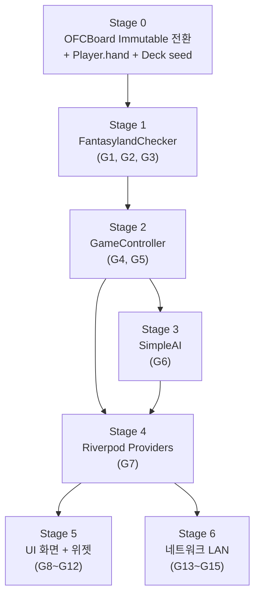
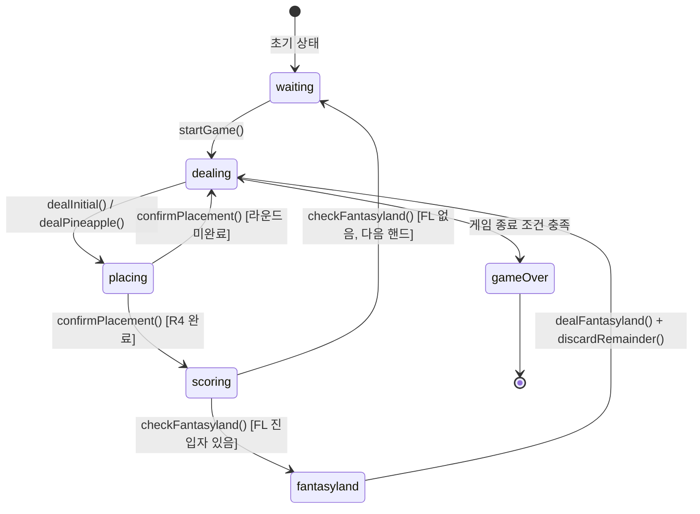
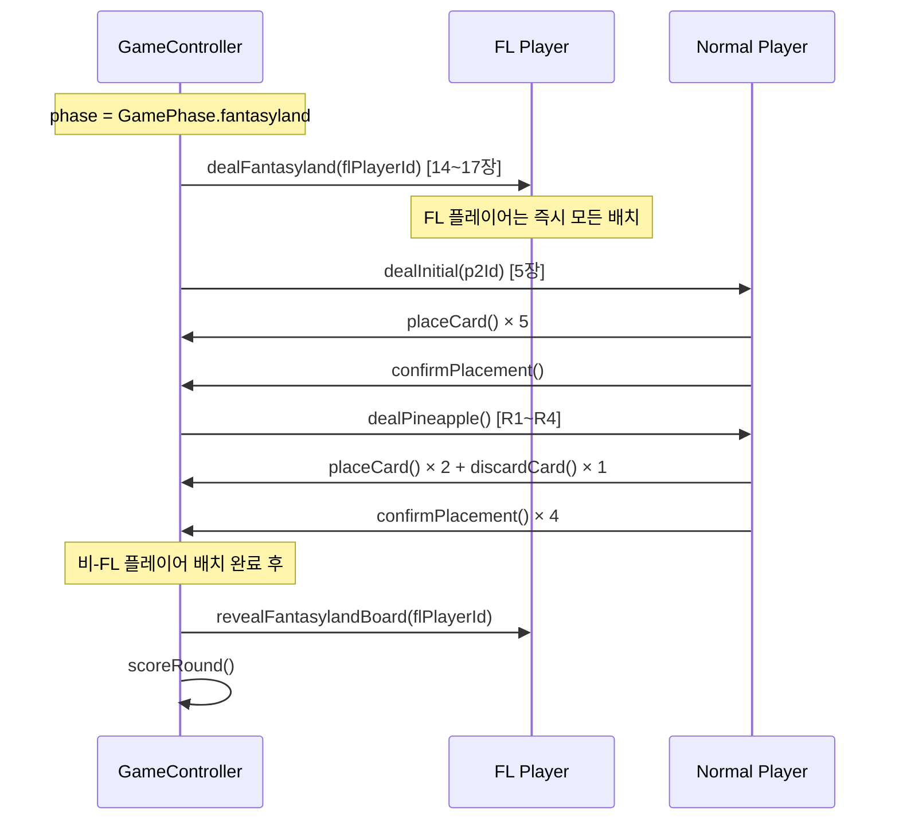
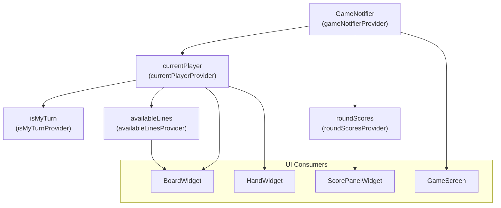
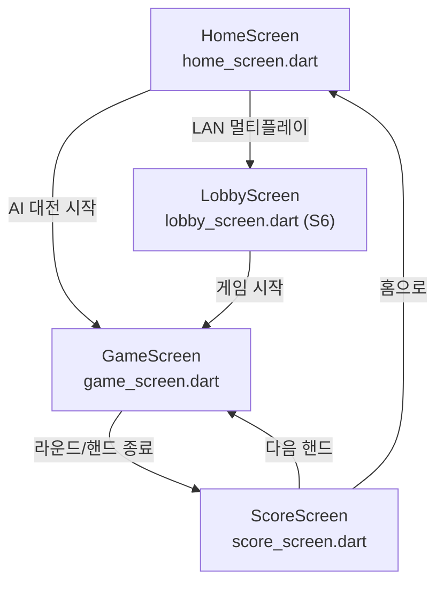
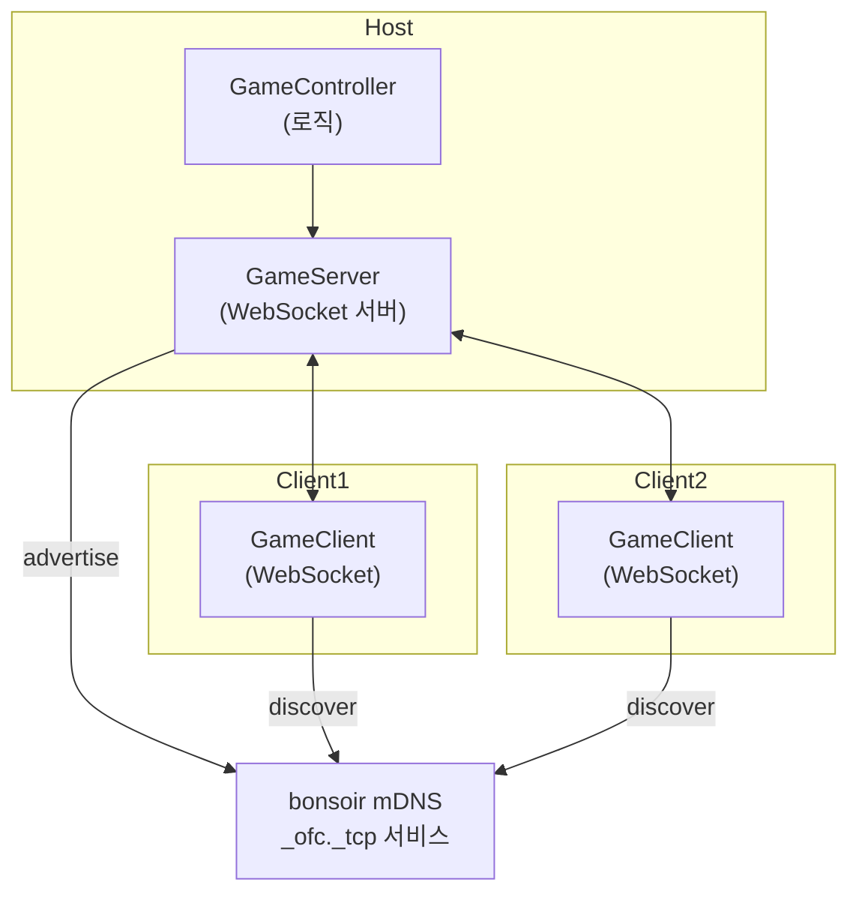

# Layer 0: Pure OFC Pineapple — 설계 문서

**버전**: 1.0
**작성일**: 2026-02-27
**계획 문서**: `docs/01-plan/layer0-ofc.plan.md` v1.1 (APPROVE됨)
**PRD**: `docs/00-prd/layer0-ofc.prd.md` v1.0
**프로젝트**: `C:\claude\card_ofc\card_ofc_flutter\`

---

## 목차

1. [배경 및 목적](#1-배경-및-목적)
2. [구현 범위 (Stage 0~6)](#2-구현-범위-stage-06)
3. [상세 설계](#3-상세-설계)
   - [3.1 Stage 0: OFCBoard Immutable 전환](#31-stage-0-ofcboard-immutable-전환)
   - [3.2 Stage 1: Fantasyland](#32-stage-1-fantasyland)
   - [3.3 Stage 2: GameController](#33-stage-2-gamecontroller)
   - [3.4 Stage 3: SimpleAI](#34-stage-3-simpleai)
   - [3.5 Stage 4: Riverpod Provider](#35-stage-4-riverpod-provider)
   - [3.6 Stage 5-6: UI + Network (개요)](#36-stage-56-ui--network-개요)
4. [영향 파일 목록](#4-영향-파일-목록)
5. [위험 요소 및 완화 방안](#5-위험-요소-및-완화-방안)

---

## 1. 배경 및 목적

### 1.1 Layer 0 목표

Pure OFC Pineapple 정식 카드 게임 규칙을 Flutter로 완전히 구현한다. 기존 Trump Card Auto Chess PRD(v4.0)에서 OFC 정식 규칙과 커스텀 오토체스 규칙이 혼합되어 발생한 22개 내부 모순을 레이어 분리로 해결한다.

**Layer 0 포함 범위**:
- OFC Pineapple 표준 딜링 및 배치 규칙 (5+3×4, Committed Rule)
- Foul, Scoop, Royalty, Fantasyland 공식 규칙
- 1:1 및 최대 3인 Pairwise 점수 계산 (1-6 Method)
- Flutter LAN 멀티플레이어 (최대 3인, bonsoir mDNS + WebSocket)

**Layer 0 제외 범위** (상위 레이어 전용):
- 경제 시스템, 별 강화, HP/데미지, 오토체스 라운드 구조, 커스텀 수트 순환 우위

### 1.2 기존 코드 활용 전략

`card_ofc_flutter/lib/` 의 models/logic 레이어는 이미 핵심 로직이 구현되어 있다. 신규 구현 대신 기존 코드를 최대한 활용한다.

| 기존 파일 | 활용 방법 | Stage |
|-----------|-----------|-------|
| `lib/models/board.dart` | OFCBoard — Immutable API로 전환 | S0 |
| `lib/models/player.dart` | Player — `hand` 필드 추가 | S0 |
| `lib/models/card.dart` | Card, Rank, Suit — 수정 없이 그대로 사용 | — |
| `lib/models/game_state.dart` | GameState (freezed) — 수정 없이 그대로 사용 | — |
| `lib/models/hand_result.dart` | HandResult, HandType — 수정 없이 그대로 사용 | — |
| `lib/logic/hand_evaluator.dart` | evaluateHand(), compareHands() — 그대로 사용 | — |
| `lib/logic/foul_checker.dart` | checkFoul() — immutable API 호환 확인 | S0 |
| `lib/logic/royalty.dart` | calcBoardRoyalty() — immutable API 호환 확인 | S0 |
| `lib/logic/scoring.dart` | calculateScores() — `_compareLine` 타입 수정 | S0 |
| `lib/logic/deck.dart` | Deck — 시드 주입 생성자 추가 | S0 |

**신규 파일** (S1~S6에서 생성):

```
lib/logic/fantasyland.dart       (S1)
lib/logic/game_controller.dart   (S2)
lib/logic/simple_ai.dart         (S3)
lib/providers/game_provider.dart (S4)
lib/providers/player_provider.dart (S4)
lib/providers/score_provider.dart  (S4)
lib/screens/home_screen.dart     (S5)
lib/screens/game_screen.dart     (S5)
lib/screens/score_screen.dart    (S5)
lib/widgets/card_widget.dart     (S5)
lib/widgets/board_widget.dart    (S5)
lib/widgets/hand_widget.dart     (S5)
lib/widgets/line_slot_widget.dart (S5)
lib/widgets/opponent_board_widget.dart (S5)
lib/widgets/score_panel_widget.dart (S5)
lib/widgets/turn_indicator_widget.dart (S5)
lib/network/game_server.dart     (S6)
lib/network/game_client.dart     (S6)
lib/network/discovery.dart       (S6)
lib/network/messages.dart        (S6)
lib/screens/lobby_screen.dart    (S6)
```

---

## 2. 구현 범위 (Stage 0~6)

### 2.1 Stage 의존성 그래프



### 2.2 Stage별 수정/신규 파일 목록

| Stage | 파일 | 구분 | 핵심 클래스/메서드 |
|-------|------|------|-------------------|
| S0 | `lib/models/board.dart` | 수정 | `OFCBoard.placeCard() → OFCBoard` |
| S0 | `lib/models/player.dart` | 수정 | `Player.hand: List<Card>` 필드 추가 |
| S0 | `lib/logic/deck.dart` | 수정 | `Deck({int? seed})` 생성자 추가 |
| S0 | `lib/logic/foul_checker.dart` | 수정 필요 시 | immutable API 호환 확인 |
| S0 | `lib/logic/royalty.dart` | 수정 필요 시 | immutable API 호환 확인 |
| S0 | `lib/logic/scoring.dart` | 수정 | `_compareLine(List<Card>)` 타입 명시 |
| S0 | `test/models/board_immutable_test.dart` | 신규 | 불변성 위전 테스트 |
| S1 | `lib/logic/fantasyland.dart` | 신규 | `FantasylandChecker` (canEnter, getEntryCardCount, canMaintain) |
| S1 | `test/logic/fantasyland_test.dart` | 신규 | 12개 테스트 케이스 |
| S2 | `lib/logic/game_controller.dart` | 신규 | `GameController` (딜링 루프, 페이즈 전환, FL 혼합 딜링) |
| S2 | `test/logic/game_controller_test.dart` | 신규 | 17개 테스트 케이스 |
| S3 | `lib/logic/simple_ai.dart` | 신규 | `SimpleAI`, `PlacementDecision` |
| S3 | `test/logic/simple_ai_test.dart` | 신규 | 5개 테스트 케이스 |
| S4 | `lib/providers/game_provider.dart` | 신규 | `GameNotifier extends _$GameNotifier` |
| S4 | `lib/providers/player_provider.dart` | 신규 | `currentPlayer`, `isMyTurn`, `availableLines` |
| S4 | `lib/providers/score_provider.dart` | 신규 | `roundScores` |
| S4 | `test/providers/game_provider_test.dart` | 신규 | Provider 단위 테스트 |
| S5 | `lib/screens/home_screen.dart` | 신규 | HomeScreen |
| S5 | `lib/screens/game_screen.dart` | 신규 | GameScreen |
| S5 | `lib/screens/score_screen.dart` | 신규 | ScoreScreen |
| S5 | `lib/widgets/card_widget.dart` | 신규 | CardWidget |
| S5 | `lib/widgets/board_widget.dart` | 신규 | BoardWidget |
| S5 | `lib/widgets/hand_widget.dart` | 신규 | HandWidget |
| S5 | `lib/widgets/line_slot_widget.dart` | 신규 | LineSlotWidget (DragTarget) |
| S5 | `lib/widgets/opponent_board_widget.dart` | 신규 | OpponentBoardWidget |
| S5 | `lib/widgets/score_panel_widget.dart` | 신규 | ScorePanelWidget |
| S5 | `lib/widgets/turn_indicator_widget.dart` | 신규 | TurnIndicatorWidget |
| S6 | `lib/network/game_server.dart` | 신규 | GameServer (WebSocket Host) |
| S6 | `lib/network/game_client.dart` | 신규 | GameClient (WebSocket) |
| S6 | `lib/network/discovery.dart` | 신규 | bonsoir mDNS 광고/검색 |
| S6 | `lib/network/messages.dart` | 신규 | NetworkMessage 프로토콜 |
| S6 | `lib/screens/lobby_screen.dart` | 신규 | LobbyScreen |

---

## 3. 상세 설계

### 3.1 Stage 0: OFCBoard Immutable 전환

#### 3.1.1 현재 상태 분석

현재 `lib/models/board.dart`의 `OFCBoard`는 mutable 방식이다.

```dart
// 현재: mutable — 직접 List에 add() 수행
bool placeCard(String line, Card card) {
  switch (line) {
    case 'top':
      if (top.length < topMaxCards) {
        top.add(card);   // ← 직접 mutation
        return true;
      }
      return false;
    // ...
  }
}
```

이 방식은 Riverpod의 `state = state.copyWith(...)` 패턴에서 상태 추적이 불가능하다. `top.add(card)`는 기존 참조를 변경하므로 Riverpod이 변경을 감지하지 못한다.

#### 3.1.2 Immutable API 전환 설계

**`lib/models/board.dart` — placeCard 반환 타입 변경**

```dart
// 변경 후: immutable — 새 OFCBoard 인스턴스 반환
OFCBoard placeCard(String line, Card card) {
  switch (line) {
    case 'top':
      if (top.length < topMaxCards) {
        return copyWith(top: [...top, card]);
      }
      return this; // 만석이면 자신 반환 (변경 없음 표시)
    case 'mid':
      if (mid.length < midMaxCards) {
        return copyWith(mid: [...mid, card]);
      }
      return this;
    case 'bottom':
      if (bottom.length < bottomMaxCards) {
        return copyWith(bottom: [...bottom, card]);
      }
      return this;
    default:
      return this;
  }
}

// 배치 가능 여부 별도 확인 메서드 (UI에서 사용)
bool canPlace(String line, Card card) {
  switch (line) {
    case 'top':    return top.length < topMaxCards;
    case 'mid':    return mid.length < midMaxCards;
    case 'bottom': return bottom.length < bottomMaxCards;
    default:       return false;
  }
}

// removeCard도 동일하게 immutable 처리
OFCBoard removeCard(String line, Card card) {
  switch (line) {
    case 'top':    return copyWith(top: top.where((c) => c != card).toList());
    case 'mid':    return copyWith(mid: mid.where((c) => c != card).toList());
    case 'bottom': return copyWith(bottom: bottom.where((c) => c != card).toList());
    default:       return this;
  }
}
```

> **주의**: `removeCard()`는 내부 테스트 목적으로만 존재한다. GameController 레벨에서는 Committed Rule(§2.3)에 따라 절대 호출하지 않는다.

#### 3.1.3 소비 코드 영향 분석

| 소비 코드 파일 | 영향 | 수정 방법 |
|---------------|------|-----------|
| `lib/logic/foul_checker.dart` | `checkFoul(OFCBoard board)` — board.top/mid/bottom에만 접근, 수정 없이 동작 | 수정 불필요 |
| `lib/logic/royalty.dart` | `calcBoardRoyalty(OFCBoard board)` — board.top/mid/bottom 읽기 전용 | 수정 불필요 |
| `lib/logic/scoring.dart` | `_compareLine(List<dynamic> cards1, ...)` — `dynamic` 타입이므로 Card로 명시 권장 | `List<Card>`로 타입 수정 |

**scoring.dart `_compareLine` 수정**:

```dart
// 변경 전
int _compareLine(List<dynamic> cards1, List<dynamic> cards2) { ... }

// 변경 후
int _compareLine(List<Card> cards1, List<Card> cards2) { ... }
```

#### 3.1.4 Player.hand 필드 추가

`lib/models/player.dart`에 `hand` 필드를 추가한다. 이 필드는 딜링 후 아직 배치되지 않은 카드를 추적한다.

```dart
@freezed
class Player with _$Player {
  const factory Player({
    required String id,
    required String name,
    @OFCBoardConverter() required OFCBoard board,
    @Default(0) int score,
    @Default(false) bool isInFantasyland,
    @Default(0) int fantasylandCardCount,
    @Default([]) List<Card> hand, // 추가: 딜 후 미배치 카드 (각 라운드 딜 시 채워짐)
  }) = _Player;

  factory Player.fromJson(Map<String, dynamic> json) => _$PlayerFromJson(json);
}
```

> `@Default([])` 지시자는 freezed가 `List<Card>`로 인식하도록 빈 리스트를 기본값으로 설정한다. freezed code generation 이후 `player.freezed.dart`와 `player.g.dart`가 갱신된다.

#### 3.1.5 Deck 시드 주입

`lib/logic/deck.dart`에 시드 주입 생성자를 추가한다. 이는 테스트 결정성을 보장한다.

```dart
import 'dart:math';
import '../models/card.dart';

class Deck {
  final List<Card> _cards = [];
  late final Random _random;
  final int? seed;

  Deck({this.seed}) {
    _random = seed != null ? Random(seed) : Random();
    _init();
    shuffle();
  }

  void shuffle() {
    _cards.shuffle(_random);
  }

  void reset() {
    _init();
    shuffle();
  }
  // ... 나머지 기존 메서드 유지
}
```

#### 3.1.6 테스트 케이스 (`test/models/board_immutable_test.dart`)

| # | 테스트 | 기대 결과 |
|---|--------|-----------|
| T1 | `placeCard('top', card)` 호출 후 원본 board 불변 | `original.top.length == 0` (변경 없음) |
| T2 | `placeCard` 반환값과 원본이 다른 참조 | `identical(original, result) == false` |
| T3 | `Player.hand` copyWith 전파 확인 | `player.copyWith(hand: [card]).hand == [card]` |
| T4 | `Deck(seed: 42).deal(5)` 두 번 실행 동일 결과 | 결정적 딜 |
| T5 | `scoring._compareLine` — Foul 양쪽 동시 → 0점 | score == 0 |
| T6 | `scoring._compareLine` — Scoop 보너스 → +3 | lineScore + 3 |

### 3.2 Stage 1: Fantasyland

#### 3.2.1 FantasylandChecker 클래스 설계

**파일**: `lib/logic/fantasyland.dart`

```dart
import '../models/board.dart';
import '../models/hand_result.dart';
import 'hand_evaluator.dart';
import 'foul_checker.dart';

/// OFC Pineapple Fantasyland 진입/유지/딜링 판정 (PRD 2.8)
class FantasylandChecker {
  // ──────────────────────────────────────────────
  // 진입 조건
  // ──────────────────────────────────────────────

  /// 진입 조건 확인: Top QQ+ 핸드 + 보드 완성 + Foul 아님
  ///
  /// 조건:
  ///   1. board.isFull() == true (13장 모두 배치)
  ///   2. checkFoul(board) == false
  ///   3. evaluateHand(board.top) == ONE_PAIR, kicker rank >= QUEEN
  ///      OR evaluateHand(board.top) == THREE_OF_A_KIND
  static bool canEnter(OFCBoard board) {
    if (!board.isFull()) return false;
    if (checkFoul(board)) return false;
    return _isQQOrBetter(board.top);
  }

  /// Progressive 딜링 카드 수 결정 (PRD 2.8 테이블)
  ///
  /// 전제: canEnter(board) == true인 상태에서 호출
  /// QQ=14, KK=15, AA=16, Trips(any)=17
  static int getEntryCardCount(OFCBoard board) {
    final topResult = evaluateHand(board.top);

    if (topResult.handType == HandType.threeOfAKind) {
      return 17; // Trips
    }

    if (topResult.handType == HandType.onePair) {
      final pairRank = _getPairRank(topResult);
      if (pairRank == Rank.ace)   return 16; // AA
      if (pairRank == Rank.king)  return 15; // KK
      return 14; // QQ (기본값, canEnter 통과했으므로 QQ 이상 보장)
    }

    return 14; // fallback (도달 불가)
  }

  // ──────────────────────────────────────────────
  // 유지 조건 (Re-Fantasyland)
  // ──────────────────────────────────────────────

  /// Re-Fantasyland 유지 조건 확인 (PRD 2.8)
  ///
  /// 조건 중 하나라도 충족 시 true:
  ///   - Top: Three of a Kind
  ///   - Mid: Four of a Kind 이상
  ///   - Bottom: Four of a Kind 이상
  static bool canMaintain(OFCBoard board) {
    if (!board.isFull()) return false;

    final topResult    = evaluateHand(board.top);
    final midResult    = evaluateHand(board.mid);
    final bottomResult = evaluateHand(board.bottom);

    if (topResult.handType == HandType.threeOfAKind) return true;
    if (midResult.handType.index >= HandType.fourOfAKind.index) return true;
    if (bottomResult.handType.index >= HandType.fourOfAKind.index) return true;

    return false;
  }

  /// Re-FL 카드 수: 항상 14장 (진입 조건과 무관)
  static const int reEntryCardCount = 14;

  // ──────────────────────────────────────────────
  // Private Helpers
  // ──────────────────────────────────────────────

  static bool _isQQOrBetter(List<Card> topCards) {
    final result = evaluateHand(topCards);
    if (result.handType == HandType.threeOfAKind) return true;
    if (result.handType == HandType.onePair) {
      final pairRank = _getPairRank(result);
      return pairRank != null && pairRank.index >= Rank.queen.index;
    }
    return false;
  }

  static Rank? _getPairRank(HandResult result) {
    // HandResult.kickers[0]이 페어의 랭크를 담고 있음 (hand_evaluator 규약)
    return result.kickers.isNotEmpty ? result.kickers[0] : null;
  }
}
```

#### 3.2.2 HandType 기반 진입/유지 조건 매핑

| 조건 | Top 핸드 | `canEnter` | `getEntryCardCount` |
|------|----------|:----------:|:-------------------:|
| QQ (Pair of Queens) | ONE_PAIR, kicker=Q | true | 14 |
| KK (Pair of Kings) | ONE_PAIR, kicker=K | true | 15 |
| AA (Pair of Aces) | ONE_PAIR, kicker=A | true | 16 |
| Trips (any rank) | THREE_OF_A_KIND | true | 17 |
| JJ 이하 페어 | ONE_PAIR, kicker<Q | false | — |
| HIGH_CARD | HIGH_CARD | false | — |
| Foul 상태 | any | false | — |
| 보드 미완성 | any | false | — |

| Re-FL 조건 | 라인 | `canMaintain` |
|-----------|------|:-------------:|
| Top Trips | Top THREE_OF_A_KIND | true |
| Mid FourOfAKind+ | Mid FOUR_OF_A_KIND 이상 | true |
| Bottom FourOfAKind+ | Bottom FOUR_OF_A_KIND 이상 | true |
| 위 조건 미충족 | — | false |

#### 3.2.3 테스트 케이스 (`test/logic/fantasyland_test.dart`)

| # | 테스트 시나리오 | 기대 결과 |
|---|----------------|-----------|
| T1 | Top QQ (Pair of Queens) + no Foul + full board | `canEnter=true, count=14` |
| T2 | Top KK + no Foul + full board | `canEnter=true, count=15` |
| T3 | Top AA + no Foul + full board | `canEnter=true, count=16` |
| T4 | Top Trips (any) + no Foul + full board | `canEnter=true, count=17` |
| T5 | Top JJ + no Foul + full board | `canEnter=false` |
| T6 | Top QQ + Foul 상태 | `canEnter=false` |
| T7 | Top QQ + 보드 미완성 | `canEnter=false` |
| T8 | Top Trips → `canMaintain=true` | Re-FL 유지 |
| T9 | Mid FourOfAKind → `canMaintain=true` | Re-FL 유지 |
| T10 | Bottom FourOfAKind → `canMaintain=true` | Re-FL 유지 |
| T11 | Top AA, Mid FullHouse, Bottom Straight | `canMaintain=false` |
| T12 | 빈 보드 → `canEnter=false` | 보드 미완성 |

### 3.3 Stage 2: GameController

#### 3.3.1 Immutable 반환 패턴

**파일**: `lib/logic/game_controller.dart`

GameController의 모든 public 메서드는 `GameState`를 반환한다. `void` 반환은 금지된다. 이는 Riverpod Provider의 `state = _controller.method()` 패턴과 일관성을 유지하며 테스트 용이성을 확보한다.

```dart
import '../models/card.dart';
import '../models/game_state.dart';
import '../models/player.dart';
import '../models/board.dart';
import 'deck.dart';
import 'fantasyland.dart';
import 'scoring.dart';
import 'foul_checker.dart';

class GameController {
  GameState _state;
  final Deck _deck;

  GameController({Deck? deck})
      : _deck = deck ?? Deck(),
        _state = const GameState(players: []);

  GameState get state => _state;

  // ──────────────────────────────────────────────
  // 게임 시작
  // ──────────────────────────────────────────────

  /// 게임 시작: 덱 셔플, 플레이어 초기화 → 새 GameState 반환
  GameState startGame(List<String> playerNames) {
    _deck.reset();
    final players = playerNames.asMap().entries.map((entry) {
      return Player(
        id: 'player_${entry.key}',
        name: entry.value,
        board: OFCBoard(),
        score: 0,
      );
    }).toList();

    _state = GameState(
      players: players,
      currentRound: 0,
      currentPlayerIndex: 0,
      phase: GamePhase.dealing,
      roundPhase: RoundPhase.initial,
    );
    return _state;
  }

  // ──────────────────────────────────────────────
  // 딜링
  // ──────────────────────────────────────────────

  /// Round 0: 5장 딜 → Player.hand 업데이트된 GameState 반환
  GameState dealInitial(String playerId) {
    final cards = _deck.deal(5);
    return _updatePlayerHand(playerId, cards);
  }

  /// Round 1~4: 3장 딜 → GameState 반환
  GameState dealPineapple(String playerId) {
    final cards = _deck.deal(3);
    return _updatePlayerHand(playerId, cards);
  }

  /// Fantasyland 플레이어에게 Progressive 딜링
  /// canEnter(board) 이후에 호출; cardCount = FantasylandChecker.getEntryCardCount()
  GameState dealFantasyland(String playerId) {
    final player = _getPlayer(playerId);
    final cardCount = player.isInFantasyland
        ? FantasylandChecker.reEntryCardCount
        : FantasylandChecker.getEntryCardCount(player.board);
    final cards = _deck.deal(cardCount);
    return _updatePlayerHand(playerId, cards);
  }

  // ──────────────────────────────────────────────
  // 배치 (Committed Rule)
  // ──────────────────────────────────────────────

  /// 카드 배치: Committed Rule 강제 (배치 후 취소 불가)
  /// 반환값: 성공 시 업데이트된 GameState, 실패 시 null (만석 라인, 핸드에 없는 카드 등)
  GameState? placeCard(String playerId, Card card, String line) {
    final player = _getPlayer(playerId);

    // 핸드에 카드가 있는지 확인
    if (!player.hand.contains(card)) return null;

    // 라인 배치 가능 여부 확인
    if (!player.board.canPlace(line, card)) return null;

    final newBoard = player.board.placeCard(line, card);
    final newHand = List<Card>.from(player.hand)..remove(card);
    final updatedPlayer = player.copyWith(board: newBoard, hand: newHand);

    return _replacePlayer(updatedPlayer);
  }

  /// 카드 버림 (Round 1~4: 3장 중 1장 버림)
  /// 반환값: 성공 시 GameState, 실패 시 null (핸드에 없는 카드)
  GameState? discardCard(String playerId, Card card) {
    final player = _getPlayer(playerId);
    if (!player.hand.contains(card)) return null;

    final newHand = List<Card>.from(player.hand)..remove(card);
    final updatedPlayer = player.copyWith(hand: newHand);
    final newDiscard = [..._state.discardPile, card];

    _state = _replacePlayer(updatedPlayer)
        .copyWith(discardPile: newDiscard);
    return _state;
  }

  /// FL 플레이어: 13장 배치 후 나머지 카드 자동 버림 (PRD 2.8)
  GameState discardFantasylandRemainder(String playerId) {
    final player = _getPlayer(playerId);
    final remainder = List<Card>.from(player.hand);
    final updatedPlayer = player.copyWith(hand: []);
    final newDiscard = [..._state.discardPile, ...remainder];

    _state = _replacePlayer(updatedPlayer)
        .copyWith(discardPile: newDiscard);
    return _state;
  }

  // ──────────────────────────────────────────────
  // 배치 확정 및 페이즈 전환
  // ──────────────────────────────────────────────

  /// 현재 플레이어 배치 완료 확인 → 다음 플레이어/라운드 전환
  GameState confirmPlacement(String playerId) {
    final nextPlayerIndex = (_state.currentPlayerIndex + 1) % _state.players.length;
    final isLastPlayer = nextPlayerIndex == 0;

    if (!isLastPlayer) {
      _state = _state.copyWith(currentPlayerIndex: nextPlayerIndex);
      return _state;
    }

    // 모든 플레이어 완료 → 라운드 전환
    final nextRound = _state.currentRound + 1;
    if (nextRound > 4) {
      // 모든 라운드 완료 → 점수 계산
      return scoreRound();
    }

    _state = _state.copyWith(
      currentRound: nextRound,
      currentPlayerIndex: 0,
      roundPhase: RoundPhase.pineapple,
    );
    return _state;
  }

  // ──────────────────────────────────────────────
  // 점수 계산 및 Fantasyland 전환
  // ──────────────────────────────────────────────

  /// 모든 라운드 완료 후 점수 계산 → GameState(점수 업데이트) 반환
  GameState scoreRound() {
    final scores = calculateScores(_state.players);
    final updatedPlayers = _state.players.map((p) {
      return p.copyWith(score: p.score + (scores[p.id] ?? 0));
    }).toList();

    _state = _state.copyWith(
      players: updatedPlayers,
      phase: GamePhase.scoring,
    );
    return _state;
  }

  /// Fantasyland 진입자 확인 및 다음 핸드 FL 설정 → GameState 반환
  GameState checkFantasyland() {
    final updatedPlayers = _state.players.map((p) {
      if (FantasylandChecker.canEnter(p.board)) {
        final cardCount = FantasylandChecker.getEntryCardCount(p.board);
        return p.copyWith(
          isInFantasyland: true,
          fantasylandCardCount: cardCount,
        );
      }
      // Re-FL 유지 여부 확인
      if (p.isInFantasyland && FantasylandChecker.canMaintain(p.board)) {
        return p.copyWith(
          isInFantasyland: true,
          fantasylandCardCount: FantasylandChecker.reEntryCardCount,
        );
      }
      return p.copyWith(isInFantasyland: false, fantasylandCardCount: 0);
    }).toList();

    _state = _state.copyWith(
      players: updatedPlayers,
      phase: GamePhase.fantasyland,
    );
    return _state;
  }

  /// FL 플레이어 보드 공개: 비-FL 플레이어 배치 완료 후 호출 (PRD 2.8)
  GameState revealFantasylandBoard(String playerId) {
    // 현재 구현에서는 상태 변경 없음 (공개 여부는 UI 레이어에서 관리)
    // 향후 isRevealed 필드 추가 시 여기서 처리
    return _state;
  }

  // ──────────────────────────────────────────────
  // Private Helpers
  // ──────────────────────────────────────────────

  Player _getPlayer(String playerId) {
    return _state.players.firstWhere((p) => p.id == playerId);
  }

  GameState _updatePlayerHand(String playerId, List<Card> cards) {
    final player = _getPlayer(playerId);
    final updatedPlayer = player.copyWith(
      hand: [...player.hand, ...cards],
    );
    _state = _replacePlayer(updatedPlayer);
    return _state;
  }

  GameState _replacePlayer(Player updatedPlayer) {
    final updatedPlayers = _state.players.map((p) {
      return p.id == updatedPlayer.id ? updatedPlayer : p;
    }).toList();
    _state = _state.copyWith(players: updatedPlayers);
    return _state;
  }
}
```

#### 3.3.2 GamePhase 상태 머신 다이어그램



#### 3.3.3 FL/비-FL 혼합 딜링 흐름

Fantasyland 진입자와 일반 플레이어가 동시에 존재할 때의 처리 흐름:



#### 3.3.4 Committed Rule 강제 메커니즘

| 레벨 | 구현 방법 | 설명 |
|------|-----------|------|
| **GameController** | `placeCard()` 반환 후 되돌리는 메서드 없음 | 컨트롤러 API 자체에 취소 기능 없음 |
| **GameController** | `removeCard()`는 GameController 레벨에서 절대 호출 금지 | 코드 규약 + 주석으로 강제 |
| **UI 레이어** | 배치 전 미리보기는 로컬 임시 상태(`_previewBoard`)로 관리 | Provider state에 반영하기 전 확인 단계 |
| **테스트** | `placeCard` → `removeCard` 시도 테스트 → null 반환 확인 | 컨트롤러가 removeCard를 노출하지 않음 |

#### 3.3.5 딜링 카드 수 검증

| 게임 구성 | 라운드별 딜 | 총 사용 | 덱 여유 |
|-----------|------------|---------|---------|
| 2인 일반 | 5 + (3×4) = 17장/인 × 2 | 34장 | 18장 |
| 3인 일반 | 17장/인 × 3 | 51장 | 1장 |
| 3인 FL 동시 (최대) | 17장/인 × 3 (Trips 기준) | 51장 | 1장 (허용) |

#### 3.3.6 테스트 케이스 (`test/logic/game_controller_test.dart`)

| # | 테스트 시나리오 | 기대 결과 |
|---|----------------|-----------|
| T1 | `startGame(['A', 'B'])` | players.length=2, round=0, phase=dealing |
| T2 | `dealInitial(playerId)` | player.hand.length=5, deck.remaining 감소 |
| T3 | Round 0: 5장 모두 `placeCard` + `confirmPlacement` | 다음 플레이어로 전환 |
| T4 | `dealPineapple(playerId)` | player.hand.length=3 |
| T5 | Round 1: 2장 `placeCard` + 1장 `discardCard` + `confirmPlacement` | 다음 플레이어 전환 |
| T6 | Committed Rule: `placeCard` 후 GameController에서 `removeCard` 노출 안됨 | API 없음 |
| T7 | Round 4 완료 → `board.isFull() == true` | 13장 배치 확인 |
| T8 | `scoreRound()` → Pairwise 점수 반환 | `calculateScores` 결과 |
| T9 | `checkFantasyland()` — QQ+ Top → `isInFantasyland=true` | FL 진입 |
| T10 | `dealFantasyland(QQ 진입자)` → 14장 딜 | player.hand.length=14 |
| T11 | `dealFantasyland(Trips 진입자)` → 17장 딜 | player.hand.length=17 |
| T12 | 3인 게임 전체 라운드 → `deck.remaining == 1` | 51장 사용 |
| T13 | 만석 라인에 `placeCard` 시도 → `null` | 배치 거부 |
| T14 | FL 플레이어 + 일반 플레이어 혼합: 일반 완료 후 `revealFantasylandBoard` 호출 | state 반환 |
| T15 | `discardFantasylandRemainder()`: 17장 중 13장 배치, 4장 hand에서 차감 | player.hand=[] |
| T16 | `placeCard()` 반환 GameState ≠ 이전 state 참조 | immutable 확인 |
| T17 | 양쪽 Foul 시 0점, Scoop +3 | 점수 규칙 검증 |

### 3.4 Stage 3: SimpleAI

#### 3.4.1 클래스 설계

**파일**: `lib/logic/simple_ai.dart`

```dart
import '../models/card.dart';
import '../models/board.dart';
import '../models/hand_result.dart';
import 'hand_evaluator.dart';
import 'foul_checker.dart';

class PlacementDecision {
  /// 카드 → 라인 매핑 (round 0: 5개, round 1~4: 2개)
  final Map<Card, String> placements;
  /// round 1~4에서 버릴 카드 (round 0에서는 null)
  final Card? discard;

  const PlacementDecision({
    required this.placements,
    this.discard,
  });
}

class SimpleAI {
  /// 주어진 핸드와 현재 보드 상태에서 배치 결정을 반환
  PlacementDecision decide(
    List<Card> hand,
    OFCBoard board,
    int round, // 0=initial, 1~4=pineapple
  ) {
    if (round == 0) {
      return _decideInitial(hand, board);
    } else {
      return _decidePineapple(hand, board);
    }
  }
}
```

#### 3.4.2 규칙 기반 배치 알고리즘 의사코드

```
function _decideInitial(hand: List<Card>, board: OFCBoard):
  placements = {}
  sorted = hand.sortedByRankDescending()
  tempBoard = board.copy()

  for card in sorted:
    line = _chooseLine(card, tempBoard, targetFL=true)
    placements[card] = line
    tempBoard = tempBoard.placeCard(line, card)

  // Foul 방지 시뮬레이션
  if checkFoul(tempBoard):
    placements = _reshuffleToAvoidFoul(hand, board)

  return PlacementDecision(placements: placements, discard: null)


function _decidePineapple(hand: List<Card>, board: OFCBoard):
  // 1. 버릴 카드 선택 (가장 가치 낮은 카드)
  discard = _selectDiscard(hand, board)
  remaining = hand.without(discard)

  placements = {}
  tempBoard = board.copy()
  for card in remaining.sortedByRankDescending():
    line = _chooseLine(card, tempBoard, targetFL=false)
    placements[card] = line
    tempBoard = tempBoard.placeCard(line, card)

  // Foul 방지 재검사
  if checkFoul(tempBoard):
    placements, discard = _reshuffleToAvoidFoul(hand, board)

  return PlacementDecision(placements: placements, discard: discard)


function _chooseLine(card: Card, board: OFCBoard, targetFL: bool):
  // 우선순위 1: Fantasyland 시도 (targetFL=true, Round 0만)
  if targetFL and card.rank >= QUEEN and board.top.length < 3:
    // 현재 Top에 같은 랭크 있으면 페어 완성 시도
    if _hasSameRankInTop(card, board):
      return 'top'

  // 우선순위 2: High cards (K, A) → Bottom 우선
  if card.rank >= KING:
    if board.bottom.length < 5: return 'bottom'
    if board.mid.length < 5:    return 'mid'

  // 우선순위 3: 페어 완성 시도
  for line in ['bottom', 'mid', 'top']:
    if _hasSameRankInLine(card, line, board) and _lineNotFull(line, board):
      return line

  // 우선순위 4: 빈 슬롯 가장 많은 라인 (Bottom 우선)
  return _lineWithMostSpace(board)
```

#### 3.4.3 Foul 방지 시뮬레이션

```dart
// Foul 방지: 배치 후 체크, Foul 발생 시 재배치 시도
List<Map<Card, String>> _generateCandidates(List<Card> hand, OFCBoard board) {
  // 순열 조합 생성 (hand.length <= 5이므로 최대 3! × 2 = 6 케이스)
  // 각 후보에 대해 checkFoul(simulatedBoard) 확인
  // Foul 없는 첫 번째 배치 반환
}
```

#### 3.4.4 테스트 케이스 (`test/logic/simple_ai_test.dart`)

| # | 테스트 시나리오 | 기대 결과 |
|---|----------------|-----------|
| T1 | Round 0: 5장 → `placements.length=5`, `discard=null` | 유효한 5장 배치 |
| T2 | Round 1~4: 3장 → `placements.length=2`, `discard != null` | 합법적 결정 |
| T3 | 모든 AI 결정 적용 후 보드 → `checkFoul(board) == false` | Foul 없음 |
| T4 | Top 3장 만석 상태에서 AI → Top에 배치 안 함 | `placements.values` 중 'top' 없음 |
| T5 | 전체 게임 R0~R4 AI 자동 진행 → `board.isFull() == true` | 13장 배치 완료 |

### 3.5 Stage 4: Riverpod Provider

#### 3.5.1 GameNotifier ↔ GameController 통합 패턴

**파일**: `lib/providers/game_provider.dart`

```dart
import 'package:riverpod_annotation/riverpod_annotation.dart';
import '../models/game_state.dart';
import '../models/card.dart';
import '../logic/game_controller.dart';
import '../logic/simple_ai.dart';

part 'game_provider.g.dart';

@riverpod
class GameNotifier extends _$GameNotifier {
  late GameController _controller;
  bool _withAI = false;

  @override
  GameState build() {
    _controller = GameController();
    return const GameState(players: []);
  }

  /// 게임 시작 (AI 대전 옵션 포함)
  void startGame(List<String> playerNames, {bool withAI = false}) {
    _withAI = withAI;
    final names = withAI ? [...playerNames, 'AI'] : playerNames;
    state = _controller.startGame(names);
  }

  /// 카드 배치 (Committed Rule: 취소 불가)
  void placeCard(Card card, String line) {
    final currentPlayerId = state.players[state.currentPlayerIndex].id;
    final newState = _controller.placeCard(currentPlayerId, card, line);
    if (newState != null) state = newState;
  }

  /// 카드 버림 (Round 1~4)
  void discardCard(Card card) {
    final currentPlayerId = state.players[state.currentPlayerIndex].id;
    final newState = _controller.discardCard(currentPlayerId, card);
    if (newState != null) state = newState;
  }

  /// 배치 확정
  void confirmPlacement() {
    final currentPlayerId = state.players[state.currentPlayerIndex].id;
    state = _controller.confirmPlacement(currentPlayerId);

    // AI 턴인 경우 자동 처리
    if (_withAI && _isAITurn()) {
      _processAITurn();
    }
  }

  /// 게임 종료 여부
  bool get isGameOver => state.phase == GamePhase.gameOver;

  bool _isAITurn() {
    final currentPlayer = state.players[state.currentPlayerIndex];
    return currentPlayer.name == 'AI';
  }

  void _processAITurn() {
    final ai = SimpleAI();
    final currentPlayer = state.players[state.currentPlayerIndex];
    final decision = ai.decide(
      currentPlayer.hand,
      currentPlayer.board,
      state.currentRound,
    );

    // AI 배치 실행
    for (final entry in decision.placements.entries) {
      placeCard(entry.key, entry.value);
    }
    if (decision.discard != null) {
      discardCard(decision.discard!);
    }
    confirmPlacement();
  }
}
```

#### 3.5.2 파생 Provider

**파일**: `lib/providers/player_provider.dart`

```dart
import 'package:riverpod_annotation/riverpod_annotation.dart';
import '../models/card.dart';
import '../models/player.dart';
import 'game_provider.dart';

part 'player_provider.g.dart';

/// 현재 턴 플레이어
@riverpod
Player? currentPlayer(Ref ref) {
  final gameState = ref.watch(gameNotifierProvider);
  if (gameState.players.isEmpty) return null;
  return gameState.players[gameState.currentPlayerIndex];
}

/// 내 턴 여부 (로컬 플레이어 ID 기준)
@riverpod
bool isMyTurn(Ref ref) {
  final current = ref.watch(currentPlayerProvider);
  // 단일 플레이어 로컬 게임에서는 항상 true
  // 네트워크 게임에서는 localPlayerId 비교 필요 (S6에서 확장)
  return current != null;
}

/// 현재 플레이어가 배치 가능한 라인 목록
@riverpod
List<String> availableLines(Ref ref) {
  final current = ref.watch(currentPlayerProvider);
  if (current == null) return [];

  final lines = <String>[];
  if (current.board.top.length < OFCBoard.topMaxCards) lines.add('top');
  if (current.board.mid.length < OFCBoard.midMaxCards) lines.add('mid');
  if (current.board.bottom.length < OFCBoard.bottomMaxCards) lines.add('bottom');
  return lines;
}
```

**파일**: `lib/providers/score_provider.dart`

```dart
import 'package:riverpod_annotation/riverpod_annotation.dart';
import 'game_provider.dart';

part 'score_provider.g.dart';

/// 현재 라운드 점수 맵 (playerId → score)
@riverpod
Map<String, int>? roundScores(Ref ref) {
  final gameState = ref.watch(gameNotifierProvider);
  if (gameState.phase != GamePhase.scoring) return null;

  // scoring.dart의 calculateScores 결과를 GameState에서 읽음
  // GameController.scoreRound() 호출 후 players[i].score 반영됨
  return {
    for (final p in gameState.players) p.id: p.score,
  };
}
```

#### 3.5.3 Provider 의존성 트리



#### 3.5.4 핵심 설계 원칙

| 원칙 | 설명 |
|------|------|
| **GameController = 순수 로직** | Flutter/Riverpod 의존 없음. `import 'package:flutter/...` 금지 |
| **Provider = Controller 래핑** | UI ↔ Logic 브릿지. `state = _controller.method()` 패턴 |
| **Immutable 일관성** | GameController 모든 메서드 → GameState 반환. Provider는 `state =` 대입으로 업데이트 |
| **void 금지** | GameController public 메서드에서 `void` 반환 금지 |

### 3.6 Stage 5-6: UI + Network (개요)

#### 3.6.1 Stage 5: UI 화면 개요

**화면 구조**:



**핵심 위젯 역할**:

| 위젯 | 파일 | 역할 |
|------|------|------|
| `CardWidget` | `widgets/card_widget.dart` | 개별 카드 (랭크+수트, 앞면/뒷면, Draggable) |
| `BoardWidget` | `widgets/board_widget.dart` | 3라인 레이아웃 (Top 3슬롯, Mid 5슬롯, Bottom 5슬롯) |
| `HandWidget` | `widgets/hand_widget.dart` | 딜된 카드 가로 배열 (배치 대상) |
| `LineSlotWidget` | `widgets/line_slot_widget.dart` | 빈/채워진 슬롯, DragTarget |
| `OpponentBoardWidget` | `widgets/opponent_board_widget.dart` | 상대 보드 축소 표시 |
| `ScorePanelWidget` | `widgets/score_panel_widget.dart` | 라인별 점수, Royalty, Scoop |
| `TurnIndicatorWidget` | `widgets/turn_indicator_widget.dart` | 현재 턴, 라운드 번호 |

**게임 화면 레이아웃**:

```
+--------------------------------------------------+
|  [Turn: Round 2]              [Score: P1: 5]    |
+--------------------------------------------------+
|                                                  |
|    [Opponent Board - compact / face-down FL]    |
|                                                  |
+--------------------------------------------------+
|                  My Board                        |
|  Top:    [ _ ] [ _ ] [ _ ]                      |
|  Mid:    [ _ ] [ _ ] [ _ ] [ _ ] [ _ ]         |
|  Bottom: [ _ ] [ _ ] [ _ ] [ _ ] [ _ ]         |
+--------------------------------------------------+
|                                                  |
|    My Hand:  [5♠] [K♥] [3♦]                    |
|                                                  |
|    [Discard Zone]         [Confirm Button]      |
+--------------------------------------------------+
```

**드래그 앤 드롭 인터랙션**:
1. 핸드 영역: 딜된 카드 가로 배열 표시
2. 드래그 시작: `LongPressDraggable` 위젯으로 카드 집기
3. 드롭 타겟: 각 `LineSlotWidget`이 `DragTarget<Card>` 역할
4. 만석 라인: 비활성 시각 표시, 드롭 거부 (`canAccept: false`)
5. 버림: 라운드 1~4에서 `DiscardZone` (DragTarget)에 드롭
6. 확정: 배치/버림 조건 충족 시 "확정" 버튼 활성화

**Fantasyland 특수 화면**:
- 14~17장 한 번에 그리드 표시 (스크롤 가능)
- 13장 배치 완료 시 나머지 자동 버림 확인 다이얼로그
- 상대방 화면에서는 FL 플레이어 보드 뒤집기 표시

#### 3.6.2 Stage 6: Network 개요

**아키텍처**:



**메시지 프로토콜 (`lib/network/messages.dart`)**:

```dart
enum MessageType {
  joinRequest, joinAccepted,
  gameStart,
  dealCards, placeCard, discardCard, confirmPlacement,
  stateUpdate, roundResult, gameOver,
}

@freezed
class NetworkMessage with _$NetworkMessage {
  const factory NetworkMessage({
    required MessageType type,
    required Map<String, dynamic> payload,
  }) = _NetworkMessage;

  factory NetworkMessage.fromJson(Map<String, dynamic> json) =>
      _$NetworkMessageFromJson(json);
}
```

| 메시지 타입 | 방향 | payload 주요 필드 |
|------------|------|-------------------|
| `joinRequest` | Client → Host | `playerName: String` |
| `joinAccepted` | Host → Client | `playerId: String, gameState: GameState` |
| `gameStart` | Host → All | `gameState: GameState` |
| `dealCards` | Host → Client | `cards: List<Card>` |
| `placeCard` | Client → Host | `cardJson, line: String` |
| `discardCard` | Client → Host | `cardJson` |
| `confirmPlacement` | Client → Host | `playerId: String` |
| `stateUpdate` | Host → All | `gameState: GameState` |
| `roundResult` | Host → All | `scores: Map<String,int>` |
| `gameOver` | Host → All | `finalScores: Map<String,int>` |

**mDNS 서비스 설정**:
- 서비스 타입: `_ofc._tcp`
- 포트: 동적 할당 (0번 → OS가 빈 포트 배정)
- TXT 레코드: `players=1/3` (현재/최대 인원)

---

## 4. 영향 파일 목록

### 4.1 전체 파일 목록 (기존 수정 + 신규 생성)

```
card_ofc_flutter/
├── lib/
│   ├── models/
│   │   ├── board.dart              [S0 수정] placeCard → OFCBoard 반환, canPlace() 추가
│   │   ├── player.dart             [S0 수정] hand: List<Card> 필드 추가
│   │   ├── card.dart               [유지] 수정 없음
│   │   ├── game_state.dart         [유지] 수정 없음
│   │   └── hand_result.dart        [유지] 수정 없음
│   ├── logic/
│   │   ├── deck.dart               [S0 수정] Deck({int? seed}) 생성자 추가
│   │   ├── foul_checker.dart       [S0 확인] immutable API 호환 확인 (수정 불필요 가능)
│   │   ├── royalty.dart            [S0 확인] immutable API 호환 확인 (수정 불필요 가능)
│   │   ├── scoring.dart            [S0 수정] _compareLine(List<Card>) 타입 명시
│   │   ├── hand_evaluator.dart     [유지] 수정 없음
│   │   ├── fantasyland.dart        [S1 신규] FantasylandChecker 클래스
│   │   ├── game_controller.dart    [S2 신규] GameController 클래스
│   │   └── simple_ai.dart          [S3 신규] SimpleAI + PlacementDecision
│   ├── providers/
│   │   ├── game_provider.dart      [S4 신규] GameNotifier
│   │   ├── player_provider.dart    [S4 신규] currentPlayer, isMyTurn, availableLines
│   │   └── score_provider.dart     [S4 신규] roundScores
│   ├── screens/
│   │   ├── home_screen.dart        [S5 신규] 홈/AI대전 선택
│   │   ├── game_screen.dart        [S5 신규] 메인 게임 화면
│   │   ├── score_screen.dart       [S5 신규] 점수 결과 화면
│   │   └── lobby_screen.dart       [S6 신규] LAN 로비/매칭
│   ├── widgets/
│   │   ├── card_widget.dart        [S5 신규] CardWidget (Draggable)
│   │   ├── board_widget.dart       [S5 신규] BoardWidget (3라인)
│   │   ├── hand_widget.dart        [S5 신규] HandWidget
│   │   ├── line_slot_widget.dart   [S5 신규] LineSlotWidget (DragTarget)
│   │   ├── opponent_board_widget.dart [S5 신규] OpponentBoardWidget
│   │   ├── score_panel_widget.dart [S5 신규] ScorePanelWidget
│   │   └── turn_indicator_widget.dart [S5 신규] TurnIndicatorWidget
│   └── network/
│       ├── game_server.dart        [S6 신규] WebSocket 호스트 서버
│       ├── game_client.dart        [S6 신규] WebSocket 클라이언트
│       ├── discovery.dart          [S6 신규] bonsoir mDNS
│       └── messages.dart           [S6 신규] NetworkMessage 프로토콜
└── test/
    ├── models/
    │   └── board_immutable_test.dart  [S0 신규] 불변성 위전 테스트 (6개)
    ├── logic/
    │   ├── fantasyland_test.dart      [S1 신규] (12개)
    │   ├── game_controller_test.dart  [S2 신규] (17개)
    │   ├── simple_ai_test.dart        [S3 신규] (5개)
    │   ├── deck_test.dart             [기존 유지]
    │   ├── hand_evaluator_test.dart   [기존 유지]
    │   ├── royalty_test.dart          [기존 유지]
    │   ├── foul_checker_test.dart     [기존 유지]
    │   └── scoring_test.dart          [기존 유지]
    ├── providers/
    │   └── game_provider_test.dart    [S4 신규] (8개)
    ├── widgets/
    │   ├── card_widget_test.dart      [S5 신규] (5개)
    │   └── board_widget_test.dart     [S5 신규] (5개)
    └── network/
        ├── game_server_test.dart      [S6 신규] (3개)
        └── game_client_test.dart      [S6 신규] (2개)
```

### 4.2 freezed 코드 재생성 대상

S0에서 `player.dart`를 수정 후 아래 명령을 실행해야 한다:

```bash
cd C:\claude\card_ofc\card_ofc_flutter
dart run build_runner build --delete-conflicting-outputs
```

재생성 대상 파일:
- `lib/models/player.freezed.dart`
- `lib/models/player.g.dart`

---

## 5. 위험 요소 및 완화 방안

| # | 위험 요소 | 영향도 | 완화 방안 |
|---|-----------|:------:|-----------|
| R1 | **OFCBoard mutable → immutable 전환 시 소비 코드 파급** | 높음 | Stage 0 완료 후 S1 시작. `foul_checker`, `royalty`, `scoring` 소비 코드는 board.top/mid/bottom 읽기 전용이므로 영향 최소. `board_immutable_test.dart` TDD로 먼저 검증 |
| R2 | **freezed code generation 지연** | 중간 | `dart run build_runner watch` 상시 실행. `player.dart` 수정 후 즉시 빌드 |
| R3 | **HandResult.kickers 접근 규약 불명확** | 중간 | `hand_evaluator.dart` 분석 후 `FantasylandChecker._getPairRank()` 구현 전 테스트 먼저 작성 (TDD) |
| R4 | **3인 FL 동시 진입 시 덱 부족 가능성** | 낮음 | 분석 결과: 3인 Trips 동시 = 51장 (52장 덱, 1장 여유). 실제 가능. 단, `deck.remaining` 체크 로직 추가 권장 |
| R5 | **GameController._replacePlayer() 선형 탐색 성능** | 낮음 | 최대 3인이므로 O(3) = 무시. 확장 시 Map<String, Player>로 변경 |
| R6 | **SimpleAI Foul 방지 실패** | 중간 | 순열 기반 Foul 방지 시뮬레이션 + 테스트 T3 (`checkFoul == false`) 필수 |
| R7 | **bonsoir mDNS 특정 OS 미지원** | 중간 | 수동 IP 입력 fallback UI 제공 (LobbyScreen에 "IP 직접 입력" 버튼) |
| R8 | **카드 드래그 앤 드롭 터치 인식 문제 (모바일)** | 중간 | `LongPressDraggable` + 탭 후 라인 선택 방식 대안 제공 |
| R9 | **WebSocket 연결 불안정 (WiFi)** | 중간 | 자동 재연결 + GameState 전체 재동기화 (`stateUpdate` 메시지) |
| R10 | **Riverpod Provider 상태 누락 (partial update)** | 중간 | GameController 모든 메서드 → GameState 반환 후 `state = newState` 단일 대입 패턴 강제 |

### 5.1 Stage 0 위험 상세: Immutable 전환 파급 분석

현재 `board.dart`의 `placeCard`는 `bool`을 반환하고 내부적으로 `top.add(card)`를 직접 수행한다. 이를 `OFCBoard` 반환으로 변경하면:

1. **직접 소비자가 없음**: `foul_checker`, `royalty`, `scoring`은 `board.top`, `board.mid`, `board.bottom` 리스트를 읽기만 한다. 반환 타입 변경이 이 파일들에 컴파일 오류를 일으키지 않는다.

2. **테스트에서의 영향**: 기존 테스트에서 `board.placeCard(...)` 호출 후 `board` 참조를 그대로 사용하는 패턴이 있으면 수정 필요. `board_immutable_test.dart`에서 사전 확인.

3. **Player.hand 추가의 JSON 호환성**: freezed `@Default([])` 사용으로 기존 JSON에 `hand` 필드 없어도 역직렬화 가능 (기본값 `[]` 적용).

---

## Changelog

| 날짜 | 버전 | 변경 내용 | 결정 근거 |
|------|------|-----------|----------|
| 2026-02-27 | v1.0 | 최초 작성 | layer0-ofc.plan.md v1.1 APPROVE 기반 설계 문서화 |
