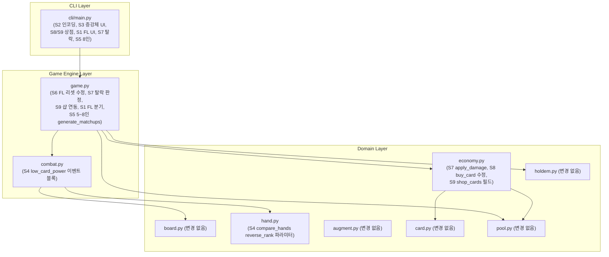
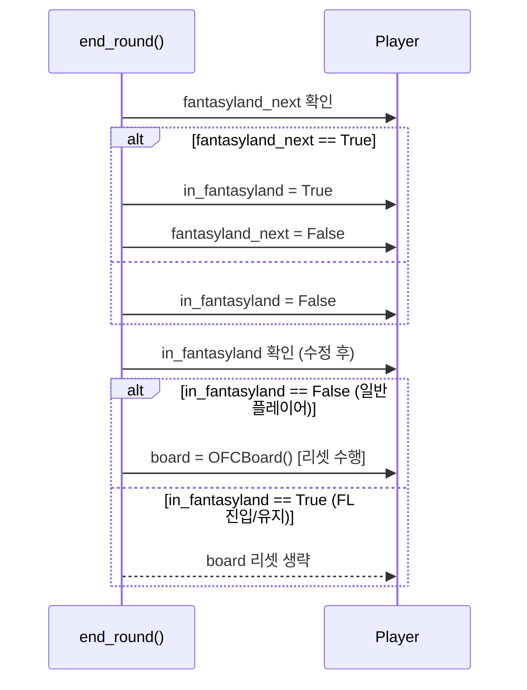
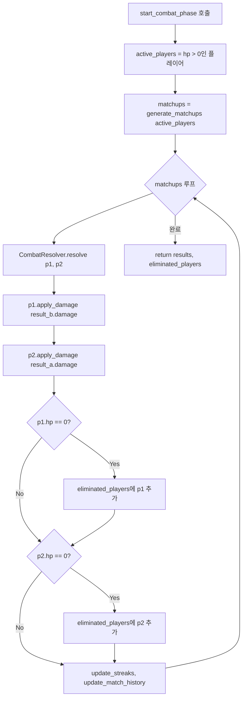
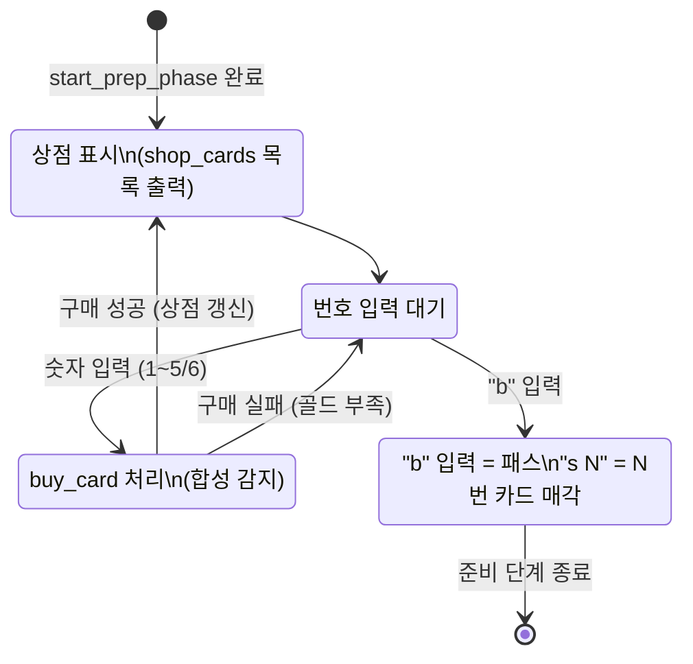
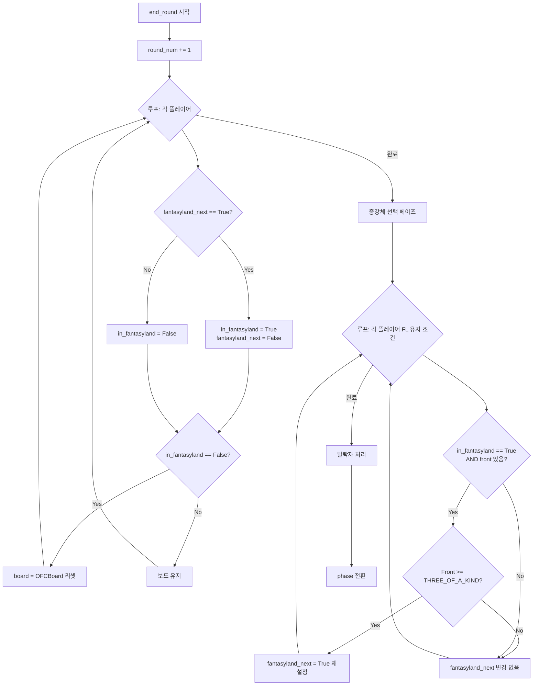
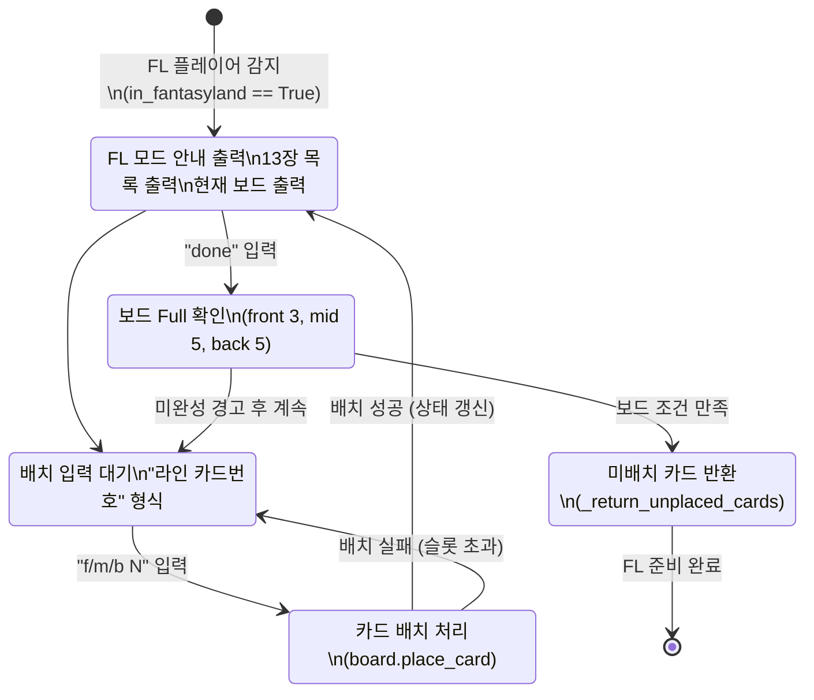

# Trump Card Auto Chess — STANDARD 단계 기술 설계 문서

**버전**: 1.0.0
**작성일**: 2026-02-23
**기반**: standard.prd.md v1.0 + standard.plan.md v1.0 + alpha.design.md v1.0
**Alpha 코드 기준**: src/ 6개 파일, cli/main.py 204줄, 261개 테스트 PASS

---

## 목차

1. [아키텍처 변경 개요](#1-아키텍처-변경-개요)
2. [S6 — FL 보드 리셋 버그 수정 설계](#2-s6--fl-보드-리셋-버그-수정-설계)
3. [S7 — HP 탈락 판정 설계](#3-s7--hp-탈락-판정-설계)
4. [S8 — 별 강화 자동 호출 설계](#4-s8--별-강화-자동-호출-설계)
5. [S9 — 샵 시스템 연동 설계](#5-s9--샵-시스템-연동-설계)
6. [S1 — 판타지랜드 13장 드로우 설계](#6-s1--판타지랜드-13장-드로우-설계)
7. [S2/S3/S4 — UX 개선 설계](#7-s2s3s4--ux-개선-설계)
8. [S5 — 8인 매칭 설계](#8-s5--8인-매칭-설계)
9. [TDD 테스트 설계](#9-tdd-테스트-설계)
10. [구현 파일 목록](#10-구현-파일-목록)

---

## 1. 아키텍처 변경 개요

### 1.1 Alpha 아키텍처 유지 및 STANDARD 변경점

STANDARD 단계는 Alpha에서 확립된 7-레이어 구조와 9개 모듈(`card.py`, `pool.py`, `hand.py`, `board.py`, `economy.py`, `augment.py`, `holdem.py`, `combat.py`, `game.py`)을 유지한다. 신규 모듈 추가 없이 기존 모듈 확장만 수행한다.



### 1.2 레이어별 변경 영향 요약

| 레이어 | 모듈 | 변경 규모 | 영향 범위 |
|--------|------|----------|---------|
| CLI | `cli/main.py` | 대 (+100줄) | 수동 테스트 |
| Game Engine | `game.py` | 대 (+80줄) | `test_game.py` |
| Game Engine | `combat.py` | 소 (+20줄) | `test_combat.py` |
| Domain | `economy.py` | 소 (+20줄) | `test_economy.py` |
| Domain | `hand.py` | 소 (+5줄) | `test_hand.py` |
| Domain | `board.py` | 없음 | — |
| Domain | `augment.py` | 없음 | — |
| Domain | `holdem.py` | 없음 | — |

### 1.3 STANDARD 변경 불필요 확인 모듈

| 모듈 | 사유 |
|------|------|
| `src/card.py` | 기반 도메인 완성 |
| `src/pool.py` | random_draw_n, return_card 이미 구현 |
| `src/board.py` | check_fantasyland 포함 Alpha 완성 |
| `src/augment.py` | SILVER_AUGMENTS 3종 완성 |
| `src/holdem.py` | PILOT_EVENTS 5종, HoldemState 완성 |

---

## 2. S6 — FL 보드 리셋 버그 수정 설계

### 2.1 현재 코드 분석

**버그 위치**: `src/game.py:152-166` — `RoundManager.end_round()`

```python
# 현재 코드 (버그 있음)
def end_round(self):
    self.state.phase = 'result'
    self.state.round_num += 1

    from src.board import OFCBoard
    for player in self.state.players:
        if player.fantasyland_next:
            player.in_fantasyland = True      # (1) True로 전환
            player.fantasyland_next = False
        else:
            player.in_fantasyland = False

        player.board = OFCBoard()             # (2) 버그: FL 진입 플레이어도 무조건 리셋
```

**버그 설명**: 플래그 전환 순서로 인해 `(1)` 단계에서 `in_fantasyland=True`가 된 플레이어(이번 라운드부터 FL 진입)가 `(2)` 단계에서도 보드가 초기화된다. FL 진입 플레이어는 다음 준비 단계에서 13장을 새로 드로우하여 배치하므로, 빈 보드 상태를 유지해야 한다. 하지만 FL 유지(이미 `in_fantasyland=True`였던 플레이어) 경우도 동일하게 리셋되어 이전 라운드 배치가 소실된다.

### 2.2 플래그 전환 순서 흐름



### 2.3 수정 명세

**변경 전**:
```python
for player in self.state.players:
    if player.fantasyland_next:
        player.in_fantasyland = True
        player.fantasyland_next = False
    else:
        player.in_fantasyland = False
    player.board = OFCBoard()   # 무조건 리셋
```

**변경 후**:
```python
for player in self.state.players:
    if player.fantasyland_next:
        player.in_fantasyland = True
        player.fantasyland_next = False
    else:
        player.in_fantasyland = False
    # 판타지랜드 진입/유지 플레이어는 보드 리셋 제외
    # (FL 플레이어는 start_prep_phase에서 13장 드로우로 새 배치를 구성)
    if not player.in_fantasyland:
        player.board = OFCBoard()
```

### 2.4 엣지케이스

| 케이스 | 처리 | 검증 방법 |
|--------|------|---------|
| FL 진입(`fantasyland_next=True` → `in_fantasyland=True`) | 보드 리셋 생략. start_prep_phase에서 13장 드로우 | `test_fl_player_board_not_reset` |
| FL 탈출(`in_fantasyland=True` → `False`) | 다음 end_round에서 정상 리셋 | `test_fl_exit_board_reset` |
| 일반 플레이어 | 기존대로 리셋 | `test_non_fl_player_board_reset` |
| `end_round()` 2회 연속 호출(테스트 시나리오) | 2회차에서 `in_fantasyland`가 정확히 평가됨 | 단위 테스트 명시 검증 |

---

## 3. S7 — HP 탈락 판정 설계

### 3.1 현재 코드 분석

**현재 HP 차감**: `src/game.py:61-62` — 직접 차감, 음수 허용

```python
# 현재 코드
players[1].hp -= result_a.damage  # hp가 음수가 될 수 있음
players[0].hp -= result_b.damage
```

**현재 탈락 처리**: `game.py:173` — 라운드 종료 시 필터링만 수행

```python
self.state.players = [p for p in self.state.players if p.hp > 0]
```

**문제**: 전투 직후 탈락 감지 없음. HP가 음수가 되어도 게임은 계속 진행.

### 3.2 `apply_damage()` 시그니처 및 동작

**추가 위치**: `src/economy.py:87` — `sell_card()` 메서드 직후

```python
def apply_damage(self, amount: int) -> None:
    """HP 차감. 음수 방지 (최소 0).

    Args:
        amount: 차감할 피해량 (0 이상 정수)

    Side effects:
        self.hp = max(0, self.hp - amount)
    """
    self.hp = max(0, self.hp - amount)
```

**동작 표**:

| 입력 (`hp`, `amount`) | 결과 `hp` |
|-----------------------|---------|
| (100, 30) | 70 |
| (5, 10) | 0 |
| (50, 0) | 50 |
| (0, 5) | 0 |

### 3.3 탈락 판정 흐름 (`start_combat_phase`)

STANDARD에서 `start_combat_phase()`는 S5와 연동하여 완전 재구현된다. 탈락 판정은 이 재구현 안에 포함된다.



**`start_combat_phase()` 재구현 후 시그니처**:

```python
def start_combat_phase(self) -> list:
    """전투 단계: N인 매칭 전투 + 탈락 감지.

    Returns:
        results: list of (result_a, result_b) 튜플
        (탈락 플레이어는 hp==0으로 표시, end_round에서 players에서 제거됨)
    """
```

**HP 차감 방식 변경**:

```python
# 변경 전
players[1].hp -= result_a.damage
players[0].hp -= result_b.damage

# 변경 후
p1.apply_damage(result_b.damage)
p2.apply_damage(result_a.damage)
```

### 3.4 CLI 탈락 메시지 처리

```python
# cli/main.py — 라운드 종료 후 탈락 감지
prev_player_names = {p.name for p in state.players}
manager.end_round()
current_player_names = {p.name for p in state.players}
eliminated = prev_player_names - current_player_names
for name in eliminated:
    print(f"\n[탈락] {name} 탈락!")
if len(state.players) == 1:
    print(f"\n[우승] {state.players[0].name} 우승!")
```

---

## 4. S8 — 별 강화 자동 호출 설계

### 4.1 현재 코드 분석

**버그 위치**: `src/economy.py:69-77` — `buy_card()` 메서드

```python
def buy_card(self, card: Card, pool: SharedCardPool) -> bool:
    if not self.can_buy(card):
        return False
    if not pool.draw(card.rank, card.suit):
        return False
    self.gold -= card.cost
    self.bench.append(card)
    return True   # ← try_star_upgrade() 호출 없음
```

**`try_star_upgrade()` 구현 상태**: `economy.py:89-109` 완전 구현됨. 3장 조건 충족 시 `Card | None` 반환.

### 4.2 `try_star_upgrade()` 삽입 위치

**변경 전**:
```python
    self.bench.append(card)
    return True
```

**변경 후**:
```python
    self.bench.append(card)
    self.try_star_upgrade()  # 3장 동일 카드 조건 자동 확인
    return True
```

**설계 결정**: `buy_card()` 반환값은 `bool`(구매 성공 여부) 그대로 유지. 합성 발생 여부는 CLI에서 `buy_card()` 호출 전후 `len(bench)` 비교로 감지.

### 4.3 CLI 합성 감지 패턴

```python
# cli/main.py — 상점 구매 처리
bench_before = len(player.bench)
success = player.buy_card(card, pool)
if success:
    bench_after = len(player.bench)
    if bench_after < bench_before:
        # 합성 발생: bench가 줄었음 (3→1)
        upgraded = player.bench[-1]
        stars_str = '★' * upgraded.stars
        print(f"  {stars_str} {card_str(upgraded)} {upgraded.stars}성 합성 완료!")
```

### 4.4 `try_star_upgrade()` 동작 검증

| 입력 상태 (`bench`) | `buy_card` 호출 후 `bench` | 합성 발생 |
|---------------------|---------------------------|---------|
| [2S, 2S] + buy 2S | [2S★★] (1성→2성) | 예 |
| [2S] + buy 2S | [2S, 2S] | 아니오 |
| [2S★★, 2S★★] + buy 2S★★ | [2S★★★] (2성→3성) | 예 |
| [2S★★★, 2S★★★] + buy 2S★★★ | [2S★★★, 2S★★★, 2S★★★] (3성 이상 불가) | 아니오 |

**주의**: `try_star_upgrade()`는 `stars < 3` 조건(`economy.py:92`)으로 3성 합성을 차단한다.

---

## 5. S9 — 샵 시스템 연동 설계

### 5.1 `Player.shop_cards` 필드 추가

**변경 위치**: `src/economy.py:8-23` — `Player` dataclass 필드 선언부

```python
@dataclass
class Player:
    name: str
    hp: int = 100
    gold: int = 0
    level: int = 1
    xp: int = 0
    board: object = None
    bench: list = field(default_factory=list)
    win_streak: int = 0
    loss_streak: int = 0
    hula_declared: bool = False
    augments: list = field(default_factory=list)
    in_fantasyland: bool = False
    fantasyland_next: bool = False
    shop_cards: list = field(default_factory=list)  # 현재 라운드 상점 드로우 결과 [신규]
```

### 5.2 `start_prep_phase()` 드로우 흐름

**현재 코드** (`game.py:43-48`):
```python
def start_prep_phase(self):
    self.state.phase = 'prep'
    for player in self.state.players:
        income = player.round_income()
        player.gold += income
```

**변경 후** (S9 + S1 통합):
```python
def start_prep_phase(self):
    self.state.phase = 'prep'

    # 홀덤 이벤트 advance (이자 계산 전 — alpha.design.md §4.4 규칙 유지)
    if self.state.holdem_state is not None:
        round_in_stage = ((self.state.round_num - 1) % 3) + 1
        self.state.holdem_state.advance(round_in_stage)

    for player in self.state.players:
        income = player.round_income()
        # double_interest 이벤트 적용
        if (self.state.holdem_state is not None
                and self.state.holdem_state.has_active_event("double_interest")):
            income += player.calc_interest()
        player.gold += income

        # 상점 드로우 (S9 + S1 분기)
        if player.in_fantasyland:
            # S1: FL 플레이어는 13장 드로우
            player.shop_cards = self.state.pool.random_draw_n(13, player.level)
        else:
            # S9: 일반 플레이어 — lucky_shop 증강체 시 6장
            shop_size = 6 if player.has_augment("lucky_shop") else 5
            player.shop_cards = self.state.pool.random_draw_n(shop_size, player.level)
```

**설계 결정**: S1(FL 13장)과 S9(일반 5/6장)를 `if/else` 단일 블록으로 통합. FL 플레이어가 13장 드로우 후 추가로 5장을 드로우하는 이중 드로우 버그를 구조적으로 방지.

### 5.3 CLI 상점 UI 상태 머신



**CLI 출력 예시**:
```
[ 상점 ] (골드: 15)
  1: 2S (1코스트)  2: 5H (1코스트)  3: TC (3코스트)  4: KS (4코스트)  5: AS (5코스트)
번호 입력 (구매), b (패스):
```

**`--auto` 모드**: 가진 골드로 살 수 있는 첫 번째 카드 자동 구매.

---

## 6. S1 — 판타지랜드 13장 드로우 설계

### 6.1 `start_prep_phase()` FL/일반 분기

§5.2에서 정의한 `start_prep_phase()` 수정에 포함됨. FL 분기는 `if player.in_fantasyland:` 블록으로 처리.

### 6.2 `_return_unplaced_cards()` 헬퍼 함수 명세

**위치**: `src/game.py` — `RoundManager` 클래스 메서드

```python
def _return_unplaced_cards(self, player) -> None:
    """FL 배치 완료 후 보드에 배치되지 않은 카드를 공유 풀로 반환.

    Args:
        player: FL 배치가 완료된 Player 인스턴스

    Side effects:
        - 미배치 카드를 pool.return_card()로 반환
        - player.shop_cards = [] (클리어)

    호출 시점: cli/main.py의 FL 배치 루프 종료 직후
    """
    placed_ids = set()
    for line in ['front', 'mid', 'back']:
        for card in getattr(player.board, line):
            placed_ids.add(id(card))

    for card in player.shop_cards:
        if id(card) not in placed_ids:
            self.state.pool.return_card(card)

    player.shop_cards = []
```

**반환 시점**: "배치 완료 후 즉시 반환" 채택 — FL 배치 UI 루프 종료 시점에 CLI에서 `manager._return_unplaced_cards(player)` 호출.

### 6.3 `end_round()` FL 유지 조건 판정 흐름

FL 유지 조건: FL 중 Front THREE_OF_A_KIND 이상 달성 → 다음 라운드도 FL 유지.

**추가 위치**: `end_round()` — 플래그 전환 블록 직후

```python
for player in self.state.players:
    if player.fantasyland_next:
        player.in_fantasyland = True
        player.fantasyland_next = False
    else:
        player.in_fantasyland = False

    if not player.in_fantasyland:
        player.board = OFCBoard()

# FL 유지 조건 판정 (플래그 전환 후 별도 루프)
from src.hand import HandType, evaluate_hand
for player in self.state.players:
    if player.in_fantasyland and player.board.front:
        front_hand = evaluate_hand(player.board.front)
        if front_hand.hand_type >= HandType.THREE_OF_A_KIND:
            player.fantasyland_next = True
```

**주의**: 플래그 전환 루프와 유지 조건 판정 루프를 분리. 단일 루프에서 처리할 경우 `in_fantasyland` 변경 전/후 순서 의존성 문제가 발생할 수 있음.



### 6.4 CLI FL 배치 UI 상태 머신



**`--auto` 모드**: 13장 중 첫 3장을 front, 다음 5장을 mid, 다음 5장을 back에 자동 배치. 나머지 반환.

---

## 7. S2/S3/S4 — UX 개선 설계

### 7.1 S2 — `sys.stdout.reconfigure` 위치

**변경 위치**: `cli/main.py` 최상단 (모든 import 전)

```python
"""2인 로컬 대전 CLI — Trump Card Auto Chess"""
import sys
import io

if hasattr(sys.stdout, 'reconfigure'):
    sys.stdout.reconfigure(encoding='utf-8')
else:
    sys.stdout = io.TextIOWrapper(sys.stdout.buffer, encoding='utf-8')

from src.card import Card, Rank, Suit  # noqa: E402 (인코딩 설정 후 import)
...
```

**처리 방식**: `reconfigure` 존재 여부를 확인하여 Python 3.7 미만 환경 호환성 유지(fallback: TextIOWrapper).

### 7.2 S3 — 증강체 선택 라운드 조건 + CLI 프롬프트 상태

**라운드 조건**: `end_round()` 내 `_offer_augments()` 호출 시점은 `round_num in (3, 4, 5)` (이미 +1된 상태). 즉, 라운드 2/4 종료 후(round_num → 3/5) 트리거.

**PRD §S3**: "라운드 2/4 종료 시" — Alpha 코드(`game.py:169`)는 이미 (3, 4, 5)로 처리. STANDARD에서는 `_offer_augments()`가 CLI에 메뉴를 노출하도록 변경.

**`_offer_augments()` 변경 설계**:

현재 코드:
```python
def _offer_augments(self) -> None:
    from src.augment import SILVER_AUGMENTS
    for player in self.state.players:
        choices = random.sample(SILVER_AUGMENTS, min(3, len(SILVER_AUGMENTS)))
        player.add_augment(choices[0])  # 자동 선택 (Alpha)
```

변경 후 (콜백 패턴 도입):
```python
def _offer_augments(self, selector=None) -> None:
    """각 플레이어에게 SILVER_AUGMENTS 중 3개 제시 후 1개 선택.

    Args:
        selector: callable(player, choices) -> Augment | None
                  None이면 자동으로 choices[0] 선택 (기존 Alpha 동작)
    """
    from src.augment import SILVER_AUGMENTS
    for player in self.state.players:
        available = [a for a in SILVER_AUGMENTS if not player.has_augment(a.id)]
        choices = random.sample(available, min(3, len(available)))
        if not choices:
            continue
        if selector is not None:
            selected = selector(player, choices)
        else:
            selected = choices[0]
        if selected is not None:
            player.add_augment(selected)
```

**CLI 증강체 선택 프롬프트**:
```python
def augment_selector(player, choices):
    """CLI 증강체 선택 함수 (--auto 모드에서는 자동 선택)."""
    print(f"\n[증강체 선택] {player.name}")
    for i, aug in enumerate(choices, 1):
        print(f"  {i}. {aug.name}: {aug.description}")
    while True:
        try:
            n = int(input("선택 (1~3): "))
            if 1 <= n <= len(choices):
                return choices[n - 1]
        except (ValueError, EOFError):
            pass
        print(f"1~{len(choices)} 중 하나를 입력하세요.")
```

**`end_round()` 호출 변경**:
```python
# 변경 전
if self.state.round_num in (3, 4, 5):
    self._offer_augments()

# 변경 후 — selector는 game.py가 아닌 RoundManager 초기화 시 설정
if self.state.round_num in (3, 4, 5):
    self._offer_augments(selector=self.augment_selector)
```

**`RoundManager` 생성자 변경**:
```python
class RoundManager:
    def __init__(self, state: GameState, augment_selector=None):
        self.state = state
        self.resolver = CombatResolver()
        self.augment_selector = augment_selector  # None=자동, callable=CLI
```

### 7.3 S4 — `combat.py` 이벤트 처리 블록 low_card_power 추가 설계

**이벤트 정의** (기존 `src/holdem.py:PILOT_EVENTS`):
```python
HoldemEvent(
    id="low_card_power",
    name="로우카드 역전",
    phase="river",
    description="이번 라운드 하이카드 비교 역전 (낮은 랭크 우선)",
    effect_type="combat",
),
```

**효과**: 타이브레이커 3단계(최고 랭크 비교)에서 낮은 랭크 우선. 핸드 강도 차이가 있는 경우 역전 없음.

**구현 전략**: `src/hand.py:compare_hands()`에 `reverse_rank: bool = False` 파라미터 추가.

**`hand.py` 변경 위치**: `compare_hands()` 함수 (현재 `hand.py:139-161`)

현재 `compare_hands()` 비교 순서 (`hand.py:139-161`):
1. `hand_type` 강도 비교
2. `enhanced_count` 강화 카드 수 비교
3. `dominant_suit` 수트 순환 우위 비교
4. `high_card_rank` 최고 랭크 비교 ← **low_card_power 역전 대상**

```python
# src/hand.py 변경
def compare_hands(h1: HandResult, h2: HandResult, reverse_rank: bool = False) -> int:
    """+1: h1 승, -1: h2 승, 0: 무승부

    reverse_rank=True 시 4단계(high_card_rank) 비교를 역전 (낮은 랭크 우선).
    1~3단계(핸드 강도, 강화수, 수트 우위)는 역전 없음.
    """
    # 1단계: 핸드 강도
    if h1.hand_type != h2.hand_type:
        return 1 if h1.hand_type > h2.hand_type else -1

    # 2단계: 강화 카드 수
    if h1.enhanced_count != h2.enhanced_count:
        return 1 if h1.enhanced_count > h2.enhanced_count else -1

    # 3단계: 수트 순환 우위
    s1, s2 = h1.dominant_suit, h2.dominant_suit
    if s1 != s2:
        if beats_suit(s1, s2):
            return 1
        if beats_suit(s2, s1):
            return -1

    # 4단계: 최고 랭크 비교 (reverse_rank=True 시 낮은 랭크 우선)
    if h1.high_card_rank != h2.high_card_rank:
        cmp = 1 if h1.high_card_rank > h2.high_card_rank else -1
        return -cmp if reverse_rank else cmp

    return 0
```

**`combat.py` 이벤트 블록 추가**:

```python
# src/combat.py:resolve() 내 — suit_bonus_spade 처리 블록 이후 추가

# low_card_power 이벤트: 타이브레이커 랭크 비교 역전
low_card_power_active = (
    events is not None
    and any(getattr(e, 'id', None) == "low_card_power" for e in events)
)

# 라인별 비교 시 low_card_power 플래그 전달
for line in ['back', 'mid', 'front']:
    ...
    cmp = compare_hands(h_a, h_b, reverse_rank=low_card_power_active)
    ...
```

**현재 `resolve()` 라인 비교 루프 재구성**:

현재 코드 (`combat.py:68-88`):
```python
for line in ['back', 'mid', 'front']:
    cards_a = getattr(board_a, line)
    cards_b = getattr(board_b, line)

    if cards_a and cards_b:
        h_a = evaluate_hand(cards_a)
        h_b = evaluate_hand(cards_b)
        if line in foul_a:
            h_a = apply_foul_penalty(h_a)
        if line in foul_b:
            h_b = apply_foul_penalty(h_b)
        cmp = compare_hands(h_a, h_b)  # ← 여기에 reverse_rank 파라미터 추가
    elif cards_a:
        cmp = 1
    elif cards_b:
        cmp = -1
    else:
        cmp = 0
```

변경 후:
```python
# foul 판정 직후 low_card_power 플래그 결정
low_card_power_active = (
    events is not None
    and any(getattr(e, 'id', None) == "low_card_power" for e in events)
)

for line in ['back', 'mid', 'front']:
    ...
    if cards_a and cards_b:
        ...
        cmp = compare_hands(h_a, h_b, reverse_rank=low_card_power_active)
    ...
```

**기존 테스트 호환성**: `compare_hands(h_a, h_b)` 호출은 `reverse_rank=False` 기본값으로 처리. **기존 테스트 수정 불필요**.

---

## 8. S5 — 8인 매칭 설계

### 8.1 `_pick_pairs_n_players()` 알고리즘 의사코드

```
function _pick_pairs_n_players(active_indices, history):
    n = len(active_indices)

    if n % 2 == 1:
        # 홀수 인원: 바이 선정
        bye_counts = _get_bye_counts()
        bye_idx = min(active_indices, key=lambda i: bye_counts[players[i].name])
        active_indices = [i for i in active_indices if i != bye_idx]
        _record_bye(players[bye_idx].name)
        n = n - 1

    # n은 이제 짝수
    pairs = []
    available = list(active_indices)
    shuffle(available)

    while len(available) >= 2:
        a = available.pop(0)
        # 3연속 동일 상대 금지
        for b in available:
            hist_a = history.get(players[a].name, [])
            hist_b = history.get(players[b].name, [])
            if hist_a.count(players[b].name) < 2 and hist_b.count(players[a].name) < 2:
                pairs.append((a, b))
                available.remove(b)
                break
        else:
            # fallback: 첫 번째 남은 상대와 매칭
            b = available.pop(0)
            pairs.append((a, b))

    return pairs
```

**인원별 출력 예시**:

| 인원 수 | 매칭 쌍 | 바이 |
|---------|--------|------|
| N=2 | 1쌍 | 0명 |
| N=3 | 1쌍 | 1명 |
| N=4 | 2쌍 | 0명 |
| N=5 | 2쌍 | 1명 |
| N=6 | 3쌍 | 0명 |
| N=7 | 3쌍 | 1명 |
| N=8 | 4쌍 | 0명 |

### 8.2 `start_combat_phase()` 완전 재구현 설계

**현재 코드 문제**: `game.py:50-81` — `len(players) == 2` 고정 분기, `generate_matchups()` 미호출, `apply_damage()` 미사용.

**재구현 내용**:

```python
def start_combat_phase(self) -> list:
    """전투 단계: N인 매칭 전투.

    변경점 (STANDARD):
    - generate_matchups() 연동 (기존: len==2 고정)
    - apply_damage() 사용 (기존: 직접 -= 연산)
    - 탈락 즉시 감지 (S7)
    - 바이 플레이어 처리
    """
    self.state.phase = 'combat'

    active_events = (
        self.state.holdem_state.active_events
        if self.state.holdem_state is not None else []
    )

    active_players = [p for p in self.state.players if p.hp > 0]
    matchups = self.generate_matchups_from(active_players)
    self.state.combat_pairs = [(self.state.players.index(p1),
                                self.state.players.index(p2))
                               for p1, p2 in matchups]

    results = []
    for p1, p2 in matchups:
        result_a, result_b = self.resolver.resolve(
            p1.board, p2.board,
            hula_a=p1.hula_declared,
            hula_b=p2.hula_declared,
            player_a=p1,
            player_b=p2,
            events=active_events,
        )
        p2.apply_damage(result_a.damage)
        p1.apply_damage(result_b.damage)

        # 판타지랜드 진입 판정 (기존 alpha 로직 유지)
        from src.board import check_fantasyland
        if check_fantasyland(p1.board):
            p1.fantasyland_next = True
        if check_fantasyland(p2.board):
            p2.fantasyland_next = True

        self._update_streaks_players(p1, p2, result_a, result_b)
        idx_a = self.state.players.index(p1)
        idx_b = self.state.players.index(p2)
        self._update_match_history(idx_a, idx_b)
        results.append((result_a, result_b))

    return results
```

**`generate_matchups_from(active_players)`** — STANDARD에서 플레이어 객체 직접 수신:

```python
def generate_matchups_from(self, active_players: list) -> list:
    """active_players 리스트 기반 전투 쌍 생성 (S5).

    기존 generate_matchups()는 self.state.players 인덱스 기반.
    STANDARD에서는 활성 플레이어 객체를 직접 받아 처리.
    """
    n = len(active_players)

    if n < 2:
        return []
    if n == 2:
        return [(active_players[0], active_players[1])]

    return self._pick_pairs_n_players(active_players)
```

### 8.3 `cli/main.py` 2~8인 선택 UI

```python
def select_player_count(auto_mode: bool) -> int:
    """플레이어 수 선택. auto_mode 시 2인 기본 반환."""
    if auto_mode:
        return 2
    print("플레이어 수를 선택하세요 (2~8):")
    while True:
        try:
            n = int(input("> "))
            if 2 <= n <= 8:
                return n
        except (ValueError, EOFError):
            pass
        print("2에서 8 사이의 숫자를 입력하세요.")
```

---

## 9. TDD 테스트 설계

### 9.1 테스트 파일별 신규 케이스

#### `tests/test_game.py` — 12개+ 추가 (현재 33개)

| # | 클래스/함수명 | 검증 내용 | 입력 | 기대값 |
|---|-------------|---------|------|------|
| 1 | `TestFantasylandReset::test_fl_player_board_not_reset` | S6: FL 진입 플레이어 보드 리셋 제외 | `fantasyland_next=True` → `end_round()` | `player.board != OFCBoard()` |
| 2 | `TestFantasylandReset::test_non_fl_player_board_reset` | S6: 일반 플레이어 보드 정상 리셋 | `in_fantasyland=False` → `end_round()` | `board == OFCBoard()` (빈 보드) |
| 3 | `TestFantasylandReset::test_fl_exit_board_reset` | S6: FL 탈출 후 다음 라운드 리셋 | FL 탈출 후 `end_round()` 재호출 | 보드 리셋됨 |
| 4 | `TestFantasylandKeep::test_fl_keep_three_of_a_kind` | S1: Front THREE_OF_A_KIND → FL 유지 | FL 중 Front 스리카인드 + `end_round()` | `fantasyland_next == True` |
| 5 | `TestFantasylandKeep::test_fl_keep_not_met_high_card` | S1: Front HIGH_CARD → FL 유지 안 됨 | FL 중 Front HIGH_CARD + `end_round()` | `fantasyland_next == False` |
| 6 | `TestShopDraw::test_prep_phase_shop_draw_5_cards` | S9: prep 후 상점 5장 드로우 | `start_prep_phase()` | `len(player.shop_cards) == 5` |
| 7 | `TestShopDraw::test_lucky_shop_draw_6_cards` | S9: lucky_shop → 6장 드로우 | `has_augment("lucky_shop")` + prep | `len(shop_cards) == 6` |
| 8 | `TestShopDraw::test_fl_player_draws_13_cards` | S1: FL 플레이어 → 13장 드로우 | `in_fantasyland=True` + prep | `len(shop_cards) == 13` |
| 9 | `TestElimination::test_hp_zero_eliminated` | S7: HP 0 → 탈락 처리 | HP=0 플레이어 + `end_round()` | 해당 플레이어 `state.players` 제외 |
| 10 | `TestElimination::test_game_over_one_survivor` | S7: 1명 생존 → `is_game_over()==True` | HP=0 처리 후 | `is_game_over() == True` |
| 11 | `TestMatchups5to8::test_5player_matchup` | S5: 5인 → 2쌍 + 바이 1명 | N=5 `generate_matchups_from()` | `len(pairs) == 2` |
| 12 | `TestMatchups5to8::test_6player_matchup` | S5: 6인 → 3쌍 | N=6 `generate_matchups_from()` | `len(pairs) == 3` |
| 13 | `TestMatchups5to8::test_7player_matchup` | S5: 7인 → 3쌍 + 바이 1명 | N=7 | `len(pairs) == 3` |
| 14 | `TestMatchups5to8::test_8player_matchup` | S5: 8인 → 4쌍 | N=8 | `len(pairs) == 4` |

#### `tests/test_economy.py` — 8개+ 추가 (현재 26개)

| # | 클래스/함수명 | 검증 내용 | 입력 | 기대값 |
|---|-------------|---------|------|------|
| 1 | `TestApplyDamage::test_apply_damage_normal` | S7: 정상 피해 적용 | `hp=100, apply_damage(30)` | `hp == 70` |
| 2 | `TestApplyDamage::test_apply_damage_zero_floor` | S7: 음수 방지 | `hp=5, apply_damage(10)` | `hp == 0` |
| 3 | `TestApplyDamage::test_apply_damage_zero` | S7: 0 피해 | `hp=50, apply_damage(0)` | `hp == 50` |
| 4 | `TestStarUpgradeAuto::test_buy_3_same_card_auto_upgrade` | S8: 3장 구매 → 자동 2성 | 같은 카드 3회 `buy_card()` | `bench[0].stars == 2`, `len(bench) == 1` |
| 5 | `TestStarUpgradeAuto::test_buy_2_same_card_no_upgrade` | S8: 2장 → 합성 없음 | 같은 카드 2회 `buy_card()` | `len(bench) == 2`, `stars == 1` |
| 6 | `TestStarUpgradeAuto::test_buy_3rd_triggers_upgrade` | S8: 3번째 구매가 합성 트리거 | 1+1 후 3번째 구매 | `len(bench) == 1`, `stars == 2` |
| 7 | `TestShopCards::test_shop_cards_default_empty` | S9: 초기 `shop_cards` 빈 리스트 | `Player(name="P")` | `player.shop_cards == []` |
| 8 | `TestShopCards::test_shop_cards_assignable` | S9: `shop_cards` 할당 가능 | `player.shop_cards = [card]` | `len(shop_cards) == 1` |

#### `tests/test_combat.py` — 4개+ 추가 (현재 32개)

| # | 클래스/함수명 | 검증 내용 | 입력 | 기대값 |
|---|-------------|---------|------|------|
| 1 | `TestLowCardPower::test_inactive_normal_compare` | S4: 이벤트 없을 때 정상 비교 | `events=[]` + 동점 상황 | 높은 랭크 우선 |
| 2 | `TestLowCardPower::test_active_reversal_tiebreak` | S4: 이벤트 활성 시 역전 | `events=[low_card_power]` + 동점 상황 | 낮은 랭크 우선 |
| 3 | `TestLowCardPower::test_no_reversal_different_hand_type` | S4: 핸드 강도 차이 → 역전 없음 | `events=[low_card_power]` + 핸드 강도 차이 | 강한 핸드 승리 |
| 4 | `TestLowCardPower::test_tiebreak_only_same_type_and_count` | S4: 3단계 타이브레이커만 역전 | 핸드타입/강화수 동일 + 랭크 차이 | 낮은 랭크 우선 |

#### `tests/test_hand.py` — 2개+ 추가

| # | 클래스/함수명 | 검증 내용 | 입력 | 기대값 |
|---|-------------|---------|------|------|
| 1 | `TestCompareHands::test_compare_hands_reverse_rank_false` | `reverse_rank=False` 기본 동작 유지 | 높은 랭크 A vs 낮은 랭크 2 | A 승리 (cmp > 0) |
| 2 | `TestCompareHands::test_compare_hands_reverse_rank_true` | `reverse_rank=True` 역전 | 동일 핸드타입/강화수 + A vs 2 | 2 승리 (cmp < 0) |

### 9.2 TDD 실행 순서

```
Red 단계 (테스트 먼저 작성)
  1. test_economy.py: S7(apply_damage), S8(buy_card 자동업그레이드), S9(shop_cards) 케이스 작성
  2. test_game.py: S6(FL 보드 리셋), S1(FL 유지/드로우), S9(샵 연동), S7(탈락), S5(5~8인) 케이스 작성
  3. test_hand.py: S4(reverse_rank) 케이스 작성
  4. test_combat.py: S4(low_card_power) 케이스 작성

Green 단계 (최소 구현으로 통과)
  STANDARD-1: S6, S8, S7 구현 → pytest STANDARD-1 PASS
  STANDARD-2: S9, S1 구현 → pytest STANDARD-2 PASS
  STANDARD-3: S2, S3, S4, S5 구현 → pytest STANDARD-3 PASS

Refactor 단계
  ruff check src/ --fix → PASS
  전체 pytest 287개+ PASS 확인
```

---

## 10. 구현 파일 목록

### 10.1 수정 파일 전체 목록

#### `src/economy.py` (현재 110줄 → 예상 130줄)

| 함수/필드 | 변경 유형 | 관련 요구사항 |
|-----------|---------|-------------|
| `Player.shop_cards` 필드 | **추가** | S9 |
| `Player.apply_damage()` | **추가** | S7 |
| `Player.buy_card()` — `try_star_upgrade()` 호출 삽입 | **수정** | S8 |

#### `src/game.py` (현재 186줄 → 예상 270줄)

| 함수/필드 | 변경 유형 | 관련 요구사항 |
|-----------|---------|-------------|
| `RoundManager.__init__()` — `augment_selector` 파라미터 | **수정** | S3 |
| `RoundManager.start_prep_phase()` — holdem advance + shop 드로우 분기 | **수정** | S9, S1 |
| `RoundManager.start_combat_phase()` — 완전 재구현 | **수정** | S5, S7 |
| `RoundManager.end_round()` — FL 보드 리셋 제외 + FL 유지 조건 | **수정** | S6, S1 |
| `RoundManager._offer_augments()` — selector 파라미터 | **수정** | S3 |
| `RoundManager._return_unplaced_cards()` | **추가** | S1 |
| `RoundManager.generate_matchups_from()` | **추가** | S5 |
| `RoundManager._pick_pairs_n_players()` | **추가** | S5 |
| `RoundManager._update_streaks_players()` | **추가** | S5, S7 |

#### `src/hand.py` (현재 미확인 → 소규모 수정)

| 함수/필드 | 변경 유형 | 관련 요구사항 |
|-----------|---------|-------------|
| `compare_hands()` — `reverse_rank` 파라미터 추가 | **수정** | S4 |

#### `src/combat.py` (현재 192줄 → 예상 215줄)

| 함수/필드 | 변경 유형 | 관련 요구사항 |
|-----------|---------|-------------|
| `resolve()` — `low_card_power_active` 플래그 + `compare_hands(reverse_rank=...)` | **수정** | S4 |

#### `cli/main.py` (현재 204줄 → 예상 310줄)

| 함수/내용 | 변경 유형 | 관련 요구사항 |
|-----------|---------|-------------|
| UTF-8 인코딩 설정 (최상단) | **추가** | S2 |
| `select_player_count()` | **추가** | S5 |
| `augment_selector()` | **추가** | S3 |
| `print_shop()` | **추가** | S9 |
| `run_shop_phase()` | **추가** | S9 |
| `print_fl_cards()` | **추가** | S1 |
| `run_fl_placement()` | **추가** | S1 |
| `run_poc_game()` — 탈락 메시지 추가 | **수정** | S7 |
| `run_poc_game()` — 증강체 선택 UI 연동 | **수정** | S3 |
| `run_poc_game()` — 상점 UI 루프 추가 | **수정** | S9 |
| `run_poc_game()` — FL 배치 UI 분기 | **수정** | S1 |
| `run_poc_game()` — 8인 지원 인원 선택 | **수정** | S5 |

### 10.2 불변 파일

| 파일 | 사유 |
|------|------|
| `src/card.py` | 기반 도메인 완성 |
| `src/pool.py` | random_draw_n, return_card 완전 구현 |
| `src/board.py` | check_fantasyland 포함 완성 |
| `src/augment.py` | SILVER_AUGMENTS 완성 |
| `src/holdem.py` | PILOT_EVENTS + HoldemState 완성 |

### 10.3 신규/확장 테스트 파일

| 파일 | 추가 케이스 수 | 대상 요구사항 |
|------|------------|------------|
| `tests/test_economy.py` | +8개 | S7, S8, S9 |
| `tests/test_game.py` | +14개 | S6, S1, S9, S7, S5 |
| `tests/test_combat.py` | +4개 | S4 |
| `tests/test_hand.py` | +2개 | S4 |

**목표 테스트 수**: 기존 261개 + 신규 28개+ = **289개+**

---

## 부록: 구현 우선순위 및 의존성 체인

### Phase 1 (버그 수정 — 병렬 가능)

```
S6 FL 보드 리셋 (game.py)
S8 별강화 자동호출 (economy.py)          ← 독립, 병렬 가능
S7 apply_damage 추가 (economy.py)        ← 독립, 병렬 가능
```

### Phase 2 (핵심 기능 — 순차 필수)

```
S9 shop_cards 필드 (economy.py)
  ↓
S9 start_prep_phase 드로우 연동 (game.py)
  ↓
S1 FL 13장 분기 (game.py:start_prep_phase — S9와 동일 함수)
  ↓
S5 start_combat_phase 재구현 (game.py — S7 apply_damage 전제)
```

### Phase 3 (UX + 확장 — Phase 2 완료 후)

```
S2 CLI 인코딩 (cli/main.py)             ← 독립
S3 증강체 선택 UI (cli/main.py + game.py) ← S9 완료 권장
S4 low_card_power (combat.py + hand.py)  ← 독립
S5 8인 CLI 선택 UI (cli/main.py)        ← S5 game.py 완료 후
```
