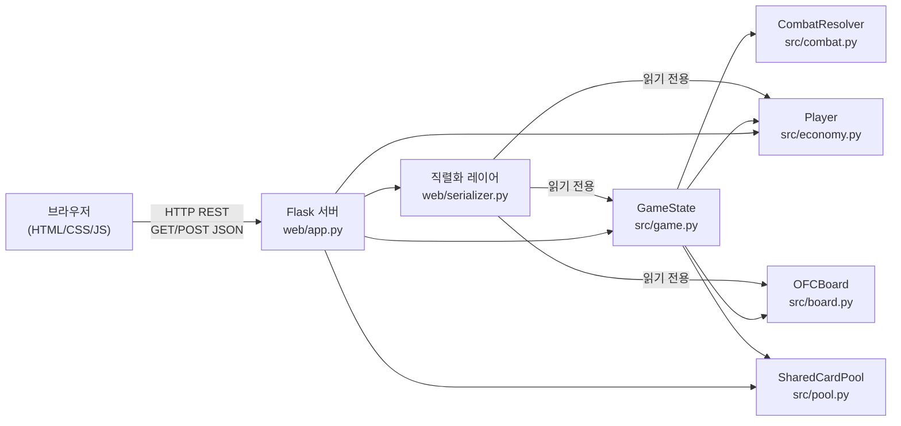
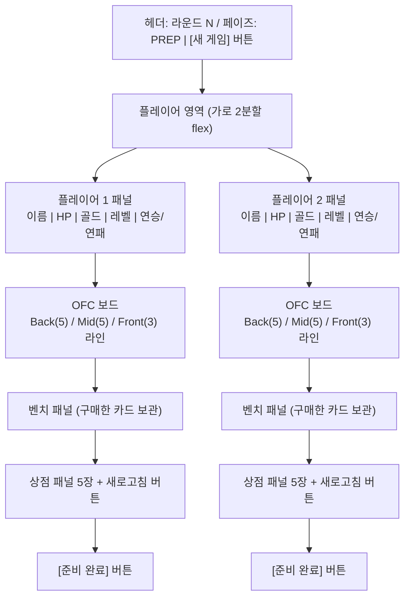
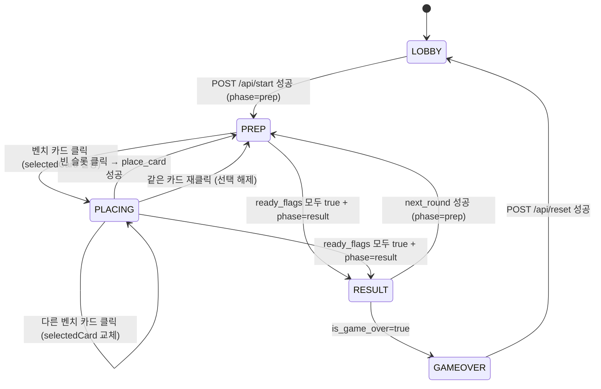
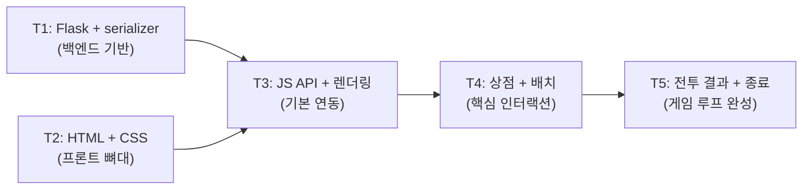

# Trump Card Auto Chess — Web GUI 기술 설계 문서

**버전**: 1.0.0
**작성일**: 2026-02-23
**기반**: `docs/00-prd/webgui.prd.md` v1.0.0 + `docs/01-plan/webgui.plan.md` v1.0.0
**Architect 권장사항**: `app.run(threaded=False)`, `next_round` 7번째 action_type, 미구매 shop_cards 풀 반환, `remove_card` 테스트 케이스

---

## 목차

1. [아키텍처 개요](#1-아키텍처-개요)
2. [web/app.py 상세 설계](#2-webapppy-상세-설계)
3. [web/serializer.py 상세 설계](#3-webserializerpy-상세-설계)
4. [HTML/CSS 설계](#4-htmlcss-설계)
5. [JavaScript 설계](#5-javascript-설계)
6. [테스트 설계](#6-테스트-설계)
7. [영향 파일 목록](#7-영향-파일-목록)

---

## 1. 아키텍처 개요

### 1.1 계층 다이어그램



### 1.2 파일 구조 트리

```
card_ofc/
├── src/                          ← 변경 금지 (293 테스트 보호)
│   ├── card.py                   Card, Rank, Suit
│   ├── board.py                  OFCBoard, FoulResult
│   ├── hand.py                   evaluate_hand(), compare_hands()
│   ├── economy.py                Player
│   ├── pool.py                   SharedCardPool
│   ├── combat.py                 CombatResolver, CombatResult
│   ├── game.py                   GameState, RoundManager
│   └── augment.py                Augment, SILVER_AUGMENTS
│
├── web/                          ← 신규 생성
│   ├── app.py                    Flask 라우터 + 게임 인스턴스 관리
│   ├── serializer.py             GameState → JSON 직렬화
│   └── static/
│       ├── index.html            SPA 메인 페이지
│       ├── style.css             카드/보드/상점/모달 스타일
│       └── game.js               UI 상태 기계 + API 통신 + 렌더링
│
├── tests/
│   ├── test_serializer.py        직렬화 단위 테스트 (신규)
│   └── test_web_api.py           Flask API 엔드포인트 테스트 (신규)
│
└── pyproject.toml                flask 의존성 추가
```

### 1.3 API 엔드포인트 목록

| 메서드 | 경로 | 설명 |
|--------|------|------|
| `GET` | `/` | `web/static/index.html` 서빙 |
| `POST` | `/api/start` | 새 게임 초기화 (플레이어 수, 이름) |
| `GET` | `/api/state` | 현재 게임 상태 JSON 반환 |
| `POST` | `/api/action` | 7가지 플레이어 액션 처리 |
| `POST` | `/api/reset` | 게임 인스턴스 초기화 |

### 1.4 공통 응답 형식

**성공**:
```json
{
  "success": true,
  "state": { "round_num": 1, "phase": "prep", "players": [...] }
}
```

**실패**:
```json
{
  "success": false,
  "error": "에러 메시지 (한글)"
}
```

- HTTP Status: 200 (성공) / 400 (클라이언트 오류) / 500 (서버 오류)
- Content-Type: `application/json; charset=utf-8`

---

## 2. web/app.py 상세 설계

### 2.1 Flask 앱 초기화 + sys.path 처리

```python
import sys
import os

# web/app.py 위치 기준으로 프로젝트 루트(src/ 상위)를 sys.path에 추가
_project_root = os.path.abspath(os.path.join(os.path.dirname(__file__), '..'))
if _project_root not in sys.path:
    sys.path.insert(0, _project_root)

from flask import Flask, jsonify, request, abort, send_from_directory
from src.game import GameState, RoundManager
from src.economy import Player
from src.pool import SharedCardPool
from web.serializer import serialize_game

app = Flask(__name__, static_folder='static', static_url_path='/static')

@app.route('/')
def index():
    return send_from_directory(app.static_folder, 'index.html')

if __name__ == '__main__':
    app.run(debug=True, threaded=False)  # Architect 권장: threaded=False (경쟁 조건 방지)
```

**`threaded=False` 이유**: 서버 메모리 단일 게임 인스턴스 패턴에서 두 플레이어가 동시에 같은 `shop_cards`를 구매하는 경쟁 조건을 방지. 요청이 순차 처리되므로 두 번째 요청은 이미 구매된 카드에 대해 에러를 반환.

### 2.2 전역 게임 인스턴스 변수

```python
# 모듈 레벨 — 서버 메모리 단일 인스턴스 패턴
_game_state: 'GameState | None' = None
_round_manager: 'RoundManager | None' = None
_pool: 'SharedCardPool | None' = None
_ready_flags: 'dict[int, bool]' = {}
_last_combat_results: list = []
```

| 변수 | 타입 | 설명 |
|------|------|------|
| `_game_state` | `GameState \| None` | 현재 게임 상태. 미시작 시 `None` |
| `_round_manager` | `RoundManager \| None` | 라운드/페이즈 관리자 |
| `_pool` | `SharedCardPool \| None` | 공유 카드 풀 |
| `_ready_flags` | `dict[int, bool]` | 플레이어별 준비 완료 상태 `{0: True, 1: False}` |
| `_last_combat_results` | `list` | 직전 전투 결과. 다음 라운드 시작 시 초기화 |

### 2.3 POST /api/start

```python
@app.route('/api/start', methods=['POST'])
def start_game():
    global _game_state, _round_manager, _pool, _ready_flags, _last_combat_results

    data = request.get_json(silent=True)
    if data is None:
        abort(400, "잘못된 요청 형식입니다")

    num_players = data.get('num_players', 2)
    if not isinstance(num_players, int) or not (2 <= num_players <= 8):
        abort(400, "플레이어 수는 2~8 사이여야 합니다")

    player_names = data.get('player_names', [])
    names = [
        player_names[i] if i < len(player_names) and player_names[i]
        else f"Player{i + 1}"
        for i in range(num_players)
    ]

    _pool = SharedCardPool()
    _pool.initialize()
    players = [Player(name=names[i]) for i in range(num_players)]
    _game_state = GameState(players=players, pool=_pool)
    _round_manager = RoundManager(_game_state)
    _round_manager.start_prep_phase()
    _ready_flags = {i: False for i in range(num_players)}
    _last_combat_results = []

    return jsonify({"success": True, "state": serialize_game(_game_state, _last_combat_results, _ready_flags)})
```

### 2.4 GET /api/state

```python
@app.route('/api/state', methods=['GET'])
def get_state():
    if _game_state is None:
        abort(400, "게임이 시작되지 않았습니다")
    return jsonify({"success": True, "state": serialize_game(_game_state, _last_combat_results, _ready_flags)})
```

### 2.5 POST /api/action — 7개 action_type 핸들러

```python
@app.route('/api/action', methods=['POST'])
def action():
    if _game_state is None:
        abort(400, "게임이 시작되지 않았습니다")
    data = request.get_json(silent=True)
    if data is None:
        abort(400, "잘못된 요청 형식입니다")

    player_id = data.get('player_id')
    action_type = data.get('action_type')
    payload = data.get('payload', {})

    if not isinstance(player_id, int) or not (0 <= player_id < len(_game_state.players)):
        abort(400, "유효하지 않은 player_id입니다")

    player = _game_state.players[player_id]

    try:
        if action_type == 'buy_card':
            return _handle_buy_card(player, payload)
        elif action_type == 'place_card':
            return _handle_place_card(player, payload)
        elif action_type == 'sell_card':
            return _handle_sell_card(player, payload)
        elif action_type == 'remove_card':
            return _handle_remove_card(player, payload)
        elif action_type == 'ready':
            return _handle_ready(player_id, player)
        elif action_type == 'roll_shop':
            return _handle_roll_shop(player)
        elif action_type == 'next_round':
            return _handle_next_round()
        else:
            abort(400, f"알 수 없는 action_type: '{action_type}'")
    except ValueError as e:
        abort(400, str(e))
```

#### 2.5.1 buy_card 핸들러

```python
def _handle_buy_card(player, payload):
    """상점 카드 구매: 골드 차감 + 벤치 추가 + 별 강화 자동 트리거"""
    if _game_state.phase != 'prep':
        raise ValueError("현재 페이즈에서 수행할 수 없는 액션입니다")

    card_index = payload.get('card_index')
    if not isinstance(card_index, int) or not (0 <= card_index < len(player.shop_cards)):
        raise ValueError("유효하지 않은 card_index입니다")

    card = player.shop_cards[card_index]
    if not player.can_buy(card):
        raise ValueError("골드가 부족합니다")

    # buy_card 내부에서 pool.draw() + bench.append() + try_star_upgrade() 호출
    success = player.buy_card(card, _pool)
    if not success:
        raise ValueError("카드 구매에 실패했습니다 (풀에서 드로우 불가)")

    player.shop_cards.pop(card_index)
    return _ok_response()
```

#### 2.5.2 place_card 핸들러

```python
def _handle_place_card(player, payload):
    """벤치 카드를 OFC 보드 라인에 배치"""
    if _game_state.phase != 'prep':
        raise ValueError("현재 페이즈에서 수행할 수 없는 액션입니다")

    card_index = payload.get('card_index')
    line = payload.get('line')
    if not isinstance(card_index, int) or not (0 <= card_index < len(player.bench)):
        raise ValueError("유효하지 않은 card_index입니다")
    if line not in ('front', 'mid', 'back'):
        raise ValueError("유효하지 않은 라인입니다")

    card = player.bench[card_index]
    success = player.board.place_card(line, card)
    if not success:
        raise ValueError(f"'{line}' 라인이 가득 찼습니다")

    player.bench.pop(card_index)
    return _ok_response()
```

#### 2.5.3 sell_card 핸들러

```python
def _handle_sell_card(player, payload):
    """벤치 카드 매각: 골드 반환 + 풀 반환"""
    if _game_state.phase != 'prep':
        raise ValueError("현재 페이즈에서 수행할 수 없는 액션입니다")

    card_index = payload.get('card_index')
    if not isinstance(card_index, int) or not (0 <= card_index < len(player.bench)):
        raise ValueError("유효하지 않은 card_index입니다")

    card = player.bench[card_index]
    sell_price = player.sell_card(card, _pool)
    if sell_price == 0:
        raise ValueError("카드 매각에 실패했습니다")

    return _ok_response()
```

#### 2.5.4 remove_card 핸들러

```python
def _handle_remove_card(player, payload):
    """보드 카드를 벤치로 회수 (prep 페이즈에서만 허용)"""
    if _game_state.phase != 'prep':
        raise ValueError("현재 페이즈에서 수행할 수 없는 액션입니다")

    line = payload.get('line')
    slot = payload.get('slot')
    if line not in ('front', 'mid', 'back'):
        raise ValueError("유효하지 않은 라인입니다")

    board_line = getattr(player.board, line)
    if not isinstance(slot, int) or not (0 <= slot < len(board_line)):
        raise ValueError("유효하지 않은 slot 인덱스입니다")

    card = board_line[slot]
    success = player.board.remove_card(line, card)
    if not success:
        raise ValueError("카드 제거에 실패했습니다")

    player.bench.append(card)
    return _ok_response()
```

#### 2.5.5 ready 핸들러 + combat 자동 트리거

```python
def _handle_ready(player_id, player):
    """준비 완료 선언. 모든 플레이어 준비 시 전투 자동 트리거"""
    global _ready_flags, _last_combat_results

    if _game_state.phase != 'prep':
        raise ValueError("현재 페이즈에서 수행할 수 없는 액션입니다")

    _ready_flags[player_id] = True

    if all(_ready_flags.values()):
        # 모든 플레이어 준비 완료 → 전투 실행
        results = _round_manager.start_combat_phase()
        _last_combat_results = results
        _game_state.phase = 'result'
        # ready_flags는 next_round 시 초기화

    return _ok_response()
```

#### 2.5.6 roll_shop 핸들러

```python
def _handle_roll_shop(player):
    """상점 새로고침: 골드 2 소모 + 기존 shop_cards 풀 반환 + 재드로우"""
    if _game_state.phase != 'prep':
        raise ValueError("현재 페이즈에서 수행할 수 없는 액션입니다")

    roll_cost = 2
    if player.gold < roll_cost:
        raise ValueError("골드가 부족합니다 (새로고침 비용: 2골드)")

    # 기존 shop_cards 풀 반환
    for card in player.shop_cards:
        _pool.return_card(card)
    player.shop_cards = []

    # 새 카드 드로우
    shop_size = 6 if player.has_augment("lucky_shop") else 5
    player.shop_cards = _pool.random_draw_n(shop_size, player.level)
    player.gold -= roll_cost

    return _ok_response()
```

#### 2.5.7 next_round 핸들러 (Architect 권장사항 — 7번째 action_type)

```python
def _handle_next_round():
    """다음 라운드 시작.

    Architect 권장사항:
    1. 미구매 shop_cards → pool.return_card() (풀 누수 방지)
    2. end_round() 호출 (라운드 번호 증가 + 보드 리셋 + 증강체 선택)
    3. start_prep_phase() 호출 (골드 지급 + 새 상점 드로우)
    4. ready_flags 초기화
    """
    global _ready_flags, _last_combat_results

    if _game_state.phase not in ('result', 'combat'):
        raise ValueError("현재 페이즈에서 수행할 수 없는 액션입니다")

    # 미구매 shop_cards 풀 반환 (풀 누수 방지)
    for player in _game_state.players:
        for card in player.shop_cards:
            _pool.return_card(card)
        player.shop_cards = []

    # 라운드 종료 처리 (번호 증가, 판타지랜드 전환, 보드 리셋, 증강체 선택, 탈락자 처리)
    _round_manager.end_round()
    _last_combat_results = []

    if _game_state.phase == 'end':
        # 게임 종료 상태 — start_prep_phase 불필요
        return _ok_response()

    # 다음 라운드 prep 시작 (골드 지급 + 새 상점 드로우)
    _round_manager.start_prep_phase()

    # ready_flags 재초기화
    _ready_flags = {i: False for i in range(len(_game_state.players))}

    return _ok_response()
```

### 2.6 POST /api/reset

```python
@app.route('/api/reset', methods=['POST'])
def reset_game():
    global _game_state, _round_manager, _pool, _ready_flags, _last_combat_results
    _game_state = None
    _round_manager = None
    _pool = None
    _ready_flags = {}
    _last_combat_results = []
    return jsonify({"success": True, "state": None})
```

### 2.7 에러 핸들러

```python
@app.errorhandler(400)
def bad_request(e):
    return jsonify({"success": False, "error": str(e.description)}), 400

@app.errorhandler(500)
def internal_error(e):
    return jsonify({"success": False, "error": "서버 내부 오류"}), 500

def _ok_response():
    """표준 성공 응답 반환 헬퍼"""
    return jsonify({"success": True, "state": serialize_game(_game_state, _last_combat_results, _ready_flags)})
```

---

## 3. web/serializer.py 상세 설계

### 3.1 serialize_card(card) → dict

```python
from src.card import Card

RANK_NAMES = {
    2: "2", 3: "3", 4: "4", 5: "5", 6: "6", 7: "7", 8: "8",
    9: "9", 10: "T", 11: "J", 12: "Q", 13: "K", 14: "A",
}
SUIT_SYMBOLS = {1: "♣", 2: "♦", 3: "♥", 4: "♠"}

def serialize_card(card: 'Card | None') -> 'dict | None':
    if card is None:
        return None
    rank_str = RANK_NAMES[card.rank.value]
    suit_int = card.suit.value
    return {
        "rank": rank_str,
        "suit": suit_int,
        "suit_symbol": SUIT_SYMBOLS[suit_int],
        "stars": card.stars,
        "cost": card.cost,
        "key": f"{rank_str}_{suit_int}",
    }
```

| 필드 | 타입 | 예시 | 설명 |
|------|------|------|------|
| `rank` | string | `"A"` | 표시용 랭크 문자 (T=10) |
| `suit` | int | `4` | 1=CLUB, 2=DIAMOND, 3=HEART, 4=SPADE |
| `suit_symbol` | string | `"♠"` | 수트 유니코드 심볼 |
| `stars` | int | `1` | 별 등급 (1~3) |
| `cost` | int | `5` | 구매 비용 (골드) |
| `key` | string | `"A_4"` | 카드 고유 식별 키 (rank_suit) |

### 3.2 serialize_board(board) → dict (hand_results 포함)

```python
from src.board import OFCBoard

def serialize_board(board: OFCBoard) -> dict:
    def pad_line(cards: list, max_len: int) -> list:
        """null 패딩으로 프론트엔드가 고정 크기 배열 렌더링 가능하게 처리"""
        serialized = [serialize_card(c) for c in cards]
        while len(serialized) < max_len:
            serialized.append(None)
        return serialized

    hand_results = board.get_hand_results()
    foul = board.check_foul()

    return {
        "front": pad_line(board.front, 3),
        "mid": pad_line(board.mid, 5),
        "back": pad_line(board.back, 5),
        "foul": foul.has_foul,
        "foul_lines": foul.foul_lines,
        "hand_strengths": {
            "front": hand_results["front"].hand_type.name if "front" in hand_results else None,
            "mid": hand_results["mid"].hand_type.name if "mid" in hand_results else None,
            "back": hand_results["back"].hand_type.name if "back" in hand_results else None,
        },
        "warnings": board.get_foul_warning(),
    }
```

| 필드 | 타입 | 설명 |
|------|------|------|
| `front` | `(Card\|null)[3]` | Front 라인 3슬롯 (null 패딩) |
| `mid` | `(Card\|null)[5]` | Mid 라인 5슬롯 |
| `back` | `(Card\|null)[5]` | Back 라인 5슬롯 |
| `foul` | bool | Foul 위반 여부 |
| `foul_lines` | string[] | Foul 발생 라인 목록 (예: `["back"]`) |
| `hand_strengths` | object | 각 라인 핸드 타입 이름 (예: `"FLUSH"`, `null`) |
| `warnings` | string[] | Foul 경고 메시지 목록 |

### 3.3 serialize_player(player, player_id) → dict

```python
from src.economy import Player

def serialize_player(player: Player, player_id: int) -> dict:
    return {
        "id": player_id,
        "name": player.name,
        "hp": player.hp,
        "gold": player.gold,
        "level": player.level,
        "xp": player.xp,
        "win_streak": player.win_streak,
        "loss_streak": player.loss_streak,
        "board": serialize_board(player.board),
        "bench": [serialize_card(c) for c in player.bench],
        "shop_cards": [serialize_card(c) for c in player.shop_cards],
        "augments": [
            {"id": a.id, "name": a.name, "description": a.description}
            for a in player.augments
        ],
        "in_fantasyland": player.in_fantasyland,
        "hula_declared": player.hula_declared,
    }
```

| 필드 | 타입 | 설명 |
|------|------|------|
| `id` | int | 플레이어 인덱스 (0-based) |
| `name` | string | 표시 이름 |
| `hp` | int | 현재 HP (초기값 100) |
| `gold` | int | 보유 골드 |
| `level` | int | 현재 레벨 (1~9) |
| `xp` | int | 현재 XP |
| `win_streak` | int | 연승 횟수 |
| `loss_streak` | int | 연패 횟수 |
| `board` | Board | OFC 보드 직렬화 결과 |
| `bench` | Card[] | 벤치 카드 목록 |
| `shop_cards` | Card[] | 상점 카드 목록 |
| `augments` | Augment[] | 보유 증강체 목록 |
| `in_fantasyland` | bool | 판타지랜드 진입 여부 |
| `hula_declared` | bool | 훌라 선언 여부 |

### 3.4 serialize_game_state(state, last_result, ready_flags) → dict

```python
from src.game import GameState

def serialize_game(
    state: GameState,
    combat_results: list = None,
    ready_flags: dict = None,
) -> dict:
    return {
        "round_num": state.round_num,
        "max_rounds": state.max_rounds,
        "phase": state.phase,
        "players": [serialize_player(p, i) for i, p in enumerate(state.players)],
        "combat_pairs": state.combat_pairs,
        "last_combat_results": (
            serialize_combat_results(combat_results, state.players)
            if combat_results else None
        ),
        "ready_flags": ready_flags or {},
        "is_game_over": state.is_game_over(),
        "winner": state.get_winner().name if state.get_winner() else None,
    }
```

| 필드 | 타입 | 설명 |
|------|------|------|
| `round_num` | int | 현재 라운드 번호 |
| `max_rounds` | int | 최대 라운드 수 |
| `phase` | string | `"prep"` / `"combat"` / `"result"` / `"end"` |
| `players` | Player[] | 플레이어 배열 |
| `combat_pairs` | int[][] | 전투 쌍 인덱스 배열 |
| `last_combat_results` | object\|null | 최근 전투 결과 직렬화 |
| `ready_flags` | object | `{0: true, 1: false}` 형태 준비 상태 |
| `is_game_over` | bool | 게임 종료 여부 |
| `winner` | string\|null | 승자 이름 (게임 종료 시) |

### 3.5 serialize_combat_results(results, players) → list

```python
from src.combat import CombatResult

def serialize_combat_result(result: CombatResult, player_name: str) -> dict:
    return {
        "player_name": player_name,
        "line_results": result.line_results,   # {"back": 1, "mid": -1, "front": 0}
        "winner_lines": result.winner_lines,
        "is_scoop": result.is_scoop,
        "damage": result.damage,
        "hula_applied": result.hula_applied,
        "stop_applied": result.stop_applied,
    }

def serialize_combat_results(results: list, players: list) -> list:
    """[(CombatResult_A, CombatResult_B), ...] → [{pair}, ...] 변환.

    combat_pairs에서 인덱스를 추출하여 플레이어 이름 매핑.
    """
    serialized = []
    for i, (result_a, result_b) in enumerate(results):
        # players 배열 순서 기준 이름 매핑 (combat_pairs 인덱스와 연동)
        name_a = result_a.__dict__.get('_player_name', f"Player{i * 2 + 1}")
        name_b = result_b.__dict__.get('_player_name', f"Player{i * 2 + 2}")
        serialized.append({
            "player_a": serialize_combat_result(result_a, name_a),
            "player_b": serialize_combat_result(result_b, name_b),
        })
    return serialized
```

**combat_results 이름 매핑 구현 방식**: `app.py`의 `_handle_ready`에서 전투 직후 플레이어 이름을 `result` 객체에 어노테이션하거나, 별도 이름 목록을 함께 전달하여 인덱스로 매핑한다.

실제 구현에서는 `serialize_game` 호출 시 `state.combat_pairs`와 `state.players`를 함께 활용:

```python
# app.py에서 호출 시
def serialize_game(state, combat_results=None, ready_flags=None):
    ...
    "last_combat_results": (
        _serialize_results_with_names(combat_results, state)
        if combat_results else None
    ),
    ...

def _serialize_results_with_names(results, state):
    serialized = []
    for idx, (result_a, result_b) in enumerate(results):
        pair = state.combat_pairs[idx] if idx < len(state.combat_pairs) else (idx*2, idx*2+1)
        name_a = state.players[pair[0]].name if pair[0] < len(state.players) else "?"
        name_b = state.players[pair[1]].name if pair[1] < len(state.players) else "?"
        serialized.append({
            "player_a": serialize_combat_result(result_a, name_a),
            "player_b": serialize_combat_result(result_b, name_b),
        })
    return serialized
```

---

## 4. HTML/CSS 설계

### 4.1 화면 레이아웃



### 4.2 카드 컴포넌트 HTML 구조

```html
<!-- 빈 슬롯 -->
<div class="card-slot empty" data-line="back" data-slot="0">
  <span class="empty-label">[ ]</span>
</div>

<!-- 카드 있는 슬롯 -->
<div class="card-slot filled suit-spade" data-line="back" data-slot="0" data-card-key="A_4">
  <span class="rank">A</span>
  <span class="suit-symbol">♠</span>
  <span class="stars">★</span>
  <span class="cost-badge">5</span>
</div>

<!-- 선택된 벤치 카드 -->
<div class="card-slot filled suit-heart selected" data-bench-index="0">
  <span class="rank">K</span>
  <span class="suit-symbol">♥</span>
  <span class="stars">★★</span>
  <span class="cost-badge">4</span>
</div>
```

### 4.3 CSS 클래스 구조

```css
/* 기본 카드 슬롯 */
.card-slot {
    width: 52px;
    height: 72px;
    border: 2px solid #bdc3c7;
    border-radius: 6px;
    display: flex;
    flex-direction: column;
    align-items: center;
    justify-content: center;
    cursor: pointer;
    transition: border-color 0.15s, background 0.15s;
}

/* 빈 슬롯 */
.card-slot.empty {
    border-style: dashed;
    background: #f8f9fa;
    color: #adb5bd;
}

/* 배치된 카드 */
.card-slot.filled {
    background: white;
    box-shadow: 0 1px 3px rgba(0,0,0,0.12);
}

/* 수트 색상 */
.suit-spade .suit-symbol,
.suit-club .suit-symbol  { color: #2c3e50; }
.suit-heart .suit-symbol,
.suit-diamond .suit-symbol { color: #e74c3c; }

/* 선택 상태 (벤치 카드 클릭) */
.card-slot.selected {
    border-color: #3498db;
    background: #ebf5fb;
    box-shadow: 0 0 0 3px rgba(52, 152, 219, 0.3);
}

/* 배치 가능 슬롯 하이라이트 */
.card-slot.empty.droppable {
    border-color: #2ecc71;
    background: #eafaf1;
}

/* 보드 라인 컨테이너 */
.board-line {
    display: flex;
    gap: 6px;
    padding: 8px;
    border-radius: 8px;
    background: #f0f4f8;
    margin-bottom: 8px;
    align-items: center;
}
.board-line-label {
    font-size: 0.75rem;
    color: #7f8c8d;
    width: 40px;
    flex-shrink: 0;
}
.hand-label {
    font-size: 0.75rem;
    color: #7f8c8d;
    font-style: italic;
    margin-left: 8px;
}

/* Foul 경고 라인 */
.board-line.foul {
    border: 2px solid #e74c3c;
    background: rgba(231, 76, 60, 0.08);
}
.warning-text {
    color: #e74c3c;
    font-size: 0.82rem;
    margin-top: 4px;
}

/* 준비 완료 버튼 상태 */
.btn-ready { background: #3498db; color: white; }
.btn-ready.ready { background: #2ecc71; cursor: default; }

/* 전투 결과 모달 */
.modal-overlay {
    position: fixed; inset: 0;
    background: rgba(0,0,0,0.5);
    display: flex; align-items: center; justify-content: center;
    z-index: 1000;
}
.modal-box {
    background: white; border-radius: 12px;
    padding: 32px; min-width: 480px;
    box-shadow: 0 8px 32px rgba(0,0,0,0.2);
}
```

### 4.4 Foul 경고 색상 규칙

| 상태 | CSS | 색상 |
|------|-----|------|
| 정상 라인 | `.board-line` | 배경 `#f0f4f8` |
| Foul 발생 라인 | `.board-line.foul` | 배경 `rgba(231,76,60,0.08)` + 테두리 `#e74c3c` |
| 경고 텍스트 | `.warning-text` | `#e74c3c` |
| 핸드 타입 레이블 | `.hand-label` | `#7f8c8d` |
| 배치 가능 슬롯 | `.card-slot.empty.droppable` | 배경 `#eafaf1` + 테두리 `#2ecc71` |

### 4.5 반응형 레이아웃 규칙

- 최소 지원 폭: 1024px (데스크탑 우선)
- 플레이어 영역: `display: flex; gap: 24px;` — 2인 좌우 분할
- 카드 슬롯: 고정 52×72px (모바일 미지원)
- 보드 컨테이너: 최대 폭 480px × 플레이어당

---

## 5. JavaScript 설계

### 5.1 전역 상태 객체 구조

```javascript
// game.js 최상단 전역 변수
let gameState = null;          // 서버에서 받은 최신 GameState JSON
let selectedCard = null;       // 현재 선택된 카드 정보 {type, index, line, slot}
let currentPlayer = 0;         // 현재 조작 중인 플레이어 ID (0 또는 1)
let uiState = 'LOBBY';         // 현재 UI 상태

// UI 상태 상수
const UIState = {
    LOBBY:    'LOBBY',
    PREP:     'PREP',
    PLACING:  'PLACING',
    COMBAT:   'COMBAT',
    RESULT:   'RESULT',
    GAMEOVER: 'GAMEOVER',
};

// selectedCard 구조
// {
//   type: 'bench',          // 'bench' | 'board'
//   index: 0,               // bench[index] 또는 board[line][slot]
//   line: null,             // board 카드의 경우 라인명
//   slot: null,             // board 카드의 경우 슬롯 번호
//   playerId: 0,            // 소유 플레이어 ID
// }
```

### 5.2 상태 전이 다이어그램



### 5.3 함수 목록

#### api.js (API 통신 레이어)

| 함수 | 설명 |
|------|------|
| `apiCall(url, options)` | fetch wrapper. 에러 시 `null` 반환 + `showError()` 호출 |
| `startGame(numPlayers, names)` | `POST /api/start` 호출 → gameState 갱신 |
| `getState()` | `GET /api/state` 호출 → gameState 갱신 |
| `sendAction(playerId, actionType, payload)` | `POST /api/action` 호출 → gameState 갱신 |
| `resetGame()` | `POST /api/reset` 호출 → gameState = null |

```javascript
async function apiCall(url, options = {}) {
    options.headers = { 'Content-Type': 'application/json', ...options.headers };
    try {
        const resp = await fetch(url, options);
        const data = await resp.json();
        if (!data.success) {
            showError(data.error);
            return null;
        }
        return data.state;
    } catch (err) {
        showError('서버 연결 오류: ' + err.message);
        return null;
    }
}

async function sendAction(playerId, actionType, payload = {}) {
    const state = await apiCall('/api/action', {
        method: 'POST',
        body: JSON.stringify({ player_id: playerId, action_type: actionType, payload }),
    });
    if (state) {
        gameState = state;
        updateUI(state);
    }
    return state;
}
```

#### game.js (렌더링 + 이벤트)

| 함수 | 설명 |
|------|------|
| `renderBoard(playerData, playerId)` | OFC 3라인 슬롯 렌더링. Foul 하이라이트 + 핸드 타입 표기 |
| `renderShop(playerData, playerId)` | 상점 카드 5장 렌더링. 골드 충분 여부에 따라 구매 버튼 활성화 |
| `renderBench(playerData, playerId)` | 벤치 카드 목록 렌더링 |
| `renderPlayerInfo(playerData)` | HP/골드/레벨/연승연패 표시 |
| `renderCombatResult(results, players)` | 전투 결과 모달 렌더링 |
| `updateUI(state)` | 전체 화면 갱신 엔트리 포인트. phase에 따라 섹션 표시/숨김 |
| `handleCardClick(event)` | 카드 클릭 이벤트 위임 핸들러 |
| `handleLineClick(event)` | 보드 슬롯 클릭 이벤트 위임 핸들러 |
| `setState(newState)` | UI 상태 전이 + DOM 클래스 갱신 |
| `showError(msg)` | 에러 메시지 토스트 표시 |

### 5.4 상태 전이 로직

```javascript
function updateUI(state) {
    if (!state) { setState(UIState.LOBBY); return; }

    if (state.is_game_over) {
        setState(UIState.GAMEOVER);
        renderGameOver(state);
        return;
    }

    switch (state.phase) {
        case 'prep':
            setState(selectedCard ? UIState.PLACING : UIState.PREP);
            renderAllPlayers(state);
            break;
        case 'combat':
            setState(UIState.COMBAT);
            renderAllPlayers(state);
            break;
        case 'result':
            setState(UIState.RESULT);
            renderAllPlayers(state);
            if (state.last_combat_results) {
                renderCombatResult(state.last_combat_results, state.players);
                showModal('combat-result-modal');
            }
            break;
        case 'end':
            setState(UIState.GAMEOVER);
            renderGameOver(state);
            break;
    }
}

function handleCardClick(event) {
    const card = event.currentTarget;
    const playerId = parseInt(card.dataset.playerId);
    const type = card.dataset.type;   // 'bench' | 'shop' | 'board'

    if (type === 'bench') {
        const idx = parseInt(card.dataset.index);
        if (selectedCard && selectedCard.type === 'bench' && selectedCard.index === idx) {
            // 같은 카드 재클릭 → 선택 해제
            selectedCard = null;
            setState(UIState.PREP);
        } else {
            selectedCard = { type: 'bench', index: idx, playerId };
            setState(UIState.PLACING);
        }
        renderBench(gameState.players[playerId], playerId);
    } else if (type === 'shop') {
        const idx = parseInt(card.dataset.index);
        sendAction(playerId, 'buy_card', { card_index: idx });
    } else if (type === 'board') {
        const line = card.dataset.line;
        const slot = parseInt(card.dataset.slot);
        // 보드 카드 클릭 → 회수
        sendAction(playerId, 'remove_card', { line, slot });
    }
}

function handleLineClick(event) {
    // 빈 슬롯 클릭 → place_card
    if (!selectedCard || selectedCard.type !== 'bench') return;
    const slot = event.currentTarget;
    if (!slot.classList.contains('empty')) return;

    const line = slot.dataset.line;
    const playerId = selectedCard.playerId;
    sendAction(playerId, 'place_card', {
        card_index: selectedCard.index,
        line,
    }).then(() => {
        selectedCard = null;
        setState(UIState.PREP);
    });
}
```

### 5.5 다음 라운드 처리

```javascript
async function handleNextRound(playerId) {
    // next_round action_type 호출 (Architect 권장 7번째 action)
    const state = await sendAction(playerId, 'next_round', {});
    if (state) {
        hideModal('combat-result-modal');
        selectedCard = null;
    }
}
```

---

## 6. 테스트 설계

### 6.1 tests/test_serializer.py — 11개 테스트 케이스 (+ remove_card 관련)

```python
"""tests/test_serializer.py — web/serializer.py 직렬화 단위 테스트"""
import pytest
from src.card import Card, Rank, Suit
from src.board import OFCBoard
from src.economy import Player
from src.game import GameState
from src.pool import SharedCardPool
from src.combat import CombatResult
from web.serializer import (
    serialize_card, serialize_board, serialize_player,
    serialize_game, serialize_combat_result,
)
```

| # | 테스트 케이스 | 검증 항목 |
|---|-------------|----------|
| 1 | `test_serialize_card_basic` | `Card(Rank.ACE, Suit.SPADE, stars=1)` → `{"rank": "A", "suit": 4, "suit_symbol": "♠", "stars": 1, "cost": 5, "key": "A_4"}` 정확히 일치 |
| 2 | `test_serialize_card_none` | `serialize_card(None)` → `None` 반환 |
| 3 | `test_serialize_card_enhanced` | `stars=2` 카드의 `stars` 필드 = 2, `cost` 유지 |
| 4 | `test_serialize_board_empty` | 빈 `OFCBoard` → `front=[null,null,null]`, `mid=[null×5]`, `back=[null×5]`, `foul=false`, `hand_strengths` 모두 null |
| 5 | `test_serialize_board_with_cards` | 카드 배치된 보드 → 올바른 직렬화 카드 + null 패딩 정확도 |
| 6 | `test_serialize_board_foul` | Back에 High Card, Mid에 Flush 배치 → `foul=true`, `foul_lines=["back"]` |
| 7 | `test_serialize_board_hand_strengths` | Back에 Flush 5장 배치 → `hand_strengths.back == "FLUSH"`, front/mid는 null |
| 8 | `test_serialize_player` | Player 전체 필드 직렬화 → `id`, `name`, `hp`, `gold`, `bench`, `shop_cards` 검증 |
| 9 | `test_serialize_player_with_augments` | 증강체 보유 플레이어 → `augments` 배열에 `id`, `name`, `description` 필드 존재 |
| 10 | `test_serialize_game_state` | `GameState` 전체 직렬화 → `round_num=1`, `phase="prep"`, `players` 배열 길이 일치, `is_game_over=False` |
| 11 | `test_serialize_combat_result` | `CombatResult` → `line_results`, `winner_lines`, `is_scoop`, `damage`, `hula_applied`, `stop_applied` 정확도 |
| 12 | `test_serialize_board_after_remove_card` | 카드 배치 후 `board.remove_card()` 호출 → 슬롯 null 처리 반영 확인 (`remove_card` 관련 추가) |

```python
# 테스트 12 예시: remove_card 후 직렬화 검증
def test_serialize_board_after_remove_card():
    board = OFCBoard()
    card = Card(Rank.ACE, Suit.SPADE)
    board.place_card('back', card)
    assert serialize_board(board)['back'][0] is not None

    board.remove_card('back', card)
    result = serialize_board(board)
    # 카드 제거 후 모든 슬롯이 null
    assert all(s is None for s in result['back'])
    assert result['foul'] is False
```

### 6.2 tests/test_web_api.py — 12개 + next_round + remove_card 케이스

```python
"""tests/test_web_api.py — Flask test_client 기반 API 엔드포인트 테스트"""
import pytest

@pytest.fixture
def client():
    import sys, os
    sys.path.insert(0, os.path.abspath(os.path.join(os.path.dirname(__file__), '..')))
    from web.app import app
    app.config['TESTING'] = True
    with app.test_client() as c:
        yield c

@pytest.fixture
def started_client(client):
    """게임 시작 상태의 클라이언트 픽스처"""
    client.post('/api/start', json={"num_players": 2, "player_names": ["P1", "P2"]})
    return client
```

| # | 테스트 케이스 | 검증 항목 |
|---|-------------|----------|
| 1 | `test_start_game` | `POST /api/start` → 200, `success=true`, `phase="prep"`, `players` 길이 = 2 |
| 2 | `test_start_game_invalid_players` | `num_players=10` → 400, `success=false`, `error` 필드 존재 |
| 3 | `test_get_state_before_start` | 게임 미시작 시 `GET /api/state` → 400 |
| 4 | `test_get_state_after_start` | 게임 시작 후 `GET /api/state` → 200, `round_num=1`, `phase="prep"` |
| 5 | `test_action_buy_card` | `buy_card` 성공 → 골드 차감 + 벤치에 카드 추가 확인 |
| 6 | `test_action_buy_card_insufficient_gold` | 골드 부족 시 `buy_card` → 400, `success=false` |
| 7 | `test_action_place_card` | `place_card` 성공 → 보드 해당 라인에 카드 추가 + 벤치에서 제거 |
| 8 | `test_action_sell_card` | `sell_card` 성공 → 골드 증가 + 벤치에서 제거 |
| 9 | `test_action_roll_shop` | `roll_shop` 성공 → 골드 2 차감 + 새 `shop_cards` 5장 |
| 10 | `test_action_ready_triggers_combat` | 2인 모두 `ready` → `phase="result"`, `last_combat_results` 존재 |
| 11 | `test_reset_game` | `POST /api/reset` → `success=true`, `state=null` |
| 12 | `test_invalid_action_type` | 잘못된 `action_type="invalid"` → 400, `success=false` |
| 13 | `test_action_next_round` (Architect 권장 추가) | 2인 모두 `ready` 후 `next_round` → `phase="prep"`, `round_num=2`, `ready_flags` 모두 false, `last_combat_results=null` |
| 14 | `test_action_remove_card` (Architect 권장 추가) | `place_card` 후 `remove_card` → 보드 슬롯 null, 벤치에 카드 복원 |

```python
# 테스트 13: next_round 검증
def test_action_next_round(started_client):
    # 두 플레이어 모두 ready
    started_client.post('/api/action', json={"player_id": 0, "action_type": "ready", "payload": {}})
    started_client.post('/api/action', json={"player_id": 1, "action_type": "ready", "payload": {}})
    # next_round 호출
    resp = started_client.post('/api/action', json={
        "player_id": 0, "action_type": "next_round", "payload": {}
    })
    data = resp.get_json()
    assert data['success'] is True
    assert data['state']['round_num'] == 2
    assert data['state']['phase'] == 'prep'
    assert data['state']['last_combat_results'] is None
    assert all(v is False for v in data['state']['ready_flags'].values())

# 테스트 14: remove_card 검증
def test_action_remove_card(started_client):
    # 먼저 카드 구매 (상점 첫 번째 카드)
    buy_resp = started_client.post('/api/action', json={
        "player_id": 0, "action_type": "buy_card", "payload": {"card_index": 0}
    })
    assert buy_resp.get_json()['success'] is True
    # 벤치 카드를 back 라인에 배치
    place_resp = started_client.post('/api/action', json={
        "player_id": 0, "action_type": "place_card", "payload": {"card_index": 0, "line": "back"}
    })
    assert place_resp.get_json()['success'] is True
    board_back = place_resp.get_json()['state']['players'][0]['board']['back']
    assert board_back[0] is not None   # 카드 배치 확인
    # back[0] 회수
    remove_resp = started_client.post('/api/action', json={
        "player_id": 0, "action_type": "remove_card", "payload": {"line": "back", "slot": 0}
    })
    data = remove_resp.get_json()
    assert data['success'] is True
    # 보드 슬롯 비워짐 확인
    assert all(s is None for s in data['state']['players'][0]['board']['back'])
    # 벤치에 카드 복원 확인
    assert len(data['state']['players'][0]['bench']) > 0
```

---

## 7. 영향 파일 목록

### 7.1 신규 생성 파일

| 파일 경로 | 분류 | 설명 | 구현 Task |
|-----------|------|------|----------|
| `web/app.py` | 백엔드 | Flask 라우터 + 전역 게임 인스턴스 관리. 7개 action_type 핸들러 | T1 |
| `web/serializer.py` | 백엔드 | `GameState` → JSON 직렬화. Card/Board/Player/CombatResult 변환 | T1 |
| `web/static/index.html` | 프론트엔드 | SPA 메인 페이지. 시작화면 + 보드 + 전투결과 모달 | T2 |
| `web/static/style.css` | 프론트엔드 | 카드/보드/상점/모달 스타일시트 | T2 |
| `web/static/game.js` | 프론트엔드 | UI 상태 기계 + API 통신 + DOM 렌더링 | T3~T5 |
| `tests/test_serializer.py` | 테스트 | 직렬화 단위 테스트 12개 (remove_card 포함) | T1 |
| `tests/test_web_api.py` | 테스트 | Flask API 엔드포인트 테스트 14개 (next_round + remove_card 포함) | T1 |

### 7.2 기존 파일 변경

| 파일 | 변경 내용 |
|------|----------|
| `pyproject.toml` | `dependencies` 항목에 `"flask"` 추가 |

### 7.3 변경 금지 파일 (src/ 전체)

| 파일 | 사용 방식 |
|------|---------|
| `src/card.py` | `Card`, `Rank`, `Suit` — serializer에서 읽기 전용 |
| `src/board.py` | `OFCBoard`, `FoulResult` — app.py에서 메서드 호출만 |
| `src/hand.py` | `evaluate_hand()` — board 내부에서 사용, serializer에서 결과 읽기만 |
| `src/economy.py` | `Player` — app.py에서 `buy_card()`, `sell_card()`, `can_buy()` 호출만 |
| `src/pool.py` | `SharedCardPool` — app.py에서 `initialize()`, `return_card()`, `random_draw_n()` 호출만 |
| `src/game.py` | `GameState`, `RoundManager` — app.py에서 인스턴스 생성 + 메서드 호출만 |
| `src/combat.py` | `CombatResolver`, `CombatResult` — serializer에서 결과 읽기만 |
| `src/augment.py` | `Augment` — serializer에서 `id`, `name`, `description` 읽기만 |
| `src/holdem.py` | 미사용 (v1.0) |

### 7.4 예상 파일 규모

| 파일 | 예상 줄 수 |
|------|----------:|
| `web/app.py` | ~180줄 |
| `web/serializer.py` | ~120줄 |
| `web/static/index.html` | ~130줄 |
| `web/static/style.css` | ~220줄 |
| `web/static/game.js` | ~560줄 |
| `tests/test_serializer.py` | ~100줄 |
| `tests/test_web_api.py` | ~130줄 |
| **합계** | **~1,440줄** |

### 7.5 구현 순서 (Task 의존관계)



**병렬 가능**: T1 백엔드 구현과 T2 HTML/CSS 뼈대 작성은 독립적으로 병렬 진행 가능.
**완료 기준**: `pytest tests/test_serializer.py tests/test_web_api.py -v` 전부 PASS + 브라우저 수동 게임 루프 확인
